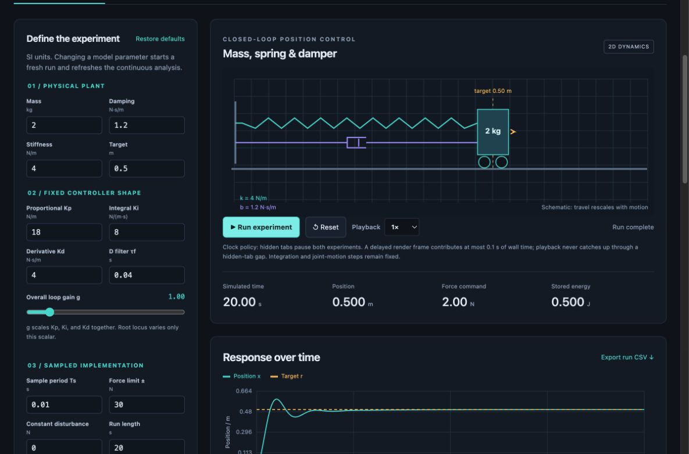
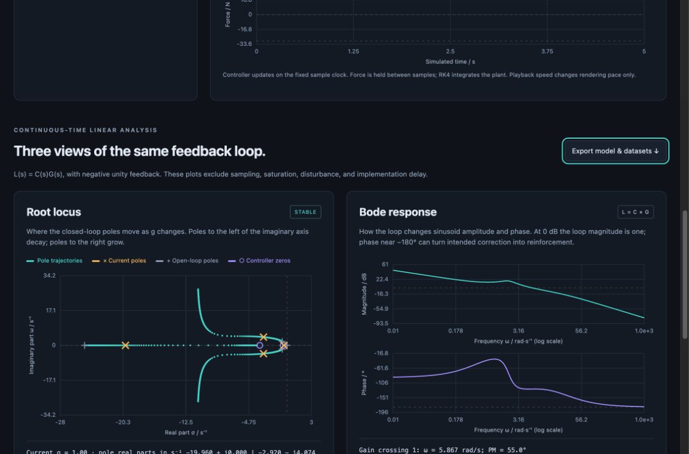
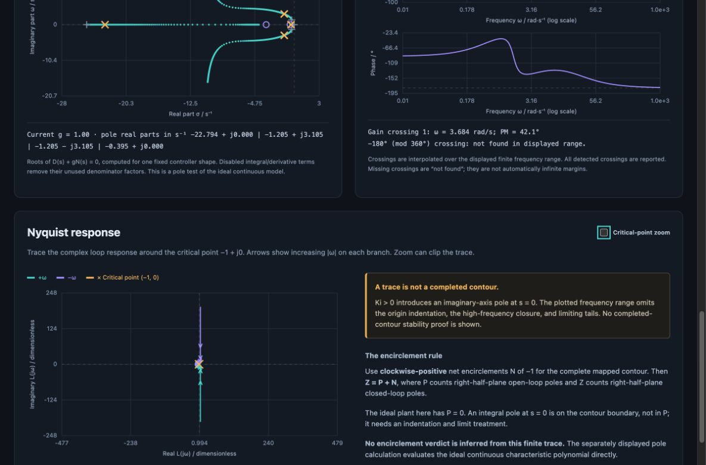
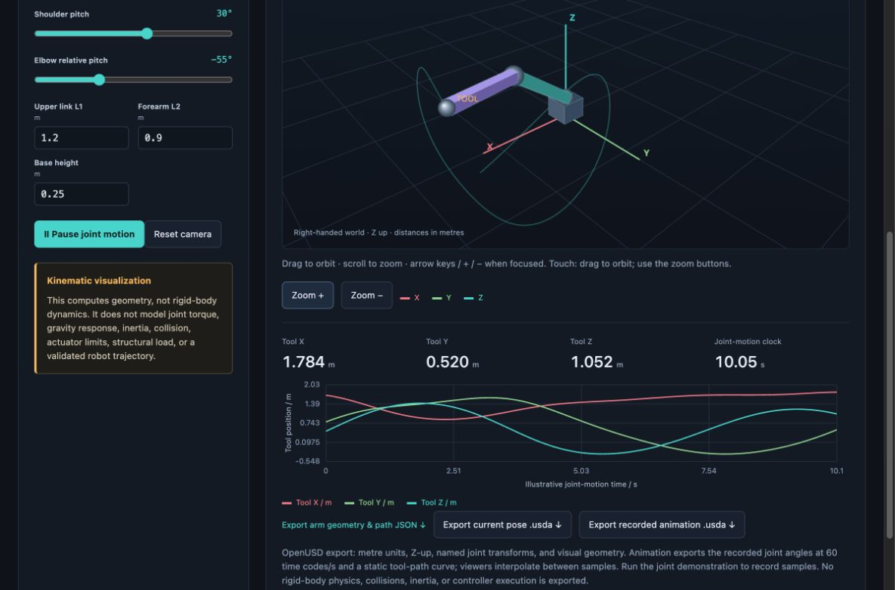
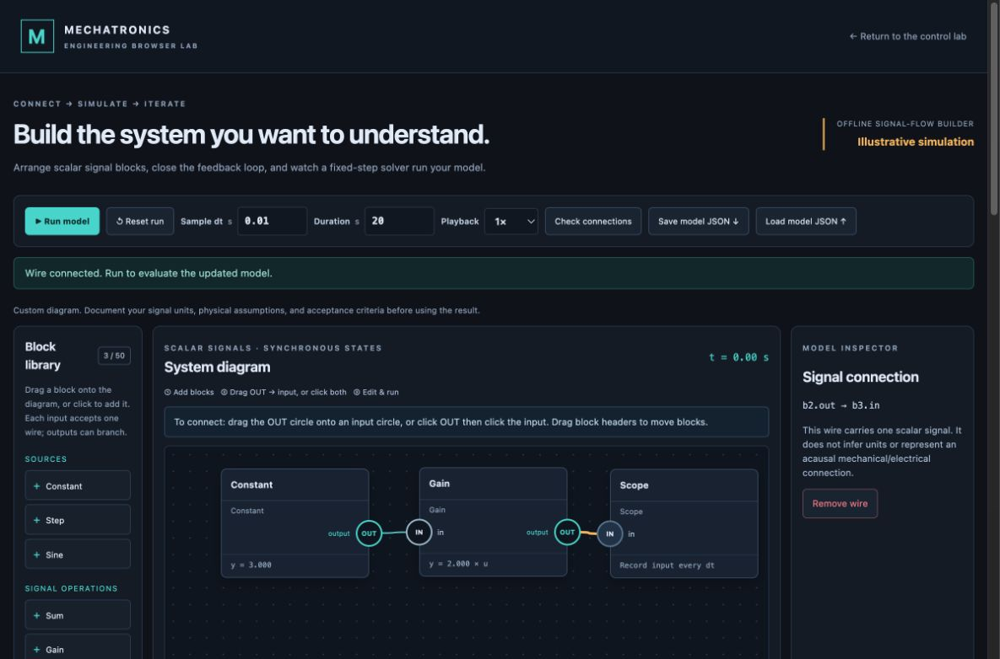

# Browser simulation workbench

## See it before you start

[Watch/download the recorded demonstration (MP4)](media/browser-workbench-demo.mp4), open the [local player](watch-workbench.html), or follow the [illustrated walkthrough](WALKTHROUGH.md). The screen recording contains real browser captures, edited scene transitions and no audio. Player captions describe the visible sections. These are views of software models, not physical test footage.



*Start on the left with the physical plant and controller parameters; use Run/Reset above the live readouts to perform an experiment.*

## Open it

Open `skills/mechatronics-engineering/assets/browser-lab/index.html` in a modern local browser. Keep its sibling CSS/JavaScript files together. There is no installation or network dependency. Alternatively run `python3 scripts/build_packages.py` and open `dist/mechatronics-browser-workbench.html`, which contains the same app in one file.

GitHub renders HTML as source; download/clone first. The repository is public; the simulator runs locally after download. If your environment requires HTTP for local preview, serve only the lab directory on loopback:

```sh
python3 -m http.server 8765 --bind 127.0.0.1 --directory skills/mechatronics-engineering/assets/browser-lab
```

Then open `http://127.0.0.1:8765` and stop the server when finished. The app never connects to hardware.

## What you can explore

- A mass–spring–damper axis with editable physical properties and sampled PID controller parameters, saturation and disturbance.
- A 2D animated mechanism and live response/control charts.
- A spatial robot arm with editable geometry/joint posture and 3D camera controls, labelled as kinematic rather than torque/contact dynamics.
- Continuous-time root locus, Bode and Nyquist plots linked to the loop parameters.
- Repeatable play/pause/reset and downloadable parameter/results data.

Use visible labels in the app for the exact control names and allowed ranges. Parameters have SI units unless an angle/frequency control explicitly says otherwise. Compare traces only when their initial conditions, parameters, sample/integration settings and disturbance schedules match.

## Five guided experiments

### 1. Find the difference between mass, stiffness and damping

Run the baseline. Increase mass while holding other values fixed; compare motion and poles. Increasing mass lowers √(k/m), the undamped natural frequency. Increase stiffness and compare again. Then increase damping and watch decay; distinguish the physical damping coefficient from derivative-controller action. Reset between comparisons and export both runs.

### 2. Tune a loop and see its limits

Change proportional, integral and derivative gains one at a time. Inspect tracking error and actuator command together. Integral action can reduce constant-load error, but saturation requires antiwindup. A filtered derivative can add damping while changing noise response; this ideal example is not a measured noisy sensor. Lower the force limit to make actuator constraints matter and compare the saturated time response with the linear plots.

### 3. Read root locus

Hold the PID shape fixed and vary the scalar loop gain. Root locus shows how closed-loop poles move for that family. Left-half-plane poles decay in the continuous LTI model; right-half-plane poles grow. Complex pairs represent oscillatory modes. The selected gain's markers connect the design to the locus. Changing the PID shape recomputes the family; it is not movement along the old locus.

### 4. Read Bode and Nyquist together

Bode shows loop gain and phase against frequency. Explain the 0 dB and −180° crossovers and why delay/filtering changes margins. A missing crossing in the plotted range is reported as missing, not assumed infinite.

Nyquist draws the same loop response in the complex plane around −1 + j0. Use the curve to understand feedback phase/gain jointly. The displayed finite-frequency trace is an educational view, not a complete Nyquist contour proof. Integral control adds an imaginary-axis pole and needs the appropriate indentation for a formal count. Continuous polynomial pole stability is separately computed; neither result certifies the sampled/saturated or physical machine.



*Hover for computed sample values. Read the loop definition, pole classification and finite-range warnings alongside the curves.*



*Critical-point zoom changes the display scale. It does not supply missing contour segments or justify an encirclement verdict.*

### 5. Explore a spatial arm

Change link lengths and joint angles, orbit the camera and inspect the end-effector coordinates. Follow the animated trajectory where provided. Identify which changes alter workspace versus posture. This demonstrates forward kinematics and geometry; it does not solve payload torque, actuator speed, contact, collision or structural loading. Ask the skill to add those models when they affect your design.



*Drag the scene to orbit; use the zoom controls to inspect geometry. Joint motion is a kinematic demonstration, not a validated motor trajectory.*

## Generate a simulation of your own solution

Ask:

> Use Mechatronics Engineering. Starting from the browser template, build a model of [my mechanism] using these equations/geometry/measurements. Let me vary [parameters with units], show 2D and 3D views, chart [states/error/effort], and export results. Explain the physical model, numerical timestep and continuous/discrete analysis limits. Test known cases, parameter effects, convergence and the actual browser controls.

The skill's [browser-generation workflow](../skills/mechatronics-engineering/references/browser-simulation.md) covers model adapters, timing, controls, charts, 2D/3D rendering and validation. A generic arm/axis animation is a starting code template, not a substitute for deriving the requested system.

## Interpretation limits

Animation pace is a display feature; control sampling and plant integration determine the simulated dynamics. Tab suspension or a slow computer must not silently turn a browser frame into a large physical timestep. Continuous root/frequency analysis uses an unsaturated linear model; time simulation uses sampled control and force bounds. A kinematic arm does not model forces. No included test establishes physical safety, field performance or certification. See [the validation report](../validation/REPORT.md) for what was actually run.

## Drag-and-drop system builder

Choose **Drag & drop system builder** in the lab, or open `skills/mechatronics-engineering/assets/browser-lab/builder.html`. The separately packaged `dist/mechatronics-system-builder.html` runs on its own. Keep both standalone HTML files in one folder to use their navigation links.

Drag components onto the canvas (or click to add). Move a block by its header. To connect signals, press an **OUT circle**, drag the dashed preview onto an **IN circle**, and release when the target highlights teal. Alternatively click OUT, release, then click IN; keyboard Tab and Enter/Space use the same buttons. Edit block parameters and run the diagram. Begin with the default PID feedback example, then add sources, sums, gains, saturation, integrators, delays, first-order/mechanical plants and scopes. Save/load model JSON for repeatable experiments. See [the builder guide](../skills/mechatronics-engineering/references/system-builder.md) for worked thermal/motor/feedback modeling techniques and tests.



*Drag OUT onto IN, or click OUT then IN. Teal inputs are unoccupied; red outlined inputs already have a wire. Each scope has its own vertical scale and author-defined signal units.*

Release on empty space or press **Esc** to cancel a drag. To replace a connection, select its wire and choose **Remove wire** first. Scroll or rearrange blocks before dragging to an off-screen input; the canvas does not automatically scroll during a wire drag. The two-click method lets you scroll between choosing the output and input. Inspect stored parameters and choose **Check connections** before running.

This is a scalar signal-flow editor inspired by the block-diagram workflow. Xcos file import, acausal physical connectors, automatic unit checking and automatic root/Bode/Nyquist analysis of arbitrary diagrams are not implemented. Derive and verify the equations behind each connection.

## Export the 3D arm to OpenUSD

In **3D robot kinematics**, set the link geometry/joint posture and use **Export current pose .usda**. Run the joint demonstration to enable **Export recorded animation .usda**. The output is an original OpenUSD scene with metre units, Z-up, a joint transform hierarchy and 60 time codes per second. Animation records the observed joint samples and an optional static tool-path curve.

Open it in a compatible OpenUSD tool; reconcile external CAD units and check a known dimension. The exported scene has no physics bodies, mass/inertia, collision, joint-drive definitions or controller execution. [OpenUSD guidance](../skills/mechatronics-engineering/references/openusd-workflow.md) explains how to supply these for downstream simulation.

An optional integration check uses Node.js and the OpenUSD Python SDK:

```sh
python3 -m venv work/usd-check
work/usd-check/bin/python -m pip install usd-core==26.8
work/usd-check/bin/python scripts/validate_openusd.py
```

The SDK is only a validation dependency. It is not bundled into the skill or required to run/export from the browser. The check parses generated scenes and compares world transforms with independent forward kinematics; it does not run an external physics engine.

## Video playback and captions

The [local player](watch-workbench.html) reads `docs/media/browser-workbench-demo.mp4` and its sibling [WebVTT captions](media/browser-workbench-demo.vtt). Keep the `docs/media/` folder with the player when copying files. If a browser restricts captions on a directly opened local file, serve only the documentation folder on loopback from the repository root:

```sh
python3 -m http.server 8766 --bind 127.0.0.1 --directory docs
```

Open `http://127.0.0.1:8766/watch-workbench.html`, then stop the server when finished. This optional server is only for local documentation playback; the browser workbench itself also supports direct file opening. The [walkthrough text](WALKTHROUGH.md) remains available without video or captions.
