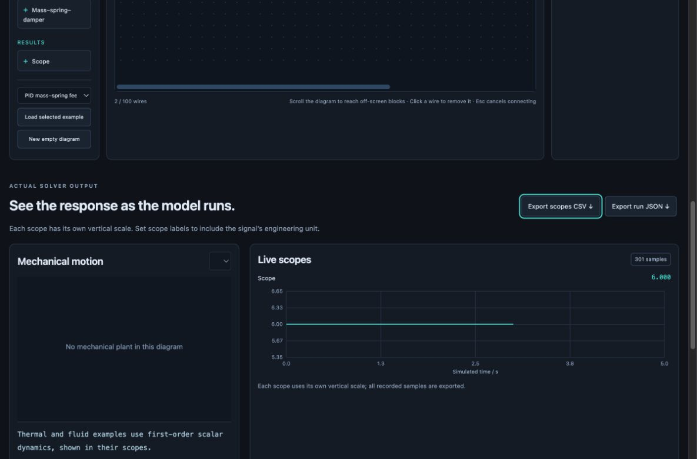

# Browser workbench: illustrated walkthrough

**[Watch/download the browser demonstration (MP4)](media/browser-workbench-demo.mp4)** · [Open the local player](watch-workbench.html) · [English captions (WebVTT)](media/browser-workbench-demo.vtt)

The approximately 55-second silent recording uses real browser captures with cuts between scenes. It shows the workbench running software models; it contains no hardware footage or generated replacement frames. Playback time, browser capture timing and each model's simulated time are different quantities. Read the simulated-time display when interpreting a response.

On GitHub, the MP4 link may open a file/download view. Clone or download the repository and open `docs/watch-workbench.html` for a local player. Keep its `media/` folder beside it. See the [playback help](BROWSER-SIMULATION.md#video-playback-and-captions) if local-file caption loading is restricted by your browser.

## 1. Run a controlled axis

The mechanical equation is `m ẍ + b ẋ + k x = u + d`: mass times acceleration, damping force and spring force balance the commanded force plus disturbance.

- **Mass, damping and stiffness** describe the physical plant. Their unit labels distinguish a physical coefficient from a controller gain.
- **Kp, Ki, Kd and derivative filter** define the controller shape. Overall gain `g` scales that shape.
- **Sample period and force limit** belong to the implemented simulation. They can change the time response even when the continuous-analysis plots appear unchanged.
- **Run experiment, Pause and Reset** control the experiment. Playback speed changes viewing pace; it does not replace the model timestep.
- **Position and force charts** show tracking and effort together. A desired position may require more holding force than the configured limit can supply.

Run the defaults, change one parameter, then run again. A model-parameter change starts a fresh trace. Export the data when you want to compare scenarios; screenshot appearance alone does not establish settling time or error tolerance.

## 2. Read the control analysis

All three views refer to the defined continuous loop `L(s) = C(s)G(s)` with negative unity feedback.

| View | What to look for | What it does not establish |
|---|---|---|
| Root locus | Movement of closed-loop poles as one scalar gain varies; current-gain markers locate the selected design | Stability of the sampled, saturated implementation or a physical machine |
| Bode | Loop magnitude and phase versus frequency; detected crossover and margin estimates | An infinite margin when a crossing is absent from the displayed range |
| Nyquist | Complex loop response relative to the critical point `−1 + j0`; positive/negative frequency branches | A completed contour or encirclement proof from this finite trace |

Hover to inspect computed samples. Changing the PID shape creates a different root-locus family. Integral action places a pole on the imaginary axis, so a formal Nyquist argument requires the correct contour indentation and limiting treatment. The separate polynomial pole calculation does not remove those requirements.

## 3. Explore robot geometry and motion

Choose **3D robot kinematics**. Base yaw rotates the arm around the vertical axis; shoulder and relative elbow pitch determine the two links' posture. Link lengths change the reachable geometry.

1. Change one angle and watch the tool's X, Y and Z coordinates.
2. Drag to orbit the camera; scroll or use the zoom buttons to inspect the view. Keyboard camera controls are described in the app.
3. Run **Demonstrate joint motion** to see a repeatable geometric trajectory and live tool-position traces.
4. Export the current pose or recorded animation as `.usda` when handing the geometry to an OpenUSD workflow.

The scene uses metre units and a right-handed, Z-up frame. It computes forward kinematics. Mass, inertia, joint torque, collision, contact and motor dynamics are not modeled in this arm view or supplied by its visual-only USD export.

## 4. Build a signal-flow model

- **Add:** drag a library block onto the diagram, or click it for keyboard/touch-friendly creation.
- **Move:** drag a block's header to arrange it. The circles on its sides are connection ports.
- **Wire by dragging:** hold the **OUT** circle, drag the dashed preview to the destination **IN** circle, and release when the target highlights teal.
- **Wire by clicking:** click OUT, release, then click IN. Tab and Enter/Space activate the same buttons by keyboard; touch supports dragging or two taps. An output may branch; each input accepts one driver.
- **Cancel or replace:** release a wire drag on empty space or press Esc to cancel. Red outlined inputs already have a wire; select that wire and choose **Remove wire** before replacing it.
- **Edit:** select a block to inspect parameters. Valid parameter edits update the stored model immediately and reset the run.
- **Check:** validate required connections before running. Feedback through a physical state or explicit delay is supported; a purely direct-feedthrough cycle is rejected as an algebraic loop.
- **Observe:** use separate scopes for quantities with different units. The editor does not infer or check dimensions from a wire.
- **Repeat:** save/load model JSON and export the actual solver results. Scroll the diagram to reach blocks outside the current view. Wire drags do not automatically scroll; arrange visible targets first or use the two-click method and scroll between clicks.

The preset menu provides PID feedback, lumped thermal heating and a linear fluid tank. Those presets are deliberately simple models with stated assumptions; they are not general heat-transfer or CFD solvers. This editor uses scalar signal flow and does not import Xcos files or solve acausal physical connections.

For a quick wiring check, start an empty diagram and connect **Constant = 3 → Gain = 2 → Scope**. Run the model and check that the scope reads **6**. This small example helps separate an editing/connection mistake from a question about more complicated plant dynamics.

## Continue with your own design

Ask:

> Use Mechatronics Engineering. Help me reproduce the relevant walkthrough experiment, explain every unfamiliar control label, and then replace the example with my mechanism. State the equations, signal units, sample timing and assumptions. Export the results and check a known solution before using the model to choose hardware.

For detailed controls and experiments, read the [browser guide](BROWSER-SIMULATION.md). For native tools, follow the [Scilab/Xcos/ROS interface guide](../skills/mechatronics-engineering/references/toolchain-interfaces.md) and [installed ROS 2 container instructions](../integrations/ros2-docker/README.md). Use the [validation report](../validation/REPORT.md) to distinguish demonstrated browser behavior, numerical checks, native-runtime tests and untested physical behavior.
