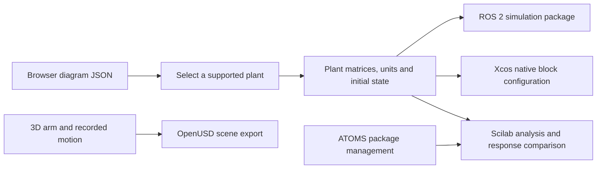

# Mechatronics Engineering Knowledge

Version 0.1.0. Use with Instructions.txt. Original reference material under the accompanying MIT licence.


---

## Source: references/browser-simulation.md

# Generate an engineering simulator that runs in a browser

Use this workflow when the user wants to see a solution move, change parameters, compare controllers or learn frequency/pole methods. Deliver the code and a usable browser artifact, not only an architectural suggestion. The included workbench (source file: ../assets/browser-lab/index.html) is a starting implementation; its actual models and validation limits must remain visible.

## 1. Make the model explicit

State the engineering question and acceptance measures, then identify states, inputs, outputs, parameters, units, frames, initial conditions, disturbances and constraints. Distinguish a kinematic visualisation from a dynamic simulation. In a kinematic arm, joint angles directly determine pose; without inertia, motor torque, contact and a solver it does not predict motion under load.

Choose appropriate equations before drawing. For an axis, m ẍ + b ẋ + k x = u + d is a useful model only when lumped mass, damping and stiffness approximate the mechanism. A thermal process, nonlinear pendulum, underwater vehicle or articulated robot requires its own equations. Use a model adapter boundary such as `derivative(state, input, parameters, time)`, `measure(state)`, `controller(reference, measurement, dt)` and `geometry(state)` so drawing code cannot silently determine physics.

For an existing nonlinear design, identify the operating point and linearise using Jacobians A = ∂f/∂x, B = ∂f/∂u, C = ∂h/∂x, D = ∂h/∂u when frequency/pole analysis is meaningful. Show both the nonlinear time simulation and the local model's validity range. If the mechanism lacks a usable model, deliver a clearly labelled conceptual visualisation and an identification experiment rather than invented dynamics.

## 2. Build the interactive interface

Use labelled controls with values, units, valid bounds and sensible increments. Let the user adjust physical properties (mass, stiffness, damping, geometry/load), controller gains, sampling, force/current saturation and disturbances as relevant. Explain what each changes physically. Validate nonfinite/invalid input and show errors beside the control. Do not coerce an impossible value silently.

Provide play/pause, reset, a repeatable baseline and export. Parameter changes must have an explicit policy: reset the run for comparable experiments, or mark the change in the timeline. Use presets for contrasting behaviours such as underdamped, well-damped and saturated, but call them examples. Avoid universal “safe gain” recommendations.

Use 2D for mechanisms, planar paths and easy-to-read load/position relationships. Use a 3D scene with real coordinates, camera projection and orbit controls for spatial arms, vehicles or clearances. A projected 3D wireframe can be sufficient without a large library; label the rendering method and keep the geometry faithful. Provide ground/grid, axes, scale and visible joint/end-effector markers. Joint sliders should update forward kinematics and a pose readout. A perspective scene alone does not establish collision checking or structural simulation.

Live charts should include time, reference, measured state, error, actuator command and disturbances where useful. Label units and distinguish reference/model/measurement. Use bounded history/downsampling for long runs, hover readouts or accessible numerical summaries, independent colours/line styles, and CSV/JSON export with parameters and evidence status. Keep animation speed separate from numerical time.

## 3. Keep computation independent of rendering

Use a fixed numerical step or justified adaptive solver; sample the controller at its own specified period and hold its output between updates. `requestAnimationFrame` schedules drawing and may pause or vary with browser load; it must not define the physical timestep. Accumulate elapsed time with a bounded catch-up policy, pause intentionally on a long hidden-tab delay, and report when real-time pace cannot be maintained. More displayed frames is not a higher control sample rate. See [MDN animation scheduling](https://developer.mozilla.org/en-US/docs/Web/API/Window/requestAnimationFrame).

Include actuator saturation, integral antiwindup, filtered derivative, quantisation/noise/delay when the scenario requires them. Record integration method, plant step, control sample and numeric precision. Recompute derived coefficients after parameter changes. Handle numerical overflow with a stopped simulation and useful diagnostic, not a flatline that looks stable.

Prefer an offline HTML/CSS/JavaScript bundle with no build step for novice portability. Use Web Workers for expensive computations when needed. Reuse a suitable installed library for general high-order systems, 3D or optimisation, but record its version/licence and make dependency/network requirements explicit. Do not imply a browser can perform hard real-time hardware control.

## 4. Explain root locus

**Intuition:** poles are the system's natural response modes; moving them changes decay, oscillation and instability. A root locus plots closed-loop poles while one scalar loop gain varies, with the plant and controller shape fixed.

For negative feedback L(s) = g N(s)/D(s), compute roots of D(s) + g N(s) = 0 over a stated gain sweep. Mark open-loop poles/zeros, the imaginary axis and current gain. Explain that right-half-plane poles imply growing modes for a continuous-time LTI model; discrete-time poles instead require the unit-circle test. Complex-conjugate poles show oscillatory modes, and their real parts set decay/growth rate. Pole stability alone does not guarantee acceptable actuator effort or transient performance.

Check polynomial conditioning and root residuals; match branches across gain steps without joining unrelated roots. Remove absent controller factors (for example a cancelled integrator when integral gain is zero) so fake poles are not plotted. Avoid hiding physically dangerous unstable pole-zero cancellations in a general model. Provide numerical poles and gain at the selected point.

**Use it:** single-parameter gain tuning, explaining how gain affects stability, and choosing compensator poles/zeros. **Limit:** simultaneous arbitrary PID changes are a family of different loci; a fixed shape is necessary for the meaning of each plot. High-order MIMO systems need suitable multivariable analysis.

## 5. Explain Bode

**Intuition:** drive a system with sine waves of different frequencies and compare output amplitude and timing. Plot magnitude and phase against logarithmic frequency. For loop analysis use the full dimensionless L(jω), not only the physical plant. Show Hz versus rad/s explicitly (ω = 2πf) and unwrap phase consistently.

At a gain crossover |L| = 1 (0 dB), phase margin is 180° + phase for the usual negative-feedback convention and the relevant phase branch. At a −180° phase crossing, gain margin is 1/|L| (or −20 log10|L| in dB). Interpolate crossings or refine the sweep; distinguish no crossing within the sampled range from a mathematically infinite margin. Report multiple crossings and their interpretation rather than selecting a reassuring one. A Bode chart of a nonminimum-phase/open-loop-unstable system needs the appropriate stability reasoning.

**Use it:** bandwidth, noise rejection, disturbance rejection, resonances, delay effects and compensator design. Show how derivative/filter/gain changes alter the tradeoff. The simplified hold-delay phase is approximately −ω T_s/2 at low frequency; actual sampled dynamics require discrete analysis. Positive classical margins are not a universal robust-stability guarantee for MIMO, nonlinear or uncertain systems.

## 6. Explain Nyquist

**Intuition:** take the loop response at each frequency and trace its real and imaginary parts as a curve. The critical point −1 + j0 represents feedback becoming self-reinforcing at the critical magnitude/phase. Mark it, label axes, show positive/negative frequency branches and direction.

For an explicitly chosen conventional contour enclosing the right half-plane clockwise, let N be the net clockwise encirclements of −1 by the mapped complete contour, P the open-loop RHP poles and Z the closed-loop RHP poles. Then N = Z − P, so stability requires Z = 0 and N = −P. Some texts count counterclockwise instead: state the convention before counting. Poles on the imaginary axis require a contour indentation and its mapped contribution.

**Use it:** assess stability with open-loop unstable poles, delays and cases where casual Bode margin reading is inadequate. **Limit:** plotting only finite-frequency L(jω) points is not the complete contour proof. Integral control introduces a pole at zero; do not count encirclements from an unindented finite curve and claim certification. A workbench may show an educational frequency trace plus independently computed closed-loop polynomial poles; label these separately.

## 7. Validate and deliver

Check known polynomial roots, repeated/conjugate roots, cancelled controller terms, frequency limits, numerical step convergence, parameter effects, saturation and reset/export reproducibility. Compare a simple model to analytical results or an independent implementation. Exercise the actual browser controls, 2D/3D views, resizing, pausing and error states; report which browsers were tested. A screenshot alone proves rendering, not correct simulation.

Deliver HTML/JS/CSS and run instructions, equations/assumptions, parameter table, example experiments, exported baseline, test results and limitations. For hosted ChatGPT, provide downloadable code/artifacts or a supported preview; ordinary Markdown knowledge uploads do not themselves execute the simulator. Open local browser code directly or serve it on loopback for testing; do not publish a private design to a public web host without authorisation.

## 8. Exchange scenes with OpenUSD

For design review or a larger robot/factory scene, offer the browser's OpenUSD USDA exports: current arm pose or recorded joint motion. Use the OpenUSD workflow (source file: openusd-workflow.md) for stage units, axis conventions, transform hierarchy, sampled timing, external references and physical-model handoff. Validate exports with a real USD parser and compare world coordinates against the original FK at multiple poses/times. Exported visuals do not supply mass, inertia, collision, drives or actuator dynamics. Do not silently infer those properties or report a dynamics result from animation. A general USD viewer/importer and physics engine are separate capabilities; the included browser authors its own bounded scene.


---

## Source: references/commercial-delivery.md

# Costing, product development, quality and go-to-market

Use this guide when an individual or company needs to justify, manufacture, finance, sell or support a mechatronic solution. Tie commercial claims to a measurable customer outcome and verified technical envelope. Use the user's currency and jurisdiction; illustrative numbers below are hypothetical currency units (CU), exclude tax, and are not supplier quotes or financial advice for a specific investment.

## 1. Define the customer and offer

Separate user, buyer, budget owner, installer, maintainer and purchasing approver. For a business customer, quantify current process cost, bottleneck, downtime, scrap, quality variation and labour redeployment. For a consumer, test ease of setup, reliability, appeal, space/noise, affordability, support and returns. Interview target customers about observed behaviour and constraints; enthusiasm is not a purchase commitment.

Use a one-page value proposition: target segment → specific job/problem → measurable outcome → credible demonstration → purchase/installation effort → price model → support promise. Compare manual process, existing automation, outsourcing and “do nothing”. Rank initial markets by problem severity, repeatability, reachable buyers, achievable evidence, delivery/support burden, sales cycle and margin. Start with a focused use case before generalising the product.

Distinguish a bespoke engineering service, a repeatable product, an integration project and an operated service. Custom contracts may fund development but accumulate unique support obligations. Standardise interfaces and configurable modules where that preserves the actual customer requirement.

## 2. Build the cost model

Separate **non-recurring engineering (NRE)** from recurring unit costs and working capital:

- NRE: discovery, design, prototypes, tooling, fixtures, test development, verification/validation, relevant conformity work, documentation and launch.
- Recurring production: materials/components, fabrication, assembly touch time, programming/calibration/test, packaging, inbound logistics, scrap and rework under a stated yield model.
- Selling/service: channel/payment fees, outbound delivery, installation/training, warranty provision, cloud/connectivity, support, field service and returns.
- Working capital: supplier deposits, inventory, work in progress, receivables less supplier credit/customer deposits. Profitability does not guarantee cash to pay suppliers.

Maintain quantity, unit price, source/date/currency, MOQ, lead time, quote validity, alternates, yield basis and confidence per BOM line. Labour = effective loaded hourly cost × touch time; elapsed machine time and labour time may differ. Avoid double-counting overhead in both loaded rates and separate allocations.

For a simple model in which every started unit incurs the same production cost and failed units are completely scrapped, production cost per good unit = cost per start / yield. If failures occur at different stages or can be reworked/recovered, model those flows explicitly. Add costs incurred only on sold units after that calculation.

Contribution per sold unit = net selling price − variable cost per sold unit. Gross margin and contribution margin depend on which costs the business includes; label definitions. Gross margin fraction = (price − defined COGS)/price; markup = (price − cost)/cost. Break-even volume = fixed costs / contribution, rounded up for indivisible units; it does not represent a cash-flow forecast. See the calculation helper (source file: ../scripts/engineering_calcs.py).

### Worked product scenario

Illustrative benchtop positioning module: BOM 180 CU, assembly 40, test 15 and production packaging 10 gives 245 CU per start. Assuming 95% yield with all start costs lost on scrap gives 257.89 CU per good unit. Add 25 CU per sold unit for variable warranty/support allowance: total 282.89. With 450 CU net selling price, contribution is 167.11 CU (37.13% of price). At 30,000 CU fixed launch cost, contribution break-even is 180 units. At 85% yield it becomes 220 units; at 400 CU selling price and 95% yield it becomes 257 units. These are scenario arithmetic, not demand or yield evidence.

Obtain supplier quotes and a pilot time/yield study before accepting these economics. Check channel fees, taxes, financing and fixed ongoing costs separately. Validate willingness to pay using interviews, demonstrations and appropriately scoped commercial offers rather than treating calculated break-even as sales forecast.

## 3. Finance the development and cash cycle

Match financing to uncertainty and repayment capacity. Bootstrapping, paid feasibility work, milestone customer funding, grants, equity, debt, equipment lease and supplier terms have different costs/control/obligations. Early technical uncertainty is a poor fit for debt that requires repayment before predictable cash generation; equity can fund uncertainty but dilutes ownership. Customer-funded pilots need clear IP, deliverables, acceptance and support boundaries reviewed for the actual agreement.

Build a monthly cash forecast: opening cash + dated customer receipts/funding − supplier/prototype/tooling/payroll/operating/tax/finance payments = closing cash. Model base/downside/upside cases, delays, minimum orders, inventory ageing, warranty shocks and slow payment. Set explicit go/no-go milestones and cash required to reach each. Verify current financing/grant eligibility, terms and jurisdiction-specific tax/accounting rules with authoritative sources and qualified advisers when needed; do not invent available funding.

For customer ROI, separate hard savings, avoided cost and speculative upside. Simple payback = initial installed cost / annual net savings when savings are steady and positive. Include installation, training, maintenance, energy, consumables, downtime and residual value. Use NPV/discounted cash flow for multi-year alternatives with a disclosed discount rate and timing assumptions. Labour minutes saved do not necessarily become cash savings if staffing/capacity does not change.

## 4. New product development and a 90-day pilot

| Period | Engineering and customer work | Evidence to decide next stage |
|---|---|---|
| Days 1–15 | Customer interviews, mission/requirements, existing solution review, first-order budgets and major hazard/unknown assessment | Defined user/buyer, measurable acceptance, feasible physical bounds and provisional economics |
| Days 16–35 | Reuse/build bench prototype, simulate, test hardest assumption, get supplier feedback | Instrumented feasibility evidence and cost/lead-time ranges |
| Days 36–60 | Integrated prototype, user workflow, design-for-manufacture, calibration/test fixture and support concept | Requirement traceability, representative tasks, defect list and revised BOM |
| Days 61–75 | Small pilot batch with actual process/operators, packaging and installation trial | Yield/touch time, critical process evidence, usability and service observations |
| Days 76–90 | Bounded customer pilot, acceptance testing, pricing/channel test and cash forecast | Evidence-based release/rework/stop decision, supported claims and funded next stage |

Adjust the timeline for complexity, tooling and regulatory lead times. A 90-day plan is a learning schedule, not a guarantee of certified market readiness. Agree pilot scope, site readiness, responsibilities, evidence access, acceptance, exclusions, warranty/service and exit criteria. Delivery should include setup/training and a recoverable configuration baseline.

## 5. Quality control and assurance

Quality assurance designs a reliable process; quality control inspects/measures output. Map critical-to-quality characteristics from customer requirements into drawings, supplier controls, process settings and end-of-line tests. Use design/process FMEA to identify failure modes, effects, causes, controls and actions. Do not hide a severe hazard behind a low multiplied risk-priority score; address severity and detectability explicitly.

Perform incoming inspection based on supplier evidence and part risk; use first-article inspection for new designs/processes; keep calibrated gauges/fixtures. Use error-proofing (poka-yoke), clear work instructions and traceable serial/lot/programming records. Maintain nonconformance quarantine/disposition and corrective/preventive actions; root-cause methods such as 5 Whys or fishbone diagrams organise hypotheses, while experiments confirm causes.

Use statistical process control (SPC) when repeated process data supports it. Control limits describe process behaviour; specification limits express customer/design requirements. Capability indices such as Cp = (USL−LSL)/(6σ) and Cpk = min(USL−μ, μ−LSL)/(3σ) require a stable process and suitable distribution/variation estimates. Do not compute a convincing Cpk from a few hand-selected prototype units. Nonnormal data, autocorrelation and measurement error need appropriate treatment. [NIST's process capability guide](https://www.itl.nist.gov/div898/handbook/pmc/section1/pmc16.htm) explains this context.

Use acceptance sampling for its stated lot risks; inspecting a sample does not prove every item conforms. Critical functional requirements may require 100% testing with an adequate measurement system. Track first-pass yield, rework, scrap, field failures/returns, repair time, supplier defects and customer acceptance. Feed evidence into engineering changes and revised cost/warranty assumptions.

A small pilot exposes process problems but gives an uncertain yield estimate. Report the count of starts/failures and an appropriate confidence interval rather than treating, for example, 10 successful builds as proof of 95% long-run yield. Separate a target yield used in the business case from the evidence needed to accept that target.

## 6. Sales, marketing and lifecycle support

For B2B, build an application-specific demo, test report, ROI model, installation/site checklist, technical/security integration information, proposal, acceptance plan and service agreement. Partner with integrators/distributors when reach and installation/support capabilities justify margin and control tradeoffs. Measure qualified pipeline, conversion, sales cycle, acquisition cost and pilot-to-production adoption.

For consumers, prioritise clear outcome-led messaging, honest demonstration videos, setup experience, compatibility, noise/space/energy expectations, shipping, returns and accessible support. Test price and messages with small experiments; report sample/channel limitations. For both markets, tie every performance/safety/environmental claim to evidence and conditions. Do not claim certification from a supplier logo or from a passed internal test.

Choose outright sale, lease, subscription, robotics-as-a-service or service contract according to customer cash preferences and who can bear uptime/maintenance/asset risks. Define inclusions, consumption limits, spares, response targets and end-of-life obligations. A subscription is not recurring profit unless continuing support/cloud costs and churn are modelled.

Plan repairability, spares, component obsolescence, cybersecurity updates, customer data handling, recalls/service campaigns and disposal. Verify applicable product, workplace, electrical, radio, battery transport, privacy, consumer and sector rules for the intended use and market using sources (source file: sources.md). These are applicability questions for the actual product, not a claim that one universal standard covers all robots.

## Commercial handoff

Deliver a dated cost model with sensitivities, quote register, make/buy rationale, funding/cash plan, pilot/NPD schedule, quality/control plan, target segment and positioning, evidence-backed demo/claims, channel/pricing/service model and measured go/no-go criteria. Keep estimated, quoted, ordered, manufactured, shipped and accepted states distinct.


---

## Source: references/control-systems.md

# Control Systems Methods

How to make a machine do what you command despite disturbances, noise, and imperfect models. Prerequisites per topic are listed in topic-map.md (source file: topic-map.md); the underlying mathematics is in mathematics-modeling.md (source file: mathematics-modeling.md) and plant models come from mechanics-dynamics.md (source file: mechanics-dynamics.md).

## Open loop vs closed loop; feedback vs feedforward

**Open loop** commands without measuring the outcome (a stepper stepping a light load): cheap, sensorless, but it cannot correct output errors from the missing feedback; whether errors accumulate depends on the system. **Closed loop** measures, compares to the target, and corrects: it rejects disturbances and model error, at the price of sensors and the new possibility of instability. **Feedforward** uses what you *know* to command proactively — gravity-compensation torque on an arm, velocity feedforward on a trajectory — leaving feedback to clean up only what you *don't* know. The working principle: feedforward the predictable, feedback the residual; a validated combination can improve tracking and disturbance rejection; an incorrect feedforward model can make performance worse.

## PID, anti-windup, derivative filtering

u = K_p·e + K_i·∫e·dt + K_d·de/dt: proportional acts on present error, integral removes steady-state error, derivative anticipates and damps. Two practical additions are near-mandatory:

- **Anti-windup:** when the actuator saturates, the integral keeps accumulating error it cannot act on, producing large overshoot when saturation ends. Clamp the integrator during saturation or use back-calculation — actuator limits always exist, so this always matters.
- **Derivative filtering:** a pure derivative amplifies sensor noise without bound. Implement it filtered, K_d·s/(τ_f·s + 1) with τ_f chosen from noise spectra, bandwidth and phase-loss tradeoffs (a fraction of derivative time is only a starting heuristic), and take the derivative of the *measurement*, not the error, to avoid a kick at every setpoint step.

**Limitations:** one PID handles one dominant dynamic well; strong cross-coupling, long delays, or strongly nonlinear plants call for the later sections.

## Cascade control

Nested loops: a fast inner loop (motor current or velocity) inside a slower outer loop (position). The inner loop linearizes and speeds up what the outer loop sees. Practice: tune the inner loop first and make it substantially faster — commonly 5–10× — than the outer loop's intended bandwidth. If the outer loop is pushed up toward the inner loop's bandwidth, the loops interact, the timescale-separation argument that justified the structure collapses, and both degrade together.

## Frequency-domain tools and fundamental limits

These work on the transfer function G(s), defined with zero initial conditions (mathematics-modeling.md (source file: mathematics-modeling.md)).

- **Bode plot:** gain and phase versus frequency. Stability margins use the loop transfer L = C G H, including sensing H and delay, under a stated negative-feedback convention; a plant-only plot does not give closed-loop margins. Phase margins of roughly 30–60° are a common target range — plant-dependent design targets, not guarantees.
- **Root locus:** how closed-loop poles migrate as one gain varies; shows exactly when raising gain drives the system unstable.
- **Nyquist criterion:** counts encirclements of −1 to decide closed-loop stability, valid even for open-loop-unstable plants where casual Bode reasoning fails.
- **Sensitivity and the waterbed:** S(s) = 1/(1 + G·C) measures how much feedback attenuates disturbances at each frequency. The Bode sensitivity integral imposes a waterbed tradeoff under specified conditions (for example a stable closed loop with a rational continuous-time loop transfer of sufficient relative degree); its value depends on unstable open-loop poles. Check the theorem's assumptions before asserting a particular integral. Nonminimum-phase zeros and delay impose additional performance limits. Disturbance location matters: S maps output disturbances; input disturbances involve G S, and measurement-noise transmission involves complementary sensitivity T = L/(1+L). Any promise of perfect tracking at all frequencies violates this limit.

## State space, controllability, observability, observers, Kalman

ẋ = A·x + B·u, y = C·x + D·u puts many states, inputs, and outputs in one notation. **Controllability** asks whether the inputs can steer every state; **observability** whether the measurements can reveal every state. Check both before designing: an uncontrollable unstable mode is a hardware redesign problem, not a tuning problem. **Observers** (Luenberger) reconstruct unmeasured states from a model corrected by measurements; the **Kalman filter** is a minimum-variance linear estimator under appropriate linear-model, initial-state and noise assumptions; with Gaussian distributions it has stronger posterior-mean optimality. It balances model and measurements using their covariances — the standard tool for fusing an IMU with encoders. Warning: wrong covariances produce confidently wrong estimates. Sanity-check by comparing innovation (residual) magnitudes against their predicted statistics; persistent excess means the filter is lying to you.

## Digital implementation

When implementing a controller digitally, specify its sample period T_s. Analog implementations instead require circuit/component bandwidth and tolerance analysis.

- **Discretization:** convert the continuous design (Tustin's method preserves frequency response well below Nyquist) or design directly in z.
- **Delay:** the zero-order hold plus computation adds effective delay of roughly T_s/2 plus compute time, which consumes phase margin — a paper design with 45° margin can lose 10–20° here. Re-check margins *after* discretization.
- **Sample rate:** a common starting heuristic is 10–30× the intended closed-loop bandwidth. This is a heuristic, not a rule: delay-sensitive or resonant plants need explicit analysis, and no single rate suits all systems.
- **Jitter:** irregular sample timing behaves like a time-varying delay; run control from a fixed-priority timer, never best-effort scheduling.
- **Aliasing:** filter before the ADC (mathematics-modeling.md (source file: mathematics-modeling.md) sampling section).

## MIMO: coupling, decoupling, LQR/LQG, MPC

When several inputs affect several outputs — drone attitude, multi-joint arms — tuning loops one at a time can fail because each loop disturbs the others. Screen the coupling first (the relative gain array is the classic check). Options in escalating effort: sensible input–output pairing with detuned loops; a static decoupling matrix; full multivariable design. **LQR** chooses state/control quadratic cost weights and yields u = −K x under stabilizability/detectability and suitable Q/R conditions. Check units/scaling and reference tracking; state regulation alone does not automatically track arbitrary setpoints. Classical margin results depend on the precise loop structure and assumptions. **LQG** (LQR plus a Kalman filter) is one option when states are not directly measured, but LQR's margin guarantees no longer carry over — verify robustness explicitly. **MPC** re-optimizes a trajectory over a horizon every step and represents constraints (actuator limits, keep-out states) explicitly, with actual satisfaction depending on feasibility, model error, state estimation and implementation: the natural choice when constraints dominate the problem, at the cost of modeling effort, compute, and a required safe fallback for when the optimizer fails to converge in time.

## Robust, adaptive, and nonlinear methods

- **Robust / H-infinity:** design against a *specified* set of model errors; the resulting guarantees hold only for that specified set.
- **Gain scheduling:** linear designs across operating points with scheduled/blended gains; validate transitions and scheduling-rate effects because stable frozen designs do not prove stability while switching.
- **Adaptive control:** adjusts parameters online; powerful when parameters drift slowly and the input stays persistently exciting, hazardous without those safeguards.
- **Lyapunov methods:** prove stability by exhibiting an energy-like function that always decreases along trajectories — the proof language for nonlinear designs.
- **Passivity:** a passive subsystem cannot generate net energy beyond its initial storage. A well-posed negative-feedback interconnection preserves passivity; stronger convergence/boundedness conclusions need appropriate strictness, storage and detectability assumptions. Check sampling, delay and saturation in impedance/contact control.
- **Sliding mode:** drives a defined state function toward a switching surface with robustness under specified matched uncertainty and actuator assumptions. Chattering can excite hardware; boundary layers or higher-order designs trade tracking/robustness against switching and sampling limits.
- **Fuzzy control:** encodes operator heuristics as interpolated rules; useful when expertise exists but no model does, and it carries no inherent stability guarantee.

## Machine learning: role and limits

ML earns its place in perception (recognizing objects and terrain), residual modeling (fitting the friction the physics missed), and tuning assistance — all feeding a conventional, analyzable control loop. A learned inner-loop policy does not inherit stability or robustness guarantees merely from training success. Some constrained learning methods support proofs under stated assumptions; verify those assumptions, out-of-distribution behaviour and implementation before relying on them. The preferred architecture: model-based inner control for stability, learning at outer or supervisory layers, and hard safety limits enforced outside anything learned. Platform-level training practice lives in robotics-autonomy.md (source file: robotics-autonomy.md).

## Decision matrix

| Situation | Start with | Escalate to |
|---|---|---|
| Single axis, mild dynamics | PI/PID with anti-windup | Cascade P/PI |
| Position atop fast velocity dynamics | Cascade loops | State feedback |
| Multiple coupled axes | Paired PIDs + coupling screen | LQR / LQG |
| Hard actuator or state constraints | Saturation-aware PID | MPC |
| Key states unmeasured or noisy | PID on filtered signal | Observer/Kalman + state feedback |
| Wide operating range | Gain scheduling | Adaptive or nonlinear design |
| Large model uncertainty | Conservative PID | H-infinity or sliding mode |
| Contact with people or environment | Passivity-based impedance control | Force / hybrid control |

Escalate only when the simpler design measurably misses a requirement: each step rightward costs modeling, compute, and validation effort, and the reuse > extend > integrate > build > buy preference (topic-map.md (source file: topic-map.md)) applies to controllers as much as hardware.

## Tuning and validation recipe

1. **Identify:** use a bounded identification experiment (steps/chirps when appropriate), with stabilising feedback retained for an unstable or otherwise unsuitable open-loop plant, and fit a low-order model (mathematics-modeling.md (source file: mathematics-modeling.md) system identification).
2. **Design in simulation** against that model with explicit margin targets (for example ≥ 45° phase margin — a design target, not a guarantee of real-world stability).
3. **Discretize** and re-check margins including hold and compute delay at the actual sample period.
4. **Test progressively:** simulation → bench with emulated load → hardware at reduced gains and limits → full envelope. Software limits on torque, speed, and position, plus an independent stop path, are active from the first hardware run.
5. **Validate against requirements:** settling time, overshoot, disturbance recovery, steady-state error, and behavior during saturation — each measured, not assumed.
6. **Re-verify after any mechanical change:** stability margins belong to the plant-plus-controller pair, not to the controller alone.

Nothing in this guide constitutes hardware-validated performance. Every design must be validated on the specific system it will run on, no sample rate suits every plant, and no controller is universally stable.

## Worked example: motor position control, end to end

**Assumed illustrative plant:** a DC gearmotor whose voltage-to-speed response is G_v(s) = 8/(0.15·s + 1) (rad/s per volt, time constant 0.15 s). **Inner velocity loop:** PI, C(s) = K_p·(1 + 1/(T_i·s)). Choosing T_i = 0.15 s cancels the plant pole, leaving loop gain 8·K_p/(0.15·s); K_p = 0.4 places crossover near 21 rad/s — assumed comfortably below unmodeled drive and electrical dynamics, an assumption to verify during identification. **Outer position loop:** position integrates velocity, so a pure proportional gain K_pos = 3 gives an outer bandwidth near 3 rad/s — about 7× separation from the inner loop, satisfying the cascade rule. **Digital:** T_s = 5 ms is roughly 60× the inner bandwidth — deliberately generous because delay margin is cheap here, not because 5 ms is a universal answer. Tustin-discretize the PI, clamp the integrator at the drive's voltage limit, and filter any derivative term ever added. **Analytical check:** exact cancellation in this ideal model gives L(s) = 21.333/s and 90° phase margin before delay; a 2.5 ms hold-delay approximation contributes about 3.06° at crossover. This excludes computation delay, discretisation details and imperfect cancellation. The ideal outer characteristic polynomial is s² + 21.333s + 64, with two real negative poles, consistent with a monotonic zero-initial-condition step in this simplified model. **Checks still required:** discrete loop margins, parameter variation, saturation/antiwindup, sensor noise and measured drive dynamics. Pole cancellation is fragile if the fitted pole changes. **Status:** original illustrative calculation with assumed parameters; no measured motor identification, simulation of this cascade example or hardware validation is claimed.


---

## Source: references/electronics-embedded.md

# Actuation, instrumentation, electronics and embedded control

Use this guide to turn force/motion/measurement requirements into parts, circuits, interfaces and firmware. Start from the load and signal budget, then select hardware. A product family name is not a verified part specification.

## Actuator selection and sizing

| Technology | Good fit and selection inputs | Design outputs and checks |
|---|---|---|
| Brushed DC motor | Simple variable speed, moderate cost; torque-speed curve, voltage, duty | H-bridge, encoder, brush life, EMI, stall/continuous current and thermal limits |
| BLDC/PMSM servo | Efficient speed/torque/position control; inertia, bandwidth, feedback | Matched inverter, commutation/FOC configuration, current loop and thermal model; motor phase versus supply current differ |
| Stepper | Predictable incremental motion at suitable load/speed | Torque-speed margin, driver current, microstepping, acceleration limits, homing; microstep resolution is not accuracy and steps can be lost |
| Linear motor, voice coil | Direct force, high dynamics, short or long travel by design | Force constant, stroke, bearing/guide and cooling; power-loss behaviour |
| Solenoid | On/off movement or holding at short stroke | Force versus gap, inrush/hold duty, return spring, flyback/release time |
| Piezoelectric | Fine displacement and fast small motion | High-voltage driver, hysteresis/creep, preload, travel and feedback |
| Pneumatic | Fast compliant motion, available compressed air | Cylinder bore, pressure/flow, valve response, exhaust/noise, compressibility and fail state |
| Hydraulic | High force/power density | Pressure, flow, load-holding valves, leakage, contamination, fluid compatibility and stored pressure |
| Shape-memory/soft actuator | Compliant or unusual form factor | Thermal/time hysteresis, fatigue, force and cycle-rate limits; characterize experimentally |

For a wheel, required tangential force includes acceleration, rolling resistance, grade and drag. At each driven wheel, shaft torque is force × radius; do not assume equal sharing on uneven ground. For a screw with lead p (m/rev), torque approximately F p/(2π η) under the stated efficiency η, plus rotational acceleration and friction. Check buckling, critical speed, backdriving, support bearings and holding arrangements. Gear reductions multiply torque with efficiency and divide speed; reflect load inertia by the square of reduction ratio. RMS torque is useful for thermal comparison only with a justified motor thermal/duty model; peak torque and driver limits still apply.

Output a selection sheet with peak/continuous loads, operating curve, cooling, duty cycle, gear ratio, backlash/compliance, brake, encoder and actual driver compatibility. An oversized motor may increase inertia and cost; a small motor may meet peak torque briefly but fail thermally.

### Gravity loads and overhead mechanisms

For a lifted mass, m g is only its weight. Linkage leverage, actuator angle, moving hardware, acceleration, friction and dynamic events determine actuator force. A voltage label and payload do not justify a force rating or current-limit percentage. Verify current-to-force behaviour, drive limits, duty/thermal data, load path, rated holding mechanism and applicable lifting/application requirements. Self-locking must be established for the actual drive under wear/vibration and all relevant conditions; do not assume it from “worm” or “lead screw”.

If a user proposes defeating a limit to cure wobble, keep the limits and separate structural modes, feedback underdamping, backlash and limit cycles through measurements. Offer calculations and a supported/isolated bench plan. Do not prescribe new operational gains or current limits without the plant and rating data. Treat waveform/frequency clues as competing hypotheses rather than a unique diagnosis. Structural vibration can sometimes be reduced by input shaping, notch filtering or active damping, but those require a validated model and suitable sensing/actuation; they do not repair an inadequate load path. Observe without touching moving or energised equipment; touching/bump tests require isolation and independently supported loads. A brake, catch or secondary retention is an engineered system; do not direct a novice to improvise it or infer a legal requirement without the applicable source. For power-loss/backdrive tests, first independently support/restrain the load and exclude people from the fall/crush zone.

## Instrumentation: from physical quantity to trustworthy number

Design the full chain: measurand → transducer → excitation/conditioning → anti-alias filter → ADC/timestamp → calibration → estimate → control decision. Set required range, uncertainty, bandwidth, latency, drift, environmental compatibility and failure detection. Use an error budget; bit count alone says little about accuracy.

| Quantity / device family | When to use | Common failure and useful test |
|---|---|---|
| Incremental/absolute encoder, resolver | Rotation/position; choose reference and power-loss needs | Missed counts, eccentricity, wrong quadrature scaling; rotate a known angle and compare independent reference |
| Potentiometer, inductive/LVDT, magnetic/Hall | Linear/rotary displacement or current | Wear, temperature or magnetic interference; multi-point calibration in both directions |
| Strain bridge, load cell, force/torque transducer | Contact force, weighing, structural load | Mounting strain, creep, cross-axis sensitivity; known loads with uncertainty and overload protection |
| Thermocouple, RTD, thermistor, IR | Temperature over suitable range/time constant | Cold-junction/lead resistance/emissivity/self-heating; compare at several known conditions |
| IMU: gyro/accelerometer/magnetometer | Attitude and short-term motion sensing | Bias, vibration, time skew and magnetic disturbance; stationary, multi-orientation and dynamic calibration |
| Camera/stereo/ToF/event camera | Geometry, inspection or high-speed events | Lighting, rolling shutter, reflective surfaces, calibration and motion blur; test operating scenes |
| LiDAR/radar/ultrasonic | Ranging and obstacle perception | Reflectivity, multipath, weather, minimum range; test difficult targets and occlusions |
| GNSS/RTK, UWB, visual-inertial or acoustic localisation | Position relative to global/local infrastructure | Multipath, outages, false precision; record covariance/quality, ground truth and dropout response |
| Pressure, flow, depth, leak, gas and chemical sensors | Fluids, underwater systems, process monitoring | Fouling, hysteresis, temperature compensation; traceable pressure/flow references and leak tests |
| Tactile, proximity, capacitive, fibre-optic, vibration/acoustic sensors | Manipulation, condition monitoring or special environments | Mounting sensitivity, contamination, bandwidth and conditioning; mission-specific test fixture |

Calibrate with model y = a x + b only if a linear relationship is justified; use residuals to select a better model when needed. Record reference uncertainty, coefficients, date, temperature, range and recalibration trigger. Separate repeatability, bias correction and uncertainty. For multiple sensors, align frames and timestamps before fusion; a better filter cannot repair a wrong frame or stale packet.

## Analog, digital and power electronics

**Analog:** use Ohm/Kirchhoff laws to check ranges and loading. Design op-amp signal conditioning for input common-mode range, output swing, gain-bandwidth, stability, offset, noise and power rails. Use differential or instrumentation amplifiers for small bridge signals. Select RC/active filters from useful signal and disturbance spectra; filtering after an ADC cannot undo aliasing already acquired. Check ADC acquisition time against source impedance, reference quality and effective number of bits. Include DAC settling, impedance matching where relevant and grounding/return-current paths.

Example: an ideal 12-bit ADC spanning 3.3 V has about 3.3/4096 = 0.806 mV per code. At a sensor sensitivity of 10 mV/N, ideal quantisation is about 0.0806 N/code. This excludes reference error, noise, gain error, drift and mechanical effects; it does not establish 0.08 N measurement accuracy.

**Digital:** verify VIH/VIL thresholds, absolute maximum ratings, pull-ups, drive strength, fanout and rise time. Open-drain and push-pull outputs are different. Document reset/boot strapping pins and power sequencing. Use debounce/edge capture for switches and timers for encoders/PWM; avoid timing control by arbitrary blocking delays. Consider metastability for asynchronous inputs and synchronisers; a software read is not an FPGA clock-domain crossing strategy.

**Power:** derive average/peak power and transient current from the mission. Choose conversion topology, efficiency, switch/inductor/capacitor ratings, ripple and thermal path. Design fuse/protection coordination, reverse-polarity handling, transient suppression, inrush, grounding and cable/connector ratings. A bench supply's current limit does not replace fault protection in a final product. Inductive loads need a verified flyback/clamp path; a diode may slow release. Regeneration can raise a DC bus above its rating if the supply cannot absorb energy. Account for battery BMS disconnect during regeneration.

**Motor drives:** match voltage/current, switching frequency, gate drive, dead time, shoot-through protection and current sensing. Estimate conduction/switching loss and temperature rise under real cooling. Keep high-current commutation loops small; protect sensitive measurements from switching return currents. Follow the actual driver's datasheet and layout guide; firmware current limits do not establish short-circuit interruption capability.

**PCB and harness deliverables:** schematic, ERC/DRC report, layout/stackup constraints, assembly drawings, Gerber/drill or fabricator-supported exports, BOM/approved alternates, pick-and-place, harness lengths/pin-to-pin map, test points, test procedure and revisions. Creepage/clearance, isolation and protective-earth requirements depend on voltage, environment and applicable product rules; determine those inputs and use the actual standard.

## Communications and radio

Choose I²C/SPI for suitable board-level links, UART for simple point-to-point, CAN/CAN FD or RS-485 for suitable robust networks, industrial Ethernet/fieldbus where synchronization and tooling justify them, and USB/Ethernet for higher throughput. Verify cable length, termination, common-mode voltage, isolation, topology and connector pinouts. Protocol names do not establish wire compatibility.

For wireless, define range/environment, data rate, latency/outage tolerance, energy and regional spectrum requirements before choosing BLE/Wi-Fi/LoRa/cellular or proprietary radio. A link budget includes transmitter power, antenna gains, losses, receiver sensitivity and fading margin. Bench range is not field range; antennas are affected by enclosures, water, carbon fibre and nearby metal. Wired or autonomous local control may be necessary when radio loses service. Set command authentication, freshness, bounded authority and a local response to disconnect. Verify current radio/product obligations for the sales jurisdiction through sources (source file: sources.md).

## MCU, RTOS, SBC, PLC and FPGA

| Compute choice | Select when | Required evidence |
|---|---|---|
| Bare-metal microcontroller | Small deterministic loop, local I/O, low energy | Timer/interrupt schedule, worst-case execution time, watchdog, stack/memory bounds |
| MCU + RTOS | Multiple concurrent timing tasks | Priorities, deadlines, mutex/priority inversion design, task monitoring and load test |
| SBC/Linux computer | Vision, planning, UI, networking | Measured latency/resource bounds, process restart, storage robustness and interface to local control |
| PLC/industrial motion controller | Maintainability, industrial I/O and established machine support | Cycle time, program/config backup, hardware environment and suitable protective architecture |
| FPGA/SoC | Parallel high-rate I/O/DSP, precise timing, custom interfaces | HDL simulation, synthesis, timing closure, clock/reset domain analysis and board tests |

Choose FPGA after a measured bottleneck justifies development/verification cost. Document fixed-point scaling, rounding, overflow, coefficient quantisation and numeric error versus a reference model. A successful bitstream build is not successful timing closure or hardware validation.

For firmware, define a state machine: boot/self-test, disabled, homing/calibration as needed, ready, active, stopping, latched fault, recovery. Fault recovery must not unexpectedly restart motion. Include parameter validation, brownout behaviour, watchdog cause logging, sensor plausibility/freshness and version reporting. Protect update credentials; record secure boot/update/rollback design for connected products. Deliver a build command/toolchain, pin map, timing table, configuration schema, logs, unit/interface tests and a staged board test. Never invent a device's pinout from a similar board.

Further authoritative starting points: ROS interface and QoS documentation, NIST measurement guidance, and device documentation sources (source file: sources.md).


---

## Source: references/manufacturing-operations.md

# Manufacturing flow, queueing, Kanban, JIT and statistical quality

Use this guide to design and improve the production system around a mechatronic product: how work arrives, waits, gets built/tested, is replenished and is accepted. Pair it with materials and manufacturing (source file: materials-manufacturing.md), commercial delivery (source file: commercial-delivery.md) and simulation (source file: simulation-validation.md). A fast robot at one station can increase queues downstream without improving shipped output.

## 1. Map flow before buying automation

Draw a value-stream map from customer order to shipment, including suppliers, queues, fabrication, assembly, programming, calibration, test, rework and information flow. Record touch time, setup/changeover, uptime, yield, routing, transfer batch, available shift time, WIP and demand variability. Separate processing time from elapsed lead time; a part may receive 20 minutes of work but wait two days.

Find the constraint/bottleneck and analyse its usable capacity. Improve first-pass quality and downtime at the constraint before optimising a station that already waits. Use time studies with representative operators/conditions, ergonomic assessment and appropriate sample sizes. Distinguish planned breaks from unplanned losses when defining available time.

| Technique | When useful | Output and check |
|---|---|---|
| Standard work and visual management | Repeated assembly/test with operator variation | Sequence, standard WIP, critical settings and acceptance; verify usability and actual cycle variation |
| 5S and point-of-use storage | Searching, motion or missing tooling slows work | Organised accessible workspace and replenishment ownership; measure search/motion reduction |
| Poka-yoke | Repeated assembly/configuration errors | Keyed fixture/connector or validated error detection; challenge with realistic wrong parts/settings |
| SMED/changeover reduction | Small batches are blocked by long setup | Separate internal machine-stopped from external preparation; verify first-good-part setup time |
| Cellular layout and line balancing | Product families share routes/processes | Workstation grouping and task allocation under precedence/ergonomic constraints; check variability and walking |
| Heijunka/production levelling | Product-mix spikes destabilise supply | Feasible levelled sequence with stated buffers; account for setup and actual demand |
| CONWIP / drum-buffer-rope | System-wide WIP or constraint scheduling dominates | WIP release limit or constraint-paced schedule; measure throughput and starvation/blocking |
| Total productive maintenance / condition monitoring | Downtime at key equipment affects delivery | Failure/maintenance plan, spares and performance trend; validate sensors against actual failure mechanisms |

Takt time = available production time / required good units. It is the demand pace, not a measured station cycle time. Example: 420 available minutes and demand 280 good units imply takt = 1.5 min/unit. Balance work content and capacity including setup, yield, downtime and variability; average cycle time below takt alone may not prevent queues. OEE = availability × performance × quality using consistent definitions; do not double-count its losses when calculating capacity or costs.

## 2. Queueing mathematics

### Little's law: inventory, throughput and lead time

L = λ W, where L is average items in a defined system, λ its average throughput (items/time), and W mean time in that system. This relationship needs consistent boundaries and long-run flow balance; it does not require exponential arrival/service times. For the waiting queue alone, Lq = λ Wq. Separate waiting from service and count rework/scrap consistently. A growing unstable backlog does not have the steady finite averages assumed by a capacity calculation.

Example: 24 assemblies in a stable process with throughput 6 good assemblies/hour imply mean lead time 4 h only if the WIP and throughput populations/boundaries match. Little's law alone does not prove that arbitrarily removing inventory preserves throughput; it may starve the bottleneck.

### M/M/1: a useful baseline, not every factory

Assume Poisson arrivals rate λ, independent exponentially distributed service times with rate μ, one server, FIFO, unlimited queue and no abandonment. For ρ = λ/μ < 1:

- Utilisation ρ; mean number in system L = ρ/(1−ρ).
- Mean queue length Lq = ρ²/(1−ρ).
- Mean system time W = 1/(μ−λ).
- Mean waiting time Wq = ρ/(μ−λ), and W = Wq + 1/μ.

At λ = 6 parts/h and μ = 8 parts/h, utilisation is 75%, mean wait 0.375 h = 22.5 min, total time 0.5 h = 30 min, Lq = 2.25 and L = 3. Operating close to full utilisation can make waits very large under variability. If λ ≥ μ, this steady-state model is unstable; reject finite-wait outputs.

### M/M/c: pooled identical servers

Use for one queue feeding c identical independent exponential servers at μ each, with Poisson arrivals and ρ = λ/(cμ) < 1. Let a = λ/μ:

P0 = [Σ(n=0 to c−1) aⁿ/n! + aᶜ/(c!(1−ρ))]⁻¹.

Probability an arrival waits (Erlang C): Pw = [aᶜ/(c!(1−ρ))] P0. Then Wq = Pw/(cμ−λ), W = Wq + 1/μ, Lq = λWq, L = λW. Pooled identical stations differ from separate dedicated queues, batch ovens, unreliable testers or product-dependent service; choose a different model if those effects dominate. Use numerically stable recurrences for very large c/a rather than naive powers/factorials.

### Variable arrivals/service: Kingman's approximation

For a stable single-server G/G/1 queue, a useful approximation is Wq ≈ [(ca²+cs²)/2] × [ρ/(1−ρ)] × te, where ca and cs are coefficients of variation (standard deviation/mean) of interarrival and service times, and te is mean service time. It highlights three causes of waiting: variability, utilisation and processing time. It is approximate and excludes many blocking/batching/failure effects unless properly represented.

Example: λ = 6/h, te = 0.125 h, ca = 1, cs = 0.5 yields ρ = 0.75 and Wq ≈ 0.234375 h = 14.0625 min. Lower service variability reduces predicted waiting relative to M/M/1 at the same mean rates. Verify arrival/service distributions and correlations from timestamps before accepting the result.

Use a discrete-event simulation for re-entrant routes, finite buffers, failures/repairs, batching, setups, calendars, priorities or mixed products. Model arrivals, resource seize/release, processing, movement, inspection and rework as events. Include warm-up, multiple seeds, run length, confidence intervals and conservation checks. Compare simple special cases against queue formulas; do not trust a single animation or seed as a production forecast.

## 3. Kanban and replenishment

Kanban is a pull signal authorising replenishment or production when material is consumed. A card/bin limit controls inventory/WIP; it does not create supplier capacity. Define part/container, route, replenishment trigger, full/empty locations, ownership, replenishment lead time and response to abnormal conditions.

A basic sizing rule is N = ceil[D × T × (1+s) / C], with D demand rate (units/time), T replenishment lead time (same time unit), safety allowance s (dimensionless), and C units/container. It assumes a reasonably stable flow and that the allowance appropriately covers uncertainty. Do not use a universal 10% or 20% buffer without evidence; model demand-during-lead-time distribution and required service level when consequential.

Example: D = 12 units/h, T = 1.5 h, C = 6, s = 0.2 gives ceil(3.6) = 4 containers/cards, holding up to 24 units. The 20% is illustrative. Measure actual replenishment time including waiting, transport, setup, inspection and supplier delay; using touch time alone undersizes the loop. Separate production and withdrawal Kanban where needed. Include yield/gross demand explicitly if losses occur before use.

Pilot one stable part family, make signals visible, establish a shortage/escalation rule, and measure stockouts, lead time, inventory and excess replenishment. Tune after data; reducing cards blindly may starve the constraint.

## 4. Just-in-time production

JIT means synchronising delivery/production with consumption while reducing waste and variability. It is not “zero inventory regardless of risk.” It depends on reliable quality, short predictable setups/lead times, capable suppliers, maintenance, usable signals and an appropriate production rhythm.

Apply by reducing changeovers, improving first-pass yield, leveling feasible demand/mix, shrinking transfer batches and using pull release. Preserve deliberate buffers for critical imported parts, uncertain demand, long lead times or high outage consequence. Compare working-capital/storage savings against expedite costs, stockout probability, downtime and customer commitments. Supplier consignment or moving inventory offsite does not eliminate system inventory or risk.

Deliver a replenishment policy with trigger, quantity, owner, calendar, lead-time assumptions, buffer justification and exception recovery. Connect it to BOM revisions: obsolete parts cannot be replenished into a new configuration accidentally.

## 5. Statistical quality control (SQC)

Begin with an adequate measurement system: calibration, bias, repeatability/reproducibility and traceability. Form rational subgroups so within-subgroup and between-subgroup variation mean what the analysis assumes. SPC detects process changes; acceptance sampling decides a lot; capability compares stable variation to specifications. They answer different questions.

| Data/problem | Technique | Check |
|---|---|---|
| Continuous measurements in repeated subgroups | X̄–R or X̄–S charts | Appropriate subgrouping and chart constants for actual subgroup size |
| Individual continuous observations | Individuals/moving-range chart | Independence/autocorrelation and measurement resolution |
| Fraction defective with varying sample count ni | p chart | Binomial assumptions; varying control limits and overdispersion |
| Defect counts per constant opportunity | c chart | Poisson-like counts, equal opportunity; defects differ from defective units |
| Defects per varying opportunity | u chart | Correct exposure ni and rate units; overdispersion |
| Small sustained mean shifts | EWMA/CUSUM | Baseline estimates, tuning and false-alarm/run-length tradeoff |
| Process versus drawing/customer limits | Cp/Cpk (or appropriate alternatives) | Stable process, suitable distribution, valid σ estimate, measurement capability |

For a p chart, pooled p̄ = total defectives / total inspected. Approximate three-sigma limits at sample size ni are p̄ ± 3√[p̄(1−p̄)/ni], clipped to [0,1]. With rare defects/small samples use suitable exact or specialist charts. Control limits are estimated from a stable baseline, not chosen to match specification limits. A point outside limits is a signal to investigate; predefine additional run rules and their false-alarm effects rather than adding rules until a desired answer appears.

For approximately normal stable dimensional data, Cp = (USL−LSL)/(6σ) and Cpk = min(USL−μ, μ−LSL)/(3σ). Example: LSL = 9.8 mm, USL = 10.2 mm, μ = 10.05 mm, σ = 0.04 mm gives Cp ≈ 1.667 and Cpk = 1.25. The process spread and centering tell different stories. Target indices depend on customer/product requirements; a calculated value is not certification. Distinguish within-process capability estimates from overall performance indices and account for autocorrelation/nonnormality.

### Sampling and confidence

For n independent representative trials and zero failures, an exact one-sided binomial upper confidence bound for failure probability at confidence 1−α is p_upper = 1 − α^(1/n). At 95% confidence, zero failures in 10 trials still permits p ≈ 25.9%; zero in 59 permits p ≈ 4.95%. This is not a guarantee for correlated trials or changed conditions. It explains why a 10-unit pilot cannot establish 95% long-run yield with high confidence.

For a binomial lot-acceptance plan with sample n and accept up to c defectives, Pa(p) = Σ(i=0 to c) choose(n,i) pⁱ(1−p)^(n−i). Choose the plan using producer/consumer risk and the relevant contract/standard; finite lot sampling without replacement may require the hypergeometric model. Acceptance does not establish every unit conforms. Critical functions may need complete inspection and process controls.

## Runnable calculations and handoff

Run `python3 scripts/manufacturing_calcs.py --demo` from the skill folder for the examples above. Helpers reject unstable queues/invalid inputs and label model assumptions. Tests check Little's law, M/M/c reduction to M/M/1, Kanban rounding, capability and binomial bounds. These are analytical examples, not measured factory throughput.

Deliver a process/value-stream map; routing and capacity/WIP/lead-time model; takt/cycle/setup/yield definitions; measured arrival/service data; pull/Kanban/replenishment policy; JIT buffer rationale; supplier and configuration controls; SPC/control plan with chart assumptions and reaction plan; acceptance-sampling/measurement plan; and updated cost/cash sensitivities. Validate predicted improvement with a bounded representative pilot before claiming production capacity.


---

## Source: references/materials-manufacturing.md

# Materials, manufacturing and assembly

Use this guide when selecting a physical construction or turning a prototype into repeatable units. Material name alone is insufficient: specify grade, condition, process, geometry, finish and environment. Start from loads, temperature, lifetime, fluid/chemical exposure, wear, electrical needs, mass, volume and available processes.

## Materials selection

| Family | Useful properties and applications | Check before choosing |
|---|---|---|
| Steels, stainless steels and cast irons | Stiff structures, shafts, gears, wear surfaces | Grade/heat treatment, fatigue, corrosion mechanism, density, weld distortion; stainless is not universally corrosion-proof |
| Aluminium/magnesium alloys | Low-mass housings/frames and heat paths | Lower elastic modulus than steel, fatigue, galvanic couples, thread wear and machining/finishing hazards |
| Copper/brass/bronze/titanium | Conductors, bearings, marine or mass-sensitive structures as appropriate | Conductivity/strength/cost tradeoff, galling, galvanic effects and fabrication difficulty |
| Thermoplastics: ABS, PC, PA, POM, PE, PEEK etc. | Enclosures, insulation, sliding parts and lightweight mechanisms | Creep, moisture uptake, UV, temperature, chemical compatibility, flammability requirements and anisotropy |
| Elastomers: silicone, EPDM, nitrile, FKM etc. | Seals, compliance, vibration isolation | Fluid-specific compatibility, compression set, swelling, permeability and temperature; use compound-specific data |
| Ceramics and glasses | Wear, insulation, high temperature, optical windows | Brittleness, impact/thermal shock, machining, dielectric properties and flaw-sensitive strength |
| Fibre composites: carbon/glass/aramid | High directional stiffness-to-mass, shells and arms | Layup, fibre direction, joints, delamination, moisture, inspection; carbon conducts electricity and can cause galvanic corrosion |
| Adhesives, coatings and sealants | Bonding, corrosion protection, sealing and surface function | Surface preparation, cure process, bond-line thickness, peel versus shear, ageing, reparability and compatibility |

Use an Ashby-style process: translate the need into constraints and an objective, screen candidates, rank by a relevant property index, then verify supplier/process data. A stiffness-limited beam and a strength-limited tie rod have different selection criteria. Obtain certified material data when the application requires it; handbook numbers are initial estimates, not batch certification.

Strength prevents yielding/failure; stiffness limits deflection. Hardness, toughness, fatigue strength, wear and corrosion resistance are distinct. Use stress concentration and fatigue loading spectra at fillets/holes/joints. Creep matters in polymers, hot metals and sustained clamping; a print that survives one pull may relax over weeks. Thermal expansion mismatches can bind guides or preload bearings as temperature changes.

## Tribology and lubrication

Tribology covers friction, wear and lubrication. Identify contact pressure, sliding/rolling speed, temperature, cleanliness, water and maintenance interval. Select dry/boundary/mixed/hydrodynamic or elastohydrodynamic regimes as appropriate. Use oil viscosity at operating temperature, grease base oil/thickener compatibility and manufacturer relubrication guidance; NLGI grade describes grease consistency, not viscosity. Check seal/polymer compatibility, food/environmental requirements and grease mixing restrictions. More grease can increase churning and heat. Design access, exclusion seals, drains and a clean replacement process. Validate wear, torque/drag and temperature over a representative duty cycle.

For bearings/gears, check load spectrum, misalignment, lubrication, contamination, preload and life calculation assumptions. Catalogue bearing fatigue life does not include every failure mode. Belt tension, gear backlash and screw preload affect friction, resonance and controller behaviour.

## Battery chemistry and integration

Select a qualified cell/pack and charger using the actual datasheet and intended product requirements. Compare chemistry families by usable energy, power, temperature, cycle/calendar life, cost, mass and fault behaviour. Lithium-ion subfamilies (including LFP and nickel-rich chemistries) need different voltage limits and charging profiles; “lithium” is not a charger specification. Lead-acid, NiMH and sodium-ion may fit different cost/environment/supply needs. Do not infer safe operation from chemistry reputation.

Specify series/parallel configuration, cell matching, BMS functions, balancing, current limits, fuse/disconnect, temperature sensing, enclosure/venting, vibration restraint, connector interlocks and service approach. BMS presence does not establish product safety. Account for cold/hot charging restrictions, ageing, usable state-of-charge window, pack voltage sag and regeneration. Procurement/transport obligations are jurisdiction and product dependent; obtain current evidence from the supplier and the relevant authority.

Example: a nominal 24 V, 10 Ah battery represents about 240 Wh nominal. With an assumed 80% usable energy fraction and 90% conversion efficiency, a constant 60 W load would run about 240×0.8×0.9/60 = 2.88 h. Real runtime requires the load cycle, discharge curve, temperature, cell age and cut-off policy. Neither nominal Ah nor this estimate demonstrates mission endurance.

## Manufacturing method selection

| Process | Best starting use | Design-for-manufacture questions |
|---|---|---|
| FDM/SLA/SLS additive | Iteration, complex low-volume parts and fixtures | Orientation/anisotropy, supports, shrinkage, post-cure, porosity, creep and test coupons |
| CNC milling/turning | Accurate functional parts at low/medium volumes | Tool access, internal corner radii, workholding, stock, setups, thin walls and deburring |
| Laser/waterjet cutting and sheet forming | Plates, guards, brackets/enclosures | Kerf, heat affected edge, bend radius/allowance, minimum feature and edge finish |
| Casting/moulding/injection moulding | Repeated production with tooling economics | Draft, parting, gates, uniform walls, sink/warpage, shrinkage, inserts and tooling lead time |
| Welding/brazing/bonding | Frames, sealed joints and mixed constructions | Joint prep, access, sequence, distortion, heat effects, inspection and repair |
| Composite layup/pultrusion | Directional structures and shells | Ply schedule, cure, tooling, voids, inserts, cutting dust and nondestructive inspection |
| PCB/harness assembly | Repeatable electrical production | Component availability, placement/reflow constraints, test access, strain relief and traceable assembly |

For cutting/machining, choose process data from the tool and material supplier, machine rigidity and actual setup. Calculate surface speed, spindle speed and chip load consistently; do not prescribe a universal feed/speed. Explain dry versus coolant machining compatibility and required chip/dust control for the actual material. Never output machine-ready G-code without stock, tooling, machine/postprocessor, work coordinates, fixtures and simulation/verification appropriate to the job. A geometry preview does not prove collision-free cutting.

## Tolerances, metrology and joints

Establish functional datums before dimensions. Use geometric dimensioning and tolerancing (GD&T) when form/orientation/location relative to datums matter. Reference the chosen drawing standard and edition; do not mix conventions silently. Define fit, allowance, surface texture, finish/coating thickness and inspection condition. Use worst-case stack-ups for guaranteed limits; use root-sum-square/statistical methods only with justified distributions, independence and capability. Thermal, compliance and calibration errors also consume the positioning budget.

Select fasteners for clamp load, joint stiffness, fatigue, environment and service. Installation torque depends on friction and lubrication; a generic torque chart is not an engineered preload specification. Consider locking, thread engagement, inserts, access and assembly error-proofing. Dissimilar metals may need isolation; coatings and insulation change fits and heat paths.

Specify measurement method and uncertainty alongside each critical tolerance. A caliper is not a universal substitute for a CMM, surface instrument or calibrated fixture. Gauge repeatability and reproducibility (Gage R&R) separates equipment/operator variation from part variation; make the measurement system adequate before claiming process capability. See commercial quality (source file: commercial-delivery.md).

## Manufacturing release package

Deliver a controlled BOM with quantities, grades, approved alternates and make/buy decisions; native CAD when produced, neutral geometry (e.g. STEP) and dimensioned drawings; tolerances/finishes; PCB/harness outputs; assembly sequence with tooling, torque/adhesive/cure instructions tied to actual specifications; inspection/control plan; serial/lot traceability; firmware/config programming instructions; calibration fixture and procedure; end-of-line acceptance tests; packaging/transport/storage requirements; service/repair/spares and recycling/disposal guidance.

For each work instruction specify inputs, tools, fixture, critical settings, visual/measured acceptance, records and reaction to failure. Run a pilot with intended operators and suppliers, record touch time, yield, rework and nonconformances, then update drawings and costs. Supplier substitutions and engineering change orders require impact checks across mechanics, electronics, firmware, certification and stock already built.

Use the project workflow (source file: project-workflow.md) to connect released revisions to acceptance evidence. Vendor pages and material data in sources (source file: sources.md) are starting points; exact compatibility and process settings remain part-specific.


---

## Source: references/mathematics-modeling.md

# Mathematics and Modeling Methods

Each family below answers: what it means in plain language, when to use it, minimum inputs, the practical method, the artifact you get, its assumptions, how to check for failure, and the next step up. Route here from topic-map.md (source file: topic-map.md); mechanics applications live in mechanics-dynamics.md (source file: mechanics-dynamics.md) and control applications in control-systems.md (source file: control-systems.md).

## Conventions and symbols

SI units throughout. t time (s), m mass (kg), F force (N), θ angle (rad), f frequency in Hz (cycles per second), ω angular frequency in rad/s, with **ω = 2πf**. These are not interchangeable: a 50 Hz vibration is ω ≈ 314 rad/s, and mixing them is a silent factor-of-6.28 error in filter and controller design. j = √−1 (engineering convention; mathematics texts write i). s is the Laplace variable (units 1/s); z the discrete-transform variable (dimensionless); T_s the sample period (s). Vectors are bold lowercase (x), matrices bold uppercase (A).

**Uncertainty vs tolerance:** uncertainty describes what you do not know about a measured or estimated value; tolerance is the variation you *permit* by design. A shaft can sit inside tolerance while your measurement of it is too uncertain to prove it. Keep the words separate and both analyses honest.

## Algebra and trigonometry

**Meaning/when:** manipulating relationships between quantities; triangles and angles for anything rotating or positioned in space. Used constantly for sizing, unit conversion, resolving forces, and link geometry. **Inputs:** known quantities plus one relationship. **Method:** isolate the unknown symbolically *before* substituting numbers — the symbolic form stays unit-checkable and reusable. **Artifact:** closed-form sizing formulas. **Worked:** a 300 mm arm raised 40° above horizontal reaches x = 0.3·cos 40° ≈ 0.230 m horizontally and y = 0.3·sin 40° ≈ 0.193 m vertically. **Failure check:** substitute the answer back; test limiting cases (angle → 0 should recover the flat case). **Next up:** vectors and linear algebra once more than one link or axis is involved.

## Complex numbers

**Meaning/when:** one number carrying magnitude and phase together — the natural language of oscillation, AC circuits, and frequency response. **Inputs:** real/imaginary parts or magnitude/phase. **Method:** rectangular form (a + jb) to add or subtract; polar form r·e^(jθ) to multiply or divide. **Artifact:** phasors and frequency-response points. **Worked:** a series resistor R = 100 Ω and inductor L = 50 mH at ω = 1000 rad/s: impedance Z = R + jωL = 100 + j50 Ω, magnitude |Z| ≈ 111.8 Ω, phase ≈ 26.6°, so current lags voltage by 26.6°. **Assumption:** sinusoidal steady state. **Failure check:** use atan2 and state wrapped versus unwrapped phase; legitimate unwrapped phase can extend beyond ±180°. **Next up:** Laplace and Fourier transforms below.

## Dimensional analysis

**Meaning/when:** units must balance on both sides of any true physical equation — a free error detector to run on *every* derived formula before trusting numbers. **Inputs:** the units of each quantity. **Method:** carry units symbolically through the algebra; optionally nondimensionalize to expose governing groups (like damping ratio ζ). **Artifact:** a verified formula, or a caught mistake. **Worked:** check ω = √(k/m): units are √((N/m)/kg) = √((kg/s²)/kg) = √(1/s²) = 1/s, which is rad/s since the radian is dimensionless. ✓ **Failure check:** if the units do not balance, the formula is wrong — no exceptions, no matter how plausible the numbers look. **Next up:** Buckingham-π scaling for designing scaled experiments (see simulation-validation.md (source file: simulation-validation.md)).

## Calculus

**Meaning/when:** derivatives are rates (velocity from position); integrals are accumulation (position from velocity, energy from power); setting a derivative to zero finds smooth interior stationary candidates; also check boundaries and classify extrema. Needed whenever a quantity changes over time or space. **Inputs:** a function, or sampled data. **Method:** symbolic calculus for models; finite differences and numerical integration for data. Caution: differentiating measured data amplifies noise — filter first, or fit a curve and differentiate the fit. **Artifact:** rate laws, accumulated quantities, extrema. **Assumption:** smoothness of the underlying quantity. **Failure check:** if the numerical derivative of encoder data looks like pure noise, it is; do not feed it raw to a controller. **Next up:** differential equations.

## Ordinary differential equations (ODEs)

**Meaning/when:** laws relating a quantity to its own rates of change — how motors spool up, temperatures settle, and masses move. Use for any transient prediction. **Inputs:** the physics (Newton's or Kirchhoff's laws), parameter values, initial conditions. **Method:** first- and second-order linear ODEs solve in closed form and yield the three most useful numbers in mechatronics — time constant τ, natural frequency ω_n, damping ratio ζ; anything messier goes to numerical integration (below). **Artifact:** response curves and those characteristic parameters. **Worked:** motor speed obeying τ·ẏ + y = K·u with τ = 0.2 s reaches ≈63% of final speed at t = 0.2 s and ≈95% at 3τ = 0.6 s. **Assumptions:** constant parameters, linearity over the range used. **Failure check:** compare predicted settling time to a rough stopwatch test; a 10× discrepancy means a wrong parameter or wrong model order. **Next up:** state-space form (next family), and PDEs for spatially distributed systems (heat in a plate, flexible beams).

## Linear algebra and tensor algebra

**Meaning/when:** handling many coupled quantities at once; matrices transform vectors — rotations, state updates, least-squares fits. Essential for multi-axis robots and state-space control. **Inputs:** vectors of quantities and their transformation relationships. **Method:** solve Ax = b with library solvers (not explicit inversion); eigenvalues reveal natural modes and stability; the singular value decomposition reveals rank and conditioning. Rotation matrices R are orthonormal with det R = 1 and move vectors between frames. Tensors are quantities whose components transform with the frame by a defined rule — the 3×3 inertia tensor is the working example, transforming as R·I·Rᵀ (see mechanics-dynamics.md (source file: mechanics-dynamics.md)). **Artifact:** state matrices, frame transforms, fitted parameters. **Failure check:** any claimed rotation must satisfy RᵀR = I; a fitted problem with a huge condition number yields unreliable parameters however good the residual looks. **Next up:** Jacobians in mechanics-dynamics.md (source file: mechanics-dynamics.md); state space in control-systems.md (source file: control-systems.md).

## Laplace and Fourier transforms

**Meaning/when:** they convert differential equations in time into algebra in frequency. Fourier answers "what frequencies does this signal contain" (vibration diagnosis, filter design); Laplace covers transients and frequency behavior in one tool (control design). **Inputs:** a linear ODE (Laplace) or a recorded signal (Fourier). **Method:** the transfer function G(s) is the ratio of output to input Laplace transforms **with all initial conditions set to zero** — it characterizes the system itself, independent of any particular starting state; nonzero initial conditions appear as separate additive terms, not inside G(s). **Worked:** τ·ẏ + y = K·u transforms to G(s) = K/(τs + 1); at ω = 1/τ the gain has fallen to K/√2 (−3 dB) with −45° phase. **Artifact:** G(s), Bode data, spectra. **Assumptions:** an LTI transfer-function model requires linear time-invariant behaviour; Fourier analysis of a signal itself does not require the generating system to be LTI. **Failure check:** the measured frequency response should match G(jω) at least at low frequency; a gross mismatch means nonlinearity or unmodeled dynamics. **Next up:** Z-transform for digital implementation; state space for multivariable systems.

For measured Fourier analysis, record the true sample timestamps/rate, remove a justified mean/trend, choose a window, compute the DFT (usually by FFT), and label amplitude versus power/PSD normalisation. Frequency-bin spacing is f_s/N = 1/T_record; zero padding interpolates bins without improving the information-limited resolution. A Hann window reduces leakage but changes amplitude and noise bandwidth, so correct coherent gain or equivalent noise bandwidth as appropriate. Use Welch averaging for a lower-variance PSD at a stated resolution, and STFT/wavelets for changing spectra. A vibration peak can reflect forcing, resonance or aliasing; compare sensors, sample settings and operating conditions before assigning a cause. Laplace analysis instead uses poles/zeros and initial-condition handling to reason about the modeled dynamics; Fourier spectra alone do not identify a causal transfer function without suitable input/output data.

## Z-transform and sampling

**Meaning/when:** the discrete-time sibling of Laplace, for controllers and filters implemented in sampled software or digital hardware; analog controllers remain continuous-time. **Inputs:** sample period T_s and either a continuous design to convert or a difference equation. **Method:** discretize (zero-order-hold or Tustin mapping) and analyze in z, where stability means poles inside the unit circle (the discrete counterpart of the left half-plane). **Aliasing:** sampling at rate f_s can only represent content below f_s/2 (the Nyquist frequency); anything above folds down and masquerades as a false low frequency. **Worked:** a 700 Hz vibration sampled at 1 kHz appears as a convincing 300 Hz signal. The fix is an analog anti-alias filter *before* the sampler — aliasing cannot be undone afterward. **Digital sensor caveat:** distinguish the IMU's internal ADC rate, digital filtering/decimation, output-data rate and host polling/logging rate. Anti-alias filtering is needed before each relevant reduction in rate; an external analog filter cannot fix an already digital aliased packet stream. Inspect the actual sensor configuration. **Artifact:** a difference equation ready to implement. **Failure check:** poles crowding z = 1 at small T_s make coefficients numerically touchy; verify the discretized design with a simulated step before deployment. **Next up:** multirate sampling and delta-operator formulations.

## Statistics and uncertainty

**Meaning/when:** quantifying spread and confidence — interpreting sensor datasheets, reporting measurements, deciding whether two test results genuinely differ. **Inputs:** repeated measurements or specified standard uncertainties. **Method:** mean and standard deviation s; for independent identically distributed readings with finite variance, the estimated standard uncertainty of their mean is s/√n. For a sum of independent quantities, standard uncertainties combine as u_c = √(u₁² + u₂² + …). In general for y = f(x), use u_y² ≈ J Σ Jᵀ, with sensitivity row J and input covariance Σ; correlations and nonlinearities can change the result. Distinguish this propagation from worst-case tolerance addition and expanded uncertainty coverage factors. **Worked:** a length built from two segments with u₁ = 0.2 mm and u₂ = 0.3 mm has combined uncertainty ≈ 0.36 mm, not 0.5 mm. **Practice:** to verify a tolerance you need measurement uncertainty comfortably smaller than it — a common working ratio is one quarter, a convention rather than a law. **Failure check:** if repeated runs scatter more than the combined uncertainty predicts, an unmodeled effect (temperature, backlash, operator) is present. **Next up:** hypothesis testing and Bayesian estimation, which lead directly to Kalman filtering in control-systems.md (source file: control-systems.md).

## System identification

**Meaning/when:** fitting a model to measured input/output data instead of deriving it from physics — for unknown friction, motor constants, or plants too messy to model from first principles. **Inputs:** logged input and output at an adequate sample rate, driven by an input that actually excites the dynamics (steps, chirps, pseudo-random sequences — a constant steady input reveals little about transient dynamics, though it can inform static gain/offset). **Method:** fit a low-order transfer function or state-space model by least squares or prediction-error methods; always split the data and judge the model on the *validation* portion it never saw. **Artifact:** a numeric G(s) or G(z) with confidence bounds — often the single highest-leverage step before controller design. **Assumptions:** a linear model requires roughly LTI behaviour over the experiment. Basic least-squares methods need suitable noise/regressor assumptions; feedback can correlate inputs with noise, requiring a closed-loop identification method. **Failure check:** good fit but poor validation prediction means overfitting; structured (non-white) residuals mean missed dynamics. **Next up:** grey-box identification (physics-derived structure with fitted parameters) and nonlinear identification.

## Numerical methods and optimization

**Meaning/when:** getting trustworthy numbers when closed forms do not exist — simulation, root finding, parameter tuning, trajectory optimization. **Inputs:** model equations, a cost function, bounds and constraints. **Method:** choose fixed-step integration for deterministic timing only when accuracy, stability and execution-time bounds fit the model; RK4 is one option for nonstiff ODEs. Adaptive solvers suit many offline calculations. Stiff systems often favour implicit methods; confirm with solver behaviour and error analysis. For scalar roots, bisection is robust on a continuous function with a sign-changing bracket; Newton requires suitable derivatives and initialisation and can fail or converge to an unintended root. For optimization, begin with bounded scalar or least-squares formulations; use gradient-free methods when the cost is noisy. **Artifact:** simulation traces and optimized parameters. **Failure checks:** halve the integration step — if the answer visibly changes, the step was too large; rerun optimizers from several starting points to expose local minima; any constraint active at the solution deserves engineering scrutiny, not just acceptance. **Next up:** receding-horizon optimization (MPC, in control-systems.md (source file: control-systems.md)) and global optimization methods.


---

## Source: references/mechanics-dynamics.md

# Mechanics and Dynamics Methods

How physical systems carry load and move. Each section states what the method does, when to use it, its inputs and outputs, limitations, and a check. Mathematical prerequisites are in mathematics-modeling.md (source file: mathematics-modeling.md); control applications in control-systems.md (source file: control-systems.md).

## Conventions

Right-handed coordinate frames, z up unless stated; angles in radians, positive counterclockwise about an axis by the right-hand rule; bold lowercase vectors, bold uppercase matrices/tensors; g = 9.81 m/s². Frames are named — {W} world, {B} body — and every vector belongs to a stated frame. Run the dimensional check from mathematics-modeling.md (source file: mathematics-modeling.md) on every derived result.

## Statics and free-body diagrams

**Meaning:** when nothing accelerates, all forces and torques sum to zero. A free-body diagram (FBD) isolates one body, draws *every* external force and torque acting on it, then applies ΣF = 0 and Στ = 0. **When:** sizing motors, brackets, and bearings before anything moves — the first analysis of almost every build. **Inputs:** geometry, masses, external loads. **Outputs:** required torques and reaction forces, which feed actuator selection (electronics-embedded.md (source file: electronics-embedded.md)) and stress checks (materials-manufacturing.md (source file: materials-manufacturing.md)). **Worked:** a joint holding a 1.2 kg payload at 0.35 m plus a 0.6 kg link with its mass center at 0.18 m needs holding torque τ = 9.81·(1.2·0.35 + 0.6·0.18) ≈ 5.18 N·m — before friction and dynamic margin; this does not establish acceleration capacity, continuous holding capability or an adequate design margin. **Limitation:** statics gives worst-pose steady loads, not vibration or impact — see the fatigue pointer below. **Check:** reactions found body-by-body must balance the total applied load when the system is reassembled.

## Momentum, work, and energy

Linear momentum p = m·v is conserved for zero net external force. Angular momentum about a fixed inertial point (or the centre of mass with the appropriate equations) is conserved for zero net external torque; for rotation about the centre of mass, L = I·ω — the tool for impacts, recoil, and reaction wheels. Work-energy accounting tracks energy in, kinetic plus potential stored, and dissipation. A truly closed conservative system conserves mechanical energy, but the mechanical subsystem of a real mechatronic system exchanges and dissipates energy: motors inject energy, friction and dampers remove it. Apply conservation to the chosen boundary with a complete power balance: P_in = d/dt(KE + PE) + P_loss. **When:** fast feasibility checks (can this battery lift this load this many times), impact severity estimates, flywheel sizing. **Worked:** raising 2 kg by 0.5 m stores 9.81 J of potential energy; at 70% drivetrain efficiency the battery supplies ≈ 14 J per lift — multiply by cycle count for a first-cut battery capacity, then refine in electronics-embedded.md (source file: electronics-embedded.md). **Check:** energy appearing from nowhere, or an efficiency over 100%, is always a sign or bookkeeping error.

## Rigid-body dynamics, inertia tensors, and frames

**Meaning:** Newton–Euler equations for bodies that rotate: F = m·a of the mass center, and about the centre of mass in a body-fixed frame τ = I·ω̇ + ω × (I·ω), with I constant in that frame and all components expressed there. The inertia tensor I is a 3×3 symmetric matrix describing resistance to angular acceleration about each axis; its principal axes diagonalize it. **Inputs:** mass, geometry (CAD tools report I directly), applied forces and torques. **Frame transformations:** vectors move between frames by rotation matrices, x^W = R·x^B; the inertia tensor transforms by the tensor rule I^W = R·I^B·Rᵀ; for parallel axes separated by perpendicular distance d, scalar I_axis = I_cm,parallel + m d². The full tensor shift in one orientation is I_O = I_cm + m[(dᵀd)1 − d dᵀ], where d is the displacement vector and 1 the identity matrix. **Worked:** a slender rod, m = 0.4 kg, length 0.5 m: about its center I = mL²/12 ≈ 0.0083 kg·m²; about its end I = mL²/3 ≈ 0.0333 kg·m² — four times the torque to swing it from the end, which is exactly why arm mass far from the joint is expensive. **Checks:** I is symmetric positive semidefinite (positive definite for a nondegenerate physical volume); principal moments satisfy I₁ + I₂ ≥ I₃; a negative diagonal entry means a frame or sign error. **Limitation:** assumes rigidity — flexible links, sloshing tanks, and cable-driven joints need extended models (simulation-validation.md (source file: simulation-validation.md)).

## Rotating frames: Coriolis and centrifugal effects

Let a_O be the acceleration of the rotating origin, ω its angular velocity, r the position from that origin, and v_rel/a_rel derivatives measured in the rotating frame. Express every vector in the same basis. The transport relation is a_inertial = a_O + a_rel + 2ω×v_rel + ω̇×r + ω×(ω×r). The final term is inward centripetal acceleration for planar circular motion. If writing m a_rel = F_real + F_apparent, move transport terms to the other side: centrifugal force is −m ω×(ω×r), outward; Coriolis force is −2m ω×v_rel; Euler force is −m ω̇×r; and origin-acceleration force is −m a_O. Use either formulation consistently. **Worked:** let ω = +3 e_z rad/s (counterclockwise seen from +z) and v_rel = +0.5 e_r m/s for a 0.2 kg slider in a radial rail. The Coriolis contribution to inertial acceleration is +3 e_θ m/s². With zero relative tangential acceleration and no other tangential force, the rail acts on the slider with +0.6 e_θ N; the slider loads the rail with −0.6 e_θ N. The apparent Coriolis force in the rotating balance is −0.6 e_θ N. Radius and radial acceleration are still needed for radial load; this is only the tangential contribution. **Check:** for v_rel = 0 and constant ω, a point fixed on the platform still has inward inertial acceleration. Transport terms can appear in an inertial calculation expressed through rotating coordinates; do not also add fictitious forces to that same inertial force balance.

## Lagrangian mechanics and Hamilton's principle

**Meaning:** rather than drawing every internal force, choose coordinates q that describe the configuration (joint angles, usually), write the Lagrangian L = T − V (kinetic minus potential energy), and turn the crank: d/dt(∂L/∂q̇) − ∂L/∂q = Q. The generalized forces Q collect everything **nonconservative** — motor torques, friction, damping — that has no potential. **When:** linkages and arms where internal joint forces are numerous but only joint motion matters; it generates equations Newton–Euler makes tedious. **Underneath** sits the calculus of variations: For a conservative system with suitable ideal constraints, Hamilton's principle makes action ∫L dt stationary among admissible nearby paths with fixed endpoint variations. Stationary need not mean a minimum. Generalised nonconservative forces enter through the Lagrange–d’Alembert extension; nonholonomic constraints require their appropriate constrained formulation. In practice you use the consequence, not the variation itself. **Worked:** pendulum of length l, mass m, angle θ from vertical, motor torque τ_m, viscous friction b: T = ½·m·l²·θ̇², V = −m·g·l·cos θ, giving m·l²·θ̈ + m·g·l·sin θ = τ_m − b·θ̇. **Hamiltonian caveats:** with p = ∂L/∂q̇ and an invertible velocity–momentum relation, H = pᵀq̇ − L gives q̇ = ∂H/∂p and ṗ = −∂H/∂q for the unforced canonical system. For the usual time-independent natural Lagrangian with quadratic kinetic energy and velocity-independent potential, H equals T + V; check this identification for moving coordinates or velocity-dependent potentials. Symplectic methods preserve geometric structure and often bounded energy error, not necessarily exact energy. Forced/port-Hamiltonian formulations can include actuation and dissipation. For working robot dynamics, Lagrange-with-Q or Newton–Euler is the practical tool; reach for Hamiltonian structure when long-horizon energy behavior in simulation matters. **Checks:** for an autonomous conservative model with no nonconservative work, physical total energy is constant and numerical energy error should remain acceptably controlled (drift is integrator error, see mathematics-modeling.md (source file: mathematics-modeling.md)); the equation count must equal the degrees of freedom.

**Conservation from symmetry:** in a suitable unforced Lagrangian model, a cyclic coordinate (L independent of q_i) gives conserved conjugate momentum p_i = ∂L/∂q̇_i. Time-translation symmetry yields an energy conservation law, spatial translation linear momentum, and rotation angular momentum under the relevant boundary/constraint assumptions (Noether's principle). Use these invariants to reduce equations and test simulations. Motors, friction, external torques, time-dependent constraints or mass/energy crossing the chosen boundary require the corresponding balance terms; check which symmetry remains before asserting conservation.

## Kinematics, inverse kinematics, Jacobians, singularities

**Kinematics** is the geometry of motion without forces. Forward kinematics maps joint angles to end-effector pose. What is sometimes called "reverse kinematics" is standardly named **inverse kinematics (IK)** — the identical idea, pose to joint angles; use the standard term when searching. **Inputs:** link lengths and offsets from CAD, joint types. **IK method:** two- and three-link planar arms solve in closed form via the law of cosines; general 6-axis arms use closed-form solutions where the geometry allows, otherwise numerical IK iterating with the Jacobian. Multiple solutions (elbow-up/elbow-down) and unreachable targets are normal — handle both explicitly rather than letting a solver pick silently. **Worked:** a planar arm with l₁ = l₂ = 0.3 m reaching r = 0.45 m: cos θ₂ = (r² − l₁² − l₂²)/(2·l₁·l₂) = (0.2025 − 0.18)/0.18 = 0.125, so θ₂ ≈ ±82.8° — two valid elbow configurations, as expected. **Jacobian J(q):** the matrix mapping joint velocities to end-effector velocity, v = J·q̇; it also maps backwards for forces, τ = Jᵀ·F, making it the bridge between motion planning and motor torque sizing. **Singularities:** configurations where J loses rank — the fully stretched arm (θ₂ = 0) is the classic case. Near them, some motion directions become unreachable and IK demands unbounded joint speeds. Detect using singular values with appropriate translational/rotational scaling (a determinant is useful only for square Jacobians); plan paths that keep a margin from singular poses. **Checks:** forward kinematics applied to an IK answer must reproduce the target pose; commanded joint speeds exploding near a particular pose is the singularity signature, not a motor fault.

## Oscillators, damping, and phase space

**Linear oscillator:** m·ẍ + c·ẋ + k·x = F(t), with natural frequency ω_n = √(k/m) and damping ratio ζ = c/(2√(k·m)). For positive m and k, 0 < ζ < 1 gives underdamped modes, ζ = 0 an undamped oscillator, ζ = 1 critical damping, ζ > 1 overdamped modes, and ζ < 0 negative damping/instability. Zero-initial-condition step-response rules depend on the output and zeros; ζ ≈ 0.7 is a common illustrative second-order target, not a universal optimum. **Resonance** — driving near ω_n with small ζ — multiplies amplitude is one possible cause of strong speed-dependent vibration; imbalance, looseness and control effects also need investigation; the fixes are shifting ω_n (stiffness or mass), adding damping, or avoiding the band. **Worked:** k = 800 N/m carrying m = 0.5 kg gives ω_n = 40 rad/s ≈ 6.4 Hz — a 6 Hz gait cycle or motor imbalance will excite it hard. **Nonlinear oscillators** (large-angle pendulum, backlash, stick-slip) break superposition: frequency depends on amplitude, and self-sustained limit cycles appear. **Phase space** — plotting x against ẋ — is the diagnostic picture: inward spirals mean damped, closed curves mean sustained oscillation or a limit cycle, and distinct trajectories of a smooth autonomous two-state system with unique solutions do not intersect at a state. Crossings in measured/projected plots can indicate forcing, hidden states, nonunique dynamics or noise, so investigate rather than dismiss the data. A conservative family of closed orbits is not an isolated attracting limit cycle. **Check:** a measured resonant frequency far from prediction means the mass or stiffness estimate is wrong — most often a compliant mount you treated as rigid.

## Pointers to coupled physical domains

- **Contact and friction:** the Coulomb model (friction force ≈ μ·N, opposing motion) is the first cut; stiction and backlash dominate precision positioning and are usually identified from data (mathematics-modeling.md (source file: mathematics-modeling.md) system identification) rather than predicted.
- **Fatigue:** parts fail well below static strength under repeated loading; any member cycling thousands of times needs a fatigue check — materials-manufacturing.md (source file: materials-manufacturing.md).
- **Thermal:** motor and electronics limits are usually thermal before they are torque limits; the dissipation term from the energy bookkeeping above feeds thermal sizing — electronics-embedded.md (source file: electronics-embedded.md), materials-manufacturing.md (source file: materials-manufacturing.md).
- **Fluids and buoyancy:** buoyant force = ρ_fluid·g·V_displaced governs marine and submersible trim; drag grows roughly with speed squared at typical robot scales. First cuts live here; serious hydrodynamic or aerodynamic modeling belongs in simulation-validation.md (source file: simulation-validation.md) and platform specifics in robotics-autonomy.md (source file: robotics-autonomy.md).


---

## Source: references/openusd-workflow.md

# OpenUSD for Mechatronics: Kinematic Interchange and Physics Description

OpenUSD (Universal Scene Description) is a scene description, composition and interchange system, originally developed at Pixar and now widely used in robotics visualisation and industrial digital-twin pipelines. It lets several tools contribute non-destructively to one 3D scene. It is not a physics solver, a CAD kernel or a universal file converter: it *describes* scenes, and compatible applications consume the data for rendering or simulation. Retain the appropriate CAD and manufacturing outputs for fabrication. Keep that separation in mind for every claim about what a USD file "does" (see the [OpenUSD introduction](https://openusd.org/release/intro.html)).

## Core data model

- **Stage**: the composed, in-memory view of a scene assembled from one or more layers. You open a stage; you edit layers.
- **Prim**: a node in the stage's namespace hierarchy with a type such as `Xform` (transform group), `Mesh` (tessellated geometry) or `Scope`. A robot arm typically becomes a tree of `Xform` prims (base, links), each carrying `Mesh` children.
- **Layer**: a file or resource holding *opinions* — authored values. Stronger layers override weaker ones, which is how teams collaborate without overwriting each other's files.
- **Attribute**: a typed, named value on a prim, e.g. `points` or `xformOp:rotateZ`. Attributes hold a single default and/or **time samples** — values keyed by time code, which is how joint animation is stored.
- **Relationship**: a named pointer from one prim to others, used for material binding and, in physics schemas, to state which two bodies a joint connects.

## File formats

`.usda` is human-readable text — ideal for reviewing, diffing and hand-inspecting an exporter's output. `.usdc` is the binary "crate" format — smaller and faster for large geometry. `.usd` may be either. `.usdz` is an uncompressed zip package bundling a scene with its textures for delivery (e.g. AR viewers); it is a distribution wrapper, not a different data model.

## Conventions: units, axes, time and angles

Interchange fails on conventions more often than on geometry. Declare them and check them on import ([units and conventions](https://docs.nvidia.com/learn-openusd/latest/beyond-basics/units.html)):

- **Linear units**: stage metadata `metersPerUnit`. UsdGeom uses a 0.01 m (centimetre) fallback if the stage has no authored linear-unit metadata — so declare it explicitly. This skill's exporter authors metres (`metersPerUnit = 1`).
- **Up axis**: `upAxis = "Z"` (the robotics/ROS convention, used by this exporter) or `"Y"` (common in content-creation tools).
- **Time**: `timeCodesPerSecond` plus `startTimeCode`/`endTimeCode` map time codes to seconds. Author timing explicitly for a reproducible handoff instead of relying on a consumer or schema fallback.
- **Angles**: rotation xformOps (`xformOp:rotateX/Y/Z` and Euler triples) are authored in **degrees**. Convert from radians at the boundary: deg = rad × 180/π.
- **Transforms**: each prim carries an ordered `xformOpOrder` of translate/rotate/scale/matrix ops; order matters, and ops compose child-under-parent down the tree. Time-varying joint motion is authored by time-sampling a rotate op ([transformations tutorial](https://openusd.org/release/tut_xforms.html)).

A one-line dimensional check catches most unit errors: pick a feature with a known drawing dimension — a 300 mm link — and confirm the imported points span 0.300 stage units at `metersPerUnit = 1`. A missed mm→m conversion is a factor of 1000. Renderers can hide it because everything scales together; physics cannot, because gravity and inertia do not rescale with your mistake.

## Composition: layers, references, payloads, variants

USD composes scenes rather than copying data. **Sublayers** stack whole layers by strength. A **reference** brings a component asset (one arm, one gripper) into an assembly many times without duplication. A **payload** is a reference whose loading can be deferred — useful when a cell layout contains heavy CAD-derived meshes you do not always need. **Variant sets** store named alternatives inside one asset — e.g. `gripper = {vacuum, twoFinger}` or `lod = {visual, collision}` — so a configuration choice is data, not a forked file. A practical asset structure keeps geometry, materials and (if authored) physics in separate layers composed by a small assembly layer, so a physics layer can be added later without touching exported geometry.

## CAD tessellation versus manufacturing solids

USD `Mesh` prims are tessellated approximations. Your CAD system's B-rep solid (STEP or native) remains the manufacturing authority: tolerances, threads, exact radii and mass properties live there. When you tessellate for USD, record the chordal tolerance; a coarse mesh that visibly facets a 40 mm cylinder may be fine for visualisation but wrong for clearance checks. For this workflow, keep CAD as the source of exact dimensions and use USD for visual/simulation proxies. A mesh-based additive workflow can be valid when its tessellation and process tolerances are specified; do not imply it retains the original parametric solid. Collision geometry usually needs its own simplified (often convex) meshes, distinct from visual meshes.

## URDF/ROS mapping

URDF describes a robot as a single-rooted tree of links (with inertials) and joints (with axes, limits, dynamics), in metres and radians. The natural mapping: link → rigid-body prim, visual/collision geometry → mesh children, joint → UsdPhysics joint prim relating two bodies, inertial → mass/inertia attributes. Three traps: radians (URDF) versus degrees (USD rotate ops); joint frames expressed differently (URDF joint origin versus USD local positions/rotations on each body); and URDF's strict tree topology versus USD's more general structure. Converters exist in several ecosystems, but fidelity varies by tool and version — verify a converted model's frames and inertias against the source rather than assuming any converter is complete.

## UsdPhysics: describing dynamics, not computing them

The [UsdPhysics schema](https://openusd.org/release/api/usd_physics_page_front.html) lets a stage *describe* physical properties that a downstream engine consumes; The USD scene/composition library does not itself advance rigid-body dynamics.

- **Rigid bodies**: PhysicsRigidBodyAPI describes a body; enabled and kinematic flags affect how an engine treats it. A physics scene sets gravity.
- **Collision**: applied per geometry prim; engines differ in supported approximations (convex hull, triangle mesh, primitives) — support is engine- and version-dependent.
- **Mass properties**: mass (kg), centre of mass, diagonal inertia with a principal-axes orientation. Author these from CAD with real material densities; otherwise engines estimate from geometry and default density.
- **Joints**: fixed, revolute, prismatic, spherical, distance and a general D6 form — each represented by a joint prim with body relationships, local frames and appropriate limits. A missing body relationship can represent the world where the schema permits.
- **Articulations**: mark a jointed chain for reduced-coordinate solving, usually the right choice for serial arms.
- **Drives**: per-joint actuation with target position/velocity, stiffness and damping — effectively a PD law, τ = kₚ(θ* − θ) + k_d(ω* − ω), capped by a maximum force; drive type, angular units, gearing and force/acceleration semantics must match the engine. Do not copy gains expressed per radian into a degree-based attribute without conversion.

Units need care: linear quantities follow stage units, mass follows a kilograms-per-unit convention, and referenced assets carrying different unit metadata must be reconciled stage-wide before simulation, not per file.

Vendor engines that consume UsdPhysics add extension attributes for solver settings, friction models and sensors. Treat all such extensions — and even which core schema features a given engine honours — as **version-dependent**; check the documentation for the specific engine release you run.

## Validation: what a scene proves and does not

A USDA file that loads and animates provides parsing/playback evidence, but can still contain incorrectly scaled geometry or wrong joint transforms. It does not establish that particular software is installed on someone else's machine, that hardware achieved the motion, or that physical behaviour is correct. Build evidence in steps:

1. **Static checks**: open in `usdview` and run validation tooling where your build provides it ([toolset](https://openusd.org/release/toolset.html) — tool availability depends on how USD was built or installed); confirm units, up axis and time metadata.
2. **Kinematic cross-check**: compute tool-frame world transforms with independent forward kinematics and compare against the composed USD transforms at several sampled times. Agreement validates the export, not the mechanism.
3. **Mass-property check**: compare authored mass/inertia against CAD mass properties.
4. **Simulation**: only after physics is authored, and label results *simulated*.
5. **Bench/field measurement**: physical evidence under the recorded load, configuration and test conditions; it does not automatically cover other conditions.

## Worked dimensional example

A link modelled as a solid aluminium rod, length L = 300 mm = 0.300 m, diameter 40 mm (r = 0.020 m), density ρ = 2700 kg/m³:

- Volume V = πr²L = π(0.020)²(0.300) ≈ 3.77 × 10⁻⁴ m³
- Mass m = ρV ≈ 1.02 kg
- Transverse inertia through the centre of mass: I = m(3r² + L²)/12 ≈ 1.02 × (0.0012 + 0.090)/12 ≈ 7.7 × 10⁻³ kg·m²

These are SI mass and transverse-inertia values appropriate to a metre/kilogram stage. Author all three principal moments and their orientation, including the axial moment I_axis = m r²/2, rather than treating one scalar as the full inertia tensor. These calculations describe an idealised shape; verified CAD mass properties for the actual part supersede them.

## When lighter formats suffice

One static part for printing or quoting: STL or STEP. A visual model for the web: glTF. A ROS-only robot description: URDF/Xacro directly. OpenUSD earns its complexity when you need layered multi-tool collaboration, configuration variants, time-sampled animation interchange, or a path toward a physics-described digital twin.

## Deliverable checklist

- [ ] `metersPerUnit`, `upAxis`, `timeCodesPerSecond` declared and stated in the handoff note
- [ ] A known dimension verified after import into the receiving tool
- [ ] `xformOpOrder` and frame conventions documented
- [ ] STEP/native CAD retained as manufacturing authority; tessellation tolerance recorded
- [ ] Visual and collision geometry separated
- [ ] If physics is authored: masses/inertias traced to CAD densities; joint limits traced to verified hardware data and drive gains to a documented model/tuning procedure
- [ ] Independent FK cross-check of sampled poses recorded
- [ ] Consuming engine name, version and honoured schema features recorded
- [ ] Evidence labels applied (exported / validated / simulated / bench-tested)

## Prompts that get useful work

- "Check this USDA header and tell me what units and axes a consumer will assume."
- "My arm export animates in tool X but is 1000× too large — walk me through the unit fix."
- "Author a UsdPhysics layer skeleton for this 3-DOF arm and list every value I must supply from CAD or datasheets."
- "Compare the exported tool-frame trajectory against forward kinematics at t = 0, 1 and 2 s."
- "Should this project use USD, glTF or URDF? Here is the toolchain."

## Sources

- [OpenUSD introduction](https://openusd.org/release/intro.html) — stage, prim, layer, composition; USD as scene interchange.
- [Transformations tutorial](https://openusd.org/release/tut_xforms.html) — xformOps and time-sampled animation.
- [UsdPhysics schema](https://openusd.org/release/api/usd_physics_page_front.html) — rigid bodies, mass/inertia, joints, articulations; physics data consumed by an engine; unit reconciliation.
- [Toolset](https://openusd.org/release/toolset.html) — usdview, usdcat and validation tools; availability varies by build.
- [Units and conventions](https://docs.nvidia.com/learn-openusd/latest/beyond-basics/units.html) — metersPerUnit, up axis, time and mass conventions.


## Use the browser export now

Open the included browser workbench's **3D robot kinematics** view. Adjust link lengths and joint angles, then export the current pose as `.usda`. Run the joint demonstration to record a path and export its animation. The root is `/Robot`; the tool origin is `/Robot/YawJoint/ShoulderJoint/ElbowJoint/Tool`. Yaw is a Z rotation; positive shoulder/elbow elevation uses negative USD Y rotations in this hierarchy. The export uses metre geometry, Z-up, degrees for rotate ops and 60 time codes per second; time code 30 means 0.5 s. The optional path curve is a static visual trace of the recorded tool positions.

No collision, mass, inertia, joints/drives or physics scene is authored. Before adding dynamic bodies, decide how to remove or disable prescribed animation on bodies the solver should move; otherwise transform animation and dynamics may compete. Keep a visual reference layer and a separately authored physics/configuration layer, recording which owns each body's motion.

With a compatible OpenUSD installation, open the exported file in `usdview`. In this repository, the optional `scripts/validate_openusd.py` check uses the OpenUSD Python SDK to parse generated examples and compare composed world transforms with independent FK. This does not require adding an OpenUSD runtime to the browser. General USD import, arbitrary CAD conversion and external-engine commissioning remain separate work.


---

## Source: references/project-workflow.md

# From problem to delivered system

Use this reference for substantial design, retrofit, build or product requests. Scale it to project size: a hobby fixture needs fewer records than an industrial robot, but both need clear interfaces and evidence. Use the dossier template (source file: ../assets/project-dossier-template.md) as an editable handoff.

## 1. Discover and specify

Ask what work the system performs, who uses/maintains it, where and how often. Capture normal use, foreseeable misuse, environment, existing infrastructure, accessibility and operator workflow. Separate goals from constraints and assumptions. Ask the user to describe a successful cycle and a bad day. Obtain photos, dimensions, logs or device revisions only when they resolve a decision.

Translate wishes into requirements:

| Everyday request | Engineering requirement pattern | Evidence |
|---|---|---|
| “Put it exactly here” | Absolute position error ≤ X mm over workspace W, load L and temperature range T; report uncertainty | Calibrated independent metrology at representative positions |
| “Always goes back” | Bidirectional repeatability within X mm over N repeated cycles | Repeat runs from both directions; backlash and warm-up evaluated |
| “Move quickly” | Stroke S, cycle time C, peak speed/acceleration/jerk under load | Position/time log, no saturation or missed deadlines |
| “Run all day” | Duty cycle profile, ambient, runtime, lifetime cycles and service interval | Thermal soak and mission energy measurement |
| “Affordable” | Target unit cost at quantity, NRE limit and whole-life cost | Quotes, build time, yield and support assumptions |
| “Safe when it fails” | Explicit safe state for each credible fault, maximum stopping distance/time | Fault injection and independent stop verification |

Give every requirement an ID, rationale, units, conditions, threshold, verification method and owner. A high-resolution encoder does not prove end-effector accuracy. Avoid specifying precision tighter than process capability or measurement uncertainty supports.

## 2. Partition the system

Draw energy and information flows separately. Identify boundaries, environment, operator, service personnel and external systems. Partition mission planning, trajectory generation, fast control, power stage and independent protective functions. Place hard real-time duties where worst-case timing can be established.

Use an interface control table: producer/consumer; signal or load; units/frame; voltage and logic level; connector and pin; protocol; message fields; update rate; allowed delay/jitter; freshness rule; failure behaviour; power-up/default state; document revision. Include mechanical datums, mating surfaces, tolerances, thermal paths, sealing and cable bend radii.

Example: the planner sends a velocity command in m/s with monotonic timestamp; the MCU converts it using the verified wheel radius and gearbox ratio, rejects stale commands after a specified interval and applies bounded deceleration. “Stop on timeout” must explain what happens on a slope or when the drive loses power; a gravity load may need a brake and a controlled release sequence.

## 3. Compare concepts and close budgets

Compare two or three credible architectures only when the choice is meaningful. Eliminate concepts that cannot meet hard constraints before scoring preferences. A weighted matrix is a decision aid, not mathematical proof: state weights, evidence and sensitivity to uncertain scores.

Budget payload/mass/inertia; torque/force and acceleration; peak/continuous/RMS current; heat rejection; battery energy; stiffness/error; sensor uncertainty; bus bandwidth; compute/memory; latency; cost; production time. Assign reserve to uncertainty, then explain its basis; do not hide arbitrary safety factors. Recalculate coupled changes: a larger battery adds mass, affecting acceleration, motor heat and runtime.

A complete control design includes the mechanism and sensing. Moving an encoder from motor to load may expose gearbox backlash; increasing bandwidth can excite structural modes; adding a filter adds phase lag. Revisit the architecture before tuning around an unsuitable mechanism.

## 4. Design reviews and evidence gates

| Stage | Work product | Exit evidence |
|---|---|---|
| Feasibility | Mission profile, requirements, concept comparison, major unknowns | First-order physical bounds and hardest assumption tested |
| Preliminary design | Layout, budgets, interfaces, model, risk treatment | Adequate reserve and prototype experiment plan |
| Detailed design | Revision-controlled CAD/drawings, circuits, firmware, BOM, test fixtures | Peer checks, simulated/analytical results, manufacturability feedback |
| Engineering verification | Instrumented integrated prototype | Requirements tested under defined conditions; defects recorded |
| Design validation | Representative users and environment | Intended use demonstrated; usability/service needs validated |
| Production validation | Pilot build with real process and fixtures | Yield, process capability where applicable, traceability and work instructions |
| Release/service | Frozen baseline, acceptance records, manuals, spares and rollback | Named release authority and open deviations accepted |

Distinguish verification (“built to specification”) from validation (“solves the user's problem”). Do not certify a prototype by renaming its test phase.

## 5. Configuration and commissioning handoff

Record hardware assembly/revision/serial IDs, bootloader, firmware/source commit, toolchain, libraries, build flags, OS and drivers. Store configuration in a versioned schema with units and valid ranges. Record encoder counts per motor/load revolution and quadrature convention, gear ratios, sensor polarity, homing direction, travel limits, torque/current limits, control sample period, filter coefficients, gains, bus IDs, safety timeouts and calibration coefficients. Keep credentials separate.

Provide backup/export and rollback procedures before changing a commissioned baseline. Check configuration belongs to the actual hardware revision; a valid file for another gear ratio can still cause a crash. Explain persistence across reboot and how to detect defaults or corrupt settings.

Commission in bounded stages selected for the machine: visual/mechanical inspection → continuity/isolation as applicable → current-limited supply with actuators disabled → sensor readings and polarity → stop/interlock checks → restrained or unloaded low-energy motion → homing/limits → control tuning → incremental load and speed → thermal endurance → fault/restart tests → acceptance. Define personnel, fixture, instrument, start conditions, stop limits, pass/fail criterion and evidence for each test. Never command an unverified drive from a document example.

## 6. Fault diagnosis and change control

Preserve the last known working configuration and collect reproducible logs before edits. Rank hypotheses by probability, consequence and cost of a discriminating test. Separate mechanical looseness/backlash, power droop/EMI, sensor/clock faults, model errors, control tuning and software scheduling. Change one causal factor at a time where feasible. For intermittent problems synchronise voltage, current, command, measured response and event timestamps.

For every released change record reason, affected parts/interfaces, revisions, recalibration needs and regression tests. A replacement “equivalent” component requires checking ratings, dynamics, connector pinout, software support and quality documentation. Maintain a field issue and corrective-action loop that updates design and manufacturing records.

## 7. Close the job

Supply files actually created, not names of imagined deliverables. If native CAD or a PCB tool is unavailable, provide dimensioned requirements, parameter tables and an explicit pending export task. A design package can be complete for review while physical validation remains pending; state both. Separate quote estimates from purchase orders and shipped goods from customer acceptance. Transfer the latest dossier and configuration baseline between sessions or platforms; do not assume their memory is shared.


---

## Source: references/robotics-autonomy.md

# Robot architectures, autonomy and training

Start from the mission and environment, then choose embodiment and autonomy. More degrees of freedom or a learned controller do not automatically improve task success. Use mechanics (source file: mechanics-dynamics.md) for sizing and frames, controls (source file: control-systems.md) for motion, and simulation (source file: simulation-validation.md) for evidence.

## Robot types and engineering implications

| Robot class | Typical mission and useful techniques | Critical design/validation questions |
|---|---|---|
| Wheeled: differential, Ackermann, omnidirectional | Indoor/outdoor transport; odometry, path planning and tracking | Traction, wheel slip, turning envelope, slopes, braking distance, payload stability and ground clearance |
| Tracked | Rough/soft terrain; skid steering and terrain interaction | Turning resistance, drivetrain heat, ground pressure, track tension and odometry error |
| Articulated arm, SCARA, collaborative application | Assembly, inspection, handling; IK, trajectory and impedance/force control | Payload inertia versus reach, singularities, tooling, collision, cycle time, guarding and application-specific interaction forces |
| Cartesian/gantry | Repeatable rectangular workspace, CNC/pick-and-place | Axis orthogonality, racking, backlash, screw/belt sizing, cable management and travel limits |
| Parallel/delta/hexapod | High acceleration or platform positioning | Workspace/collision constraints, coupled dynamics, calibration and singularities |
| Legged/humanoid | Traversal and interaction; contact planning, whole-body control | Balance, friction cones, contact impacts, energy, falls and recovery envelope |
| Drone/multirotor/fixed wing/VTOL | Aerial sensing and transport | Thrust/weight, aerodynamics, state estimation, wind, energy reserve, link loss and lawful operating environment |
| Surface vessel/sail robot | Water monitoring and transport | Buoyancy, stability/righting, drag, wind/current, waterproofing, corrosion, navigation and recovery |
| ROV/submersible/AUV | Underwater inspection/science | Hydrostatic pressure, sealing, buoyancy trim, added mass, hydrodynamic damping, acoustic/optical navigation, tether drag or autonomous recovery |
| Swarm/multi-robot fleet | Coverage, transport or distributed sensing | Task allocation, consensus assumptions, communication limits, collision avoidance, deadlock and loss of members |
| Soft/continuum/cable-driven | Confined access, compliant manipulation | Shape sensing, material hysteresis, cable tension, contact modelling and calibration |
| Wearable/exoskeleton/medical application | Assistive motion or clinical tasks | Human variability, alignment, contact/force limits and applicable specialist validation obligations |
| Hybrid/amphibious/climbing | Transitions across environments | Adhesion/contact, mode transitions, recovery and combined environmental constraints |

“Water robot” needs a distinction between surface and underwater operation. Pressure grows with depth as approximately ρ g h relative to the surface; an enclosure splash rating does not establish depth capability. Most ordinary radio links perform poorly through water; evaluate tether, acoustics and local autonomy using the actual mission.

## Kinematics, motion and manipulation

Define world/map, odometry, base, joint, tool and sensor frames with a consistent handedness. Use homogeneous transforms or quaternions/rotation matrices, with explicit active/passive and multiplication conventions. Normalise quaternions and account for the q/−q equivalence when comparing orientations. Check a known pose through the entire transform chain before tuning a controller.

Forward kinematics maps joint positions to tool pose; inverse kinematics finds joint positions for a target pose. IK can have zero, one or multiple solutions. Respect joint limits, self-collision, obstacles, singularities and task priorities. Jacobians map joint rates to tool twist and transpose-map suitable wrenches to joint torques under consistent frames. Use damped least squares near singularity while reporting the resulting tracking compromise. A numerical IK result is not a collision-free trajectory.

Plan a geometric path, time-parameterise it under velocity/acceleration/jerk/torque limits, then track it with feedback. Choose trapezoidal or S-curve profiles for industrial moves; trajectory optimisation/MPC when coupled constraints justify it. Include stopping distance and dynamic obstacles. For manipulation, separate grasp geometry, payload uncertainty, contact force, slip detection and release verification. Use impedance/admittance control when compliant interaction is needed and sensing/actuator bandwidth permit it; analyse interaction stability with environment stiffness and delay.

## Perception, localisation and navigation

Choose detection/segmentation/tracking/pose estimation based on task success, not generic benchmark accuracy. Calibrate camera intrinsics/extrinsics and timing. Test lighting, weather, dust, reflective/transparent objects, motion blur and unusual objects. Preserve confidence and quality indicators; model confidence is not guaranteed probability of correctness.

Odometry integrates relative motion and drifts. Localisation estimates pose against a reference; SLAM jointly estimates pose and a map. Fuse IMU/encoder/GNSS/vision/range data only after units, frames, bias, delay and covariance are checked. Evaluate innovation/residual distributions and recovery after outages. Ground-truth quality bounds what the evaluation can establish.

For planning, use graph search such as Dijkstra/A* on an appropriate representation, sampling planners for complex configuration spaces, or optimisation for dynamic constraints. Select global route plus local obstacle handling when appropriate. Define reachable free space including robot footprint, payload, uncertainty and braking envelope. A map cell being free does not prove a suspended load or tall robot clears the space.

## ROS and operating architecture

ROS 2 is middleware and tooling for component communication, not by itself a hard real-time operating system or certified safety controller. Choose a supported distribution and compatible packages for the target OS/hardware; verify current support and maintain a lockfile/container or reproducible environment. Avoid silently choosing Rolling for a production baseline.

Separate nodes by coherent responsibility: drivers, state estimation, planning, control interface, diagnostics and mission coordination. Use topics for streams, services for bounded request/reply, actions for long-running cancellable tasks. Configure frames, timestamp source, message units, namespaces, robot descriptions (URDF/Xacro), inertias, joint limits and sensor extrinsics. Use tf2 and recorded datasets to diagnose transforms and timing. Package names such as Nav2, MoveIt 2, ros2_control and micro-ROS are starting points; verify their current compatibility and actual hardware support.

DDS/ROS QoS must match the communication need and publisher/subscriber compatibility. Decide reliability, history/depth, durability, deadlines and liveliness from message semantics and network limits. Old reliable commands can be worse than dropped data if freshness is not enforced. Inspect offered/requested policies when a topic exists but no messages arrive. Official ROS QoS and interface sources (source file: sources.md) support these distinctions.

Keep fast current/velocity loops and immediate fault reactions local to suitable hardware. Measure end-to-end sensor-to-actuator delay, not only node execution time. Bound command authority and implement watchdogs, state transitions, cancellation, safe restarts and logging. Connected robots also require identity, access control, update integrity, secrets handling and a threat model for the actual interfaces.

## Machine learning and robotics training

| Technique | Use when | Inputs, output and validation |
|---|---|---|
| Supervised learning | Labels represent desired perception/prediction | Curated labelled data → model; split by scene/site/time/robot to avoid leakage; evaluate task-level failures and distribution shift |
| Self-supervised/representation learning | Large unlabelled streams with usable pretext signal | Sensor sequences → representations; validate downstream benefit and robustness |
| Imitation/behaviour cloning | Demonstrations describe useful behaviour | Expert trajectories → policy; test compounding errors and recovery outside demonstrations |
| DAgger-style iterative data collection | Policy visits states absent from demonstrations | Reviewed intervention labels → expanded dataset; constrain collection and expert authority |
| Reinforcement learning | Sequential decisions with meaningful reward and safe training environment | Simulator/environment/reward → policy; evaluate reward hacking, constraints, seed variation and independent scenarios |
| Residual learning / learned dynamics | Physics model works but misses repeatable effects | Residual data → bounded correction; retain baseline/fallback and uncertainty-aware limits |
| Bayesian optimisation / design of experiments | Expensive tuning with bounded parameters | Safe parameter bounds and objective → tested candidate; account for noise and experimental budget |
| Foundation/vision-language-action models | High-level semantic tasks or demonstrated applicable skills | Task/context → action proposal; verify grounding, latency, feasible action set and recoverable execution |

Start with a non-ML baseline and a metric tied to the requirement. State why data-driven behaviour may improve it. Define dataset provenance/permission, label quality, class balance, train/validation/test separation, preprocessing and model version. Collect rare-but-important conditions deliberately. Evaluate calibration, precision/recall or regression error where relevant, but also mission completion, collision/near-miss, intervention rate, energy, timing and recovery.

For sim-to-real, calibrate dynamics and sensor models from measurements, randomise plausible mass/friction/delay/noise/lighting ranges, use curriculum learning where helpful and test withheld environments and parameters. Domain randomisation does not prove transfer; parameter ranges must reflect reality. Hardware-in-loop and guarded physical trials establish successive evidence levels. Record seeds, simulator versions, hyperparameters, training duration and evaluation episodes; running inference is not training and exporting a model is not deploying it.

Use a bounded deployment ladder: offline replay → simulation stress cases → shadow/advisory mode → restricted trials with an independent stop/fallback → monitored expansion after acceptance. High-level language-model plans must pass feasibility, authority and freshness checks before becoming actuator commands. Explain the permitted action envelope and what happens when confidence or communication is lost.

## Fleet and service

For swarms, distinguish central scheduling from distributed coordination. State graph connectivity assumptions, local sensing limits, clock synchronisation, collision constraints and convergence conditions before invoking consensus theory. Test partitions, lost robots, contradictory maps and task reassignment. Optimise throughput without hiding congestion, charging, maintenance and service costs. Deliver fleet identity/configuration, telemetry retention, update/rollback, operator procedures and recovery tools with the engineering package.


---

## Source: references/simulation-validation.md

# Simulation, computation and experimental validation

Use this guide to select a model and solver, build reproducible evidence and decide what must be measured next. **Verification** asks whether the equations/code were solved correctly. **Validation** asks whether the model represents the real system well enough for its intended decision. Neither is replaced by an attractive animation.

## Select fidelity by the decision

| Question | Smallest useful model | Escalate when |
|---|---|---|
| Can the actuator meet load/speed/runtime? | Static loads, inertia, torque-speed and energy budget | Duty/thermal behaviour, compliance or transient limits matter |
| Is the feedback design plausible? | Transfer function/state space at a stated operating point | Saturation, contact, hysteresis, nonlinear geometry or mode transitions affect results |
| Will a structure deflect/fail? | Beam/shaft equations and load cases | Complex geometry/contact/load path requires finite element analysis (FEA) |
| Does flow/cooling work? | Pressure-loss and thermal resistance network | Complex turbulent flow, conjugate heat transfer or local hot spots justify CFD |
| Can a robot complete a mission? | Kinematic model and scenario logic | Contact, perception, vehicle dynamics or sensor artefacts dominate |
| What is production throughput? | Cycle-time and queue estimate | Shared resources, variability, failures and batching need discrete-event simulation |
| How sensitive is the decision? | Local derivatives and bounded parameter sweep | Nonlinear uncertainty/dependence requires Monte Carlo or global sensitivity |

Inputs include equations, geometry, material/plant parameters, initial/boundary conditions, disturbances, controller, sensor model, units, random seeds and solver settings. Identify each parameter as measured, vendor-stated, fitted or assumed. Calibrate on one dataset and validate on another. Avoid adjusting a model until it matches the same dataset used to claim success.

## Numerical methods and failure checks

Use explicit Runge–Kutta methods for many nonstiff ODEs; implicit Radau/BDF-type methods for stiffness when supported and justified. State error tolerances and provide a Jacobian when useful. Use fixed steps when emulating a deterministic control period; integrate continuous plant dynamics between samples separately. A smaller plant integration step does not remove controller sampling delay. Use events for impacts, switching and limits; do not silently step through discontinuities. [SciPy's solver documentation](https://docs.scipy.org/doc/scipy/reference/generated/scipy.integrate.solve_ivp.html) describes these solver choices and tolerances.

For long conservative mechanical simulations, consider symplectic or variational integrators and monitor energy behaviour; numerical damping or energy growth can imitate real physics. For DAEs/multibody constraints, choose a suitable solver and consistent initial conditions; track constraint residuals. For contact, examine penetration, restitution/friction assumptions and timestep sensitivity.

Perform step-size/mesh/time-horizon convergence on the quantity that drives the decision. Compare dt and dt/2, or successive mesh refinements, until the change is small against the acceptance tolerance; report the comparison, not just “converged”. Keep temporal discretisation, spatial discretisation, parameter uncertainty and model-form error separate. An FEA colour plot needs boundary-condition justification, mesh quality and peak-stress interpretation; singular point loads can make stress diverge under refinement.

For Monte Carlo, document distributions, correlations, truncation and sample count. Use convergence/confidence estimates and examine failure tails. Random samples are not exhaustive worst-case proof; bounded safety constraints need a suitable worst-case analysis. Use designed experiments to distinguish effects efficiently, randomise run order and account for blocking/drift.

## Software selection

Choose tools already supported in the user's environment where practical. Verify versions, licences, hardware and interoperability before committing a commercial workflow. The following are tool families to evaluate, not claims of installation:

| Work | Candidate tools | Decision factors |
|---|---|---|
| Algebra, numerical methods and plots | Python/NumPy/SciPy/SymPy, Julia, GNU Octave, MATLAB | Team skills, validation, solver features, licensing and reproducibility |
| Control design | python-control, MATLAB/Simulink and relevant toolboxes | MIMO/discrete/robust support, model/code generation, hardware integration |
| Multiphysics/system models | Modelica/OpenModelica, Simscape | Physical libraries, DAEs, parameter identification and FMI/FMU exchange |
| Robot dynamics/training | MuJoCo, Gazebo, PyBullet, Isaac Sim/Lab, Drake | Contact accuracy, sensors, determinism, GPU needs, ROS integration and task suitability |
| CAD/FEA/CFD | FreeCAD, Onshape, Fusion, SolidWorks, CalculiX, Code_Aster, OpenFOAM, ANSYS, COMSOL | Geometry/process needs, boundary-condition support, solver validation and export/licence limits |
| Electronics/PCB | KiCad, ngspice/LTspice, manufacturer simulators | Supported device models, mixed-signal/power fidelity, parasitics and fabrication outputs |
| FPGA | Vendor toolchain, Verilator/GHDL/cocotb where compatible | Device support, HDL semantics, simulation coverage, synthesis/timing analysis |
| Embedded/real-time testing | Native compiler/unit tests, RTOS tooling, processor/HIL equipment | Timing fidelity, instrumentation, fault injection and target behaviour |
| Production/logistics | SimPy or established discrete-event suites | Queue/resource/shift modelling, input data and statistical output analysis |

Reproduce an environment using version records/lockfiles, input data hashes and an executable run recipe. Do not silently install licensed products or download large models. A text-only environment can deliver equations, code and expected checks while marking unexecuted results. See sources (source file: sources.md) for verified primary entry points; check exact current support before selecting a stack.

## Practical test ladder

1. **Analytical bounds:** check units, force/energy balance, signs, zero-load/zero-input limits and plausible magnitudes. Use an independent formulation for key quantities.
2. **Software tests:** test meaningful properties such as saturation bounds, stale-command rejection, round-trip frame transformations or IK → FK reconstruction. Use known analytical solutions to check numerical routines.
3. **Model simulation:** nominal and disturbed cases, parameter variation, unreachable commands, quantisation, delay, jitter, noise and actuator limits. Check metrics and full traces.
4. **SIL/PIL/HIL:** software-in-loop runs the actual software against a model; processor-in-loop uses target computation; hardware-in-loop incorporates relevant physical I/O/timing. Record what hardware is actually included and what remains simulated.
5. **Bench:** instrumented tests with known loads, independent references and defined stop criteria. Verify supply/polarity/stop functions before energetic motion. Record equipment/revision/calibration and environmental conditions.
6. **Application/field:** representative missions/users, environmental extremes, endurance, restart/recovery and service. Assess transfer from bench results and open deviations.

For control, measure rise/settling time, overshoot, steady error, saturation duration, disturbance rejection, noise amplification and robust stability evidence as appropriate. State definitions: settling time is entry into a band that remains satisfied for the observation interval, not the first crossing. A 10-second trace says nothing directly about hour-long thermal drift.

For reliability, define mission and failure, sample exposure and confidence before interpreting “zero failures”. Do not extrapolate a short trial to a large MTBF without a justified model. Accelerated testing must preserve relevant failure mechanisms. Trace defects to corrective action and retest the affected requirements.

## Included computational lab

control_lab.py (source file: ../scripts/control_lab.py) implements an original sampled PID driving a mass–spring–damper through a saturated force command, integrated with RK4 and held input. It includes derivative-on-measurement, filtering and conditional integral antiwindup. It also exports plant frequency response. It writes CSV, a JSON result and a standalone HTML chart using only Python's standard library. It does not control hardware or provide universal gains.

engineering_calcs.py (source file: ../scripts/engineering_calcs.py) contains transparent helpers for screw sizing, a simple rover traction bound, battery runtime, planar 2R inverse kinematics and contribution-margin break-even. Each has explicit assumptions and input checks; the worked examples (source file: worked-examples.md) explain their use and limits. Use these as reproducible starting points; expand the model when the real decision requires it.


---

## Source: references/sources.md

# Sources and verification rules

Primary documentation entry points checked during preparation on **15 September 2026**. This is a curated learning and verification map, not a claim that every standard, device, package version or engineering solution has been validated. Explanations and worked examples in this skill are original synthesis; external sources retain their own licences.

## Engineering and computation

| Source | Use it for | Boundary |
|---|---|---|
| [Modern Robotics — Lynch and Park, chapter resources](https://modernrobotics.northwestern.edu/blog/) | Frames, kinematics, Jacobians, dynamics, motion/control and manipulation | Select the relevant chapter and conventions |
| [Modern Robotics — rigid-body dynamics](https://modernrobotics.northwestern.edu/nu-gm-book-resource/8-2-dynamics-of-a-single-rigid-body-part-1-of-2/) | Inertia matrices, body motion and Newton–Euler derivations | Check reference point and frame before applying equations |
| [MIT Underactuated Robotics — Tedrake](https://underactuated.mit.edu/) | Nonlinear dynamics, LQR, Lyapunov, optimisation, planning and learning | Proof assumptions and model scope matter |
| [MIT — fully actuated and underactuated systems](https://underactuated.mit.edu/intro.html) | Choosing appropriate dynamics/control formulations | Actuation rank and operating region affect applicability |
| [Python Control Systems Library](https://python-control.readthedocs.io/en/latest/) | Transfer functions, state space, plots and control analysis | Verify installed API/version and numerical conventions |
| [MathWorks Control System Toolbox](https://www.mathworks.com/help/control/index.html) | Bode, root locus, state space and controller workflows | Toolbox/licence availability is environment-specific |
| [MathWorks root locus design](https://www.mathworks.com/help/control/ug/root-locus-design.html) | Gain-dependent pole design and compensator exploration | An example model is not the user's plant |
| [SciPy solve_ivp](https://docs.scipy.org/doc/scipy/reference/generated/scipy.integrate.solve_ivp.html) | ODE solvers, stiffness, tolerances and events | Solver success does not validate physical assumptions |
| [NIST measurement uncertainty](https://www.nist.gov/itl/sed/topic-areas/measurement-uncertainty) | Measurement models, uncertainty and propagation | Keep uncertainty distinct from tolerance and error |
| [NIST uncertainty budgets and sensitivity coefficients](https://www.itl.nist.gov/div898/handbook/mpc/section5/mpc56.htm) | Combining contributions through a measurement model | Correlation and sensitivity coefficients matter |
| [NIST process capability](https://www.itl.nist.gov/div898/handbook/pmc/section1/pmc16.htm) | Cp/Cpk and process-versus-specification interpretation | Establish process stability and appropriate distribution first |
| [Texas Instruments — motor driver current ratings](https://www.ti.com/lit/an/slva505a/slva505a.pdf) | Peak/continuous ratings, thermal and overcurrent limitations | Application note is guidance; use the exact part datasheet/layout |
| [ROS 2 QoS concepts](https://docs.ros.org/en/humble/Concepts/Intermediate/About-Quality-of-Service-Settings.html) | Publisher/subscriber policy compatibility and communication tradeoffs | Humble page documents concepts, not a recommendation to select that distribution |
| [ROS 2 interfaces](https://docs.ros.org/en/ros2_documentation/rolling/Concepts/Basic/Interfaces-Topics-Services-Actions.html) | Topics, services and actions | Verify the target distribution and package versions |
| [Protolabs manufacturing design tips](https://www.protolabs.com/resources/design-tips/) | CNC, additive and moulding design considerations | Supplier-specific capabilities; obtain a quote/DFM review |
| [Protolabs injection moulding tolerances](https://www.protolabs.com/resources/blog/injection-molding-tolerances/) | Tooling/material/process effects on moulded dimensions | Do not transfer one resin's shrinkage/tolerances to another |
| [NASA — Designing Safe Batteries](https://www.nasa.gov/wp-content/uploads/2024/01/battery-failure-databank.pdf) | Battery failure mechanisms and design/test perspective | Aerospace context is not consumer certification |
| [MDN Canvas API](https://developer.mozilla.org/en-US/docs/Web/API/Canvas_API) | Browser drawing, scenes and chart rendering | A renderer is not a physics engine |
| [MDN requestAnimationFrame](https://developer.mozilla.org/en-US/docs/Web/API/Window/requestAnimationFrame) | Display scheduling and background behaviour | Keep the numerical/control clock independent |

## Business and product delivery

- [MIT manufacturing/supply-chain queueing notes](https://ocw.mit.edu/courses/15-763j-manufacturing-system-and-supply-chain-design-spring-2005/22f4805864deb06eee85acc1601463ba_queueing_note.pdf): M/M/1, Little's law and a general-arrival/service approximation; check assumptions before applying to a production line.
- [Lean Enterprise Institute — Kanban](https://www.lean.org/lexicon-terms/kanban/): production and withdrawal signals in pull systems; pair sizing calculations with measured replenishment behaviour.
- [NIST — proportions control charts](https://www.itl.nist.gov/div898/handbook/pmc/section3/pmc332.htm): binomial p-chart basis and control limits; data and subgroup assumptions matter.
- [NIST — control charts](https://www.itl.nist.gov/div898/handbook/pmc/section3/pmc31.htm): process monitoring, baseline and limits. Use the manufacturing operations guide (source file: manufacturing-operations.md) for original calculations and decision routing.

- [business.gov.au — start-up cost planning](https://business.gov.au/planning/new-businesses/calculate-the-start-up-costs-of-your-business): a starting structure for setup/operating costs and planning. Adapt to the actual business and currency.
- [business.gov.au — product labelling](https://business.gov.au/products-and-services/product-labelling): an Australian applicability starting point. Determine product type, intended use and all intended sales jurisdictions before identifying obligations.

For exact conformity obligations, retrieve current applicable documents from the regulator or standards publisher, and competent specialist interpretation where needed. Candidate families may include machinery risk assessment, machinery electrical systems, safety-related controls, industrial robots/mobile robots, electrical/EMC/radio, battery transport, pressure, aviation/marine, consumer and sector-specific requirements. These categories are a research route, not a completed standards assessment; no clauses or certification are asserted here.

## Platform packaging

- [Anthropic — create custom skills](https://support.claude.com/en/articles/12512198-how-to-create-custom-skills): YAML metadata, resource folders, ZIP packaging and testing.
- [Claude Code — skills](https://code.claude.com/docs/en/skills): personal/project skill discovery and invocation.
- [OpenAI — build skills](https://learn.chatgpt.com/docs/build-skills): Agent Skills format, local discovery and ChatGPT/Codex surfaces. Availability can vary by surface and workspace.
- [OpenAI — create and edit GPTs](https://help.openai.com/en/articles/8554397-creating-a-gpt): instructions versus knowledge and preview testing.
- [OpenAI — Projects](https://help.openai.com/en/articles/10169521-using-projects-in-chatgpt): shared project files and instructions.
- [MIT licence text and summary](https://choosealicense.com/licenses/mit/): permissive reuse terms; see the package/repository LICENSE for the operative notice.

## How the skill should cite and refresh

For a consequential specification, quote the exact device/software/document revision and section/page, retrieval date and applicable operating conditions. Distinguish manufacturer claim, measured evidence and inference. Re-check prices, availability, firmware interfaces, software support, laws/standards and platform installation steps at use time. If a source is inaccessible, say what was not checked and proceed with a provisional design or targeted information request; do not invent a citation or treat search snippets as a device datasheet.

## OpenUSD scene interchange

- [OpenUSD introduction](https://openusd.org/release/intro.html): stages, layers, prims and composition.
- [Transformations and sampled animation](https://openusd.org/release/tut_xforms.html): transform ordering, rotations and time samples.
- [UsdPhysics schema](https://openusd.org/release/api/usd_physics_page_front.html): physics data and units; match the consumer's supported release/features.
- [OpenUSD toolset](https://openusd.org/release/toolset.html): usdview, usdcat and validation tooling; SDK builds differ.
- [NVIDIA units tutorial](https://docs.nvidia.com/learn-openusd/latest/beyond-basics/units.html): stage units and asset conversion.

Pointers verified on 15 September 2026. This skill bundles an original USDA authoring implementation, not the OpenUSD runtime or third-party models.

## Heat transfer, thermodynamics and fluids

- [MIT heat-transfer course](https://ocw.mit.edu/courses/2-051-introduction-to-heat-transfer-fall-2015/): conduction, convection, radiation and transient models.
- [MIT thermal-energy syllabus](https://ocw.mit.edu/courses/16-050-thermal-energy-fall-2002/pages/syllabus/): energy and thermodynamics.
- [NASA Navier–Stokes introduction](https://www1.grc.nasa.gov/beginners-guide-to-aeronautics/navier-strokes-equation/) and [Bernoulli introduction](https://www1.grc.nasa.gov/beginners-guide-to-aeronautics/bernoullis-equation/): governing equations and assumptions.
- [DOE fluid-flow handbook](https://www.energy.gov/ehss/articles/doe-hdbk-10123-92) and [pump-system sourcebook](https://www.energy.gov/sites/prod/files/2014/05/f16/pump.pdf): flow, head losses, system curves and pump selection.

These are educational sources, not component ratings or current certification requirements. URLs checked 15 September 2026; refresh actual fluid/material properties, pump curves and cell temperature envelopes for the design.


---

## Source: references/system-builder.md

# Build a system by connecting simulation blocks

Use the visual system builder (source file: ../assets/browser-lab/builder.html) to test a causal signal-flow model: each wire carries one numerical signal from a block's output to another block's input. This is the same broad block-diagram idea used by tools such as Xcos. The included editor is an original bounded simulator; it does not import Xcos files, execute Modelica, or solve arbitrary physical connector networks.

## Build the model before tuning it

Start with the engineering question, state variables, inputs, outputs, parameter units and acceptance measures. A wire means information flow; it does not automatically represent a shaft, electrical net, hydraulic pipe or conservation equation. Derive the force/current/energy balances first and express them as signal blocks. Keep the units beside the equations and parameter definitions; the editor does not infer or verify dimensional compatibility.

For a translating mechanism, m ẍ + b ẋ + k x = F has displacement x in metres, force F in newtons, mass m in kg, damping b in N·s/m and stiffness k in N/m. The mass–spring block encapsulates this equation. Connect a controller force command to the plant input and its displacement output to the controller measurement input. A reference position enters the setpoint input. A scope on position and one on force reveal tracking and actuator effort together.

A visual loop is not evidence of stability. Establish plausible physical values, limits and timing; compare against analytic cases and measurements. Do not turn an animation's apparent smoothness into a torque, current or structural rating.

## Editing and running

1. Open the builder from the main browser lab or open `builder.html` in the same local folder.
2. Start with the default feedback diagram. Run it, inspect the scope results, then reset before a comparison.
3. Drag a component from the palette to the canvas; the palette's click-to-add option also supports keyboard/touch workflows. Move a block by dragging its title/header, keeping the IN and OUT circles available for wiring.
4. Press and hold a block's **OUT** circle, drag the dashed wire preview onto the destination **IN** circle, then release when the input highlights teal. You can also click OUT, release, then click the input; Tab and Enter/Space activate the same buttons by keyboard. One input takes one wire; an output may feed several inputs. Select a block to inspect its parameter values and change them in the parameter editor.
5. Validate before running. Complete missing connections and resolve invalid parameters. Remove a connection before replacing it; remove unused nodes or connect their required inputs.
6. Set the sample period and duration. Run/pause/reset, inspect live scopes and the mechanical-state illustration, and save the diagram as JSON. Load only a diagram in this editor's schema; a JSON file is data, not executable code.
7. Compare runs by saving diagram versions and result exports with their settings. Editing starts a new experiment so a result cannot silently mix different models.

### If a wire will not connect

- Start at the **OUT circle**, not the block body or title. Dragging the title moves the block.
- Watch the connection message above the diagram: a free input highlights teal; an input that already has a driver is outlined red. Select the existing wire and choose **Remove wire** before replacing it. A rejected drop preserves existing connections.
- Release on empty space or press **Esc** to cancel a drag. Moving outside the canvas, losing pointer capture, or hiding the tab must not create a wire. A drop on another output is not a valid connection.
- On a touch screen, hold and move from OUT to IN, or use two separate taps. If a destination is off screen, scroll to arrange a visible route first; the drag gesture does not automatically scroll the diagram. The two-click/tap method lets you scroll between selecting OUT and the input.
- Teal means an input is unoccupied. The graph validator can still reject a connection that creates an algebraic loop. Read the reported reason; do not insert an artificial delay merely to dismiss it.

A quick check is **Constant = 3 → Gain = 2 → Scope**. Add and arrange these blocks, edit the two values, connect both wires, then run: every scope sample should equal **6**.

Use the visible interface labels as the authority for current controls and limits. The builder supports bounded node/wire counts and finite runs to keep a local browser responsive.

## Block library and applications

| Block | Meaning and example use | Main check |
|---|---|---|
| Constant | Fixed source, bias, operating point or disturbance | Define its signal unit |
| Step | Command change at a stated time | Initial/final values, step time and transient conditions |
| Sine | Periodic command/disturbance for response exploration | Frequency in Hz, amplitude and sample rate; do not alias a fast input |
| Sum | Combine two signed inputs, e.g. command minus measurement | Signs and matching units |
| Gain | y = K u, calibration or unit conversion | Gain units/sign and physical operating range |
| Saturation | Clamp signal to min/max | Limits reflect the actual modeled actuator/sensor; clipping alone does not model thermal/current dynamics |
| PID | Sampled error-based controller with filtered derivative, integral state and output bounds | Use the documented implementation, sample period, derivative behaviour and antiwindup; tuning is model-specific |
| Integrator | State accumulation, ẋ = u | Initial condition, signal/time units and integration accuracy |
| Unit delay | Previous sample value | One whole sample of delay; it changes the model and is not free numerical repair |
| First-order plant | τ ẏ + y = K u | Positive time constant, static gain and validity of the first-order approximation |
| Mass–spring–damper | Coupled position/velocity from applied force | Mass/damping/stiffness and initial state; linear lumped approximation |
| Scope | Record/plot a signal over time | Signal name/unit, initial conditions, limits and full timescale |

## More than one domain

**Thermal control:** from C_th Ṫ = P − (T−T_ambient)/R_th, use temperature rise θ = T−T_ambient. Then τ = R_th C_th and K = R_th in a first-order plant from power to θ. Add ambient temperature through a sum if displaying absolute temperature. Add heater saturation and a controller; this approximation omits spatial temperature gradients and nonlinear losses.

**A simple DC motor model:** electrical current obeys L i̇ = V − R i − K_e ω; shaft speed obeys J ω̇ = K_t i − b ω − τ_load. Build the two equations with sums/gains/integrators, or derive a justified reduced first-order speed model. Use voltage/current/torque units consistently and include limits. The model's inductance can create a fast timescale; a coarse sample interval may be unsuitable. A brushless drive needs its own commutation/current-control model when those effects matter.

**Two interacting axes:** several scalar state/plant blocks may share signals. Write the coupled equations explicitly and use gains/sums for cross terms. This can explore a small MIMO model, but the included builder does not automatically design a MIMO controller or certify multivariable stability.

**Manufacturing flow:** continuous signal blocks are generally a poor fit for discrete jobs, setup, queues and resource contention. Use manufacturing operations (source file: manufacturing-operations.md) and a discrete-event model for those questions. Select the solver by the underlying mathematics.

## Algebraic loops and timing

A combinational cycle means an output depends immediately on itself through only direct-feedthrough blocks, e.g. a gain wired into its own input. Solving that requires an algebraic equation solver and may have no unique solution. The builder rejects this cycle. A physical plant's state, an integrator or a genuine modeled sample delay can break immediate dependence. Add a delay only when the hardware/model has that delay; otherwise simplify the equations or use a suitable algebraic/DAE solver.

State outputs are read for the current sample; direct signal equations are evaluated in dependency order; state updates are then performed synchronously. Continuous plant blocks advance under held inputs while controllers update on the sample clock. Browser redraw frequency is separate from simulation time. Hidden tabs pause, and long frames are capped so resuming a tab does not create a huge integration step.

This is an explicit sampled coupling between blocks. Even if each plant block has an accurate internal step, a loop assembled from several blocks may change with the sample period. Halve the period and compare key outputs; repeat until the decision is insensitive within a stated tolerance. Resolve the fastest relevant time constant and controller dynamics. Overflow/nonfinite state should stop a run, not draw a falsely stable trace.

## Acceptance tests for a new diagram

- Constant → gain → scope must give the expected signed constant.
- A unit first-order plant with a unit step follows y(t) = 1 − exp(−t/τ) from zero initial state, under the stated gain/step timing.
- An unforced damped mechanical plant should lose energy; constant force at equilibrium yields x = F/k when k > 0.
- Check feedback sign by the initial correction direction before tuning gains.
- Check actuator bounds and integrator behaviour under a large unreachable setpoint.
- Compare multiple coupled states with an independent equation implementation and timestep refinement.
- Save/reload a diagram and reproduce the same run. Test missing inputs, duplicate connections and algebraic loops explicitly.

Use root locus/Bode/Nyquist in the control lab (source file: browser-simulation.md) when the loop matches its stated plant/controller family, or derive/implement analysis of the new diagram's actual linear model. The block builder does not automatically transfer arbitrary diagrams into those plots. For spatial scene export use the separate OpenUSD workflow (source file: openusd-workflow.md); a signal diagram JSON is not a USD scene.

## Deliver the user's idea as an experiment

Return the diagram JSON, equations and units, parameter sources, runnable browser files, expected results, recorded results, sample/convergence settings, and an explanation of what the result does and does not establish. Offer an extension only when a required physical effect cannot be represented by the existing blocks. For advanced stiff/contact/multibody or acausal models, export the equations/requirements into a suitable dedicated solver and verify the handoff.

## Related tool

[Scilab Xcos](https://www.scilab.org/software/xcos) is an established graphical dynamic-system modeler with its own libraries and file formats. Use its official documentation when a user needs its supported hybrid/acausal workflows. This repository implements its own smaller browser signal-flow editor and does not bundle Xcos.

## Included presets and model files

Choose PID feedback, Thermal heating or Linear fluid tank in **Example model**, then **Load selected example**. The heater preset implements C=500 J/K, UA=5 W/K, P=50 W and ambient25°C; it reaches27.5918178°C after30s from ambient. The tank has area0.05m², inflow0.001m³/s and linear outflow q=0.001h, giving τ=50s and level0.451188364m after30s from empty. This linear drain is a modeling assumption; it is not the square-root Torricelli orifice law.

Equivalent JSON files are under `assets/browser-lab/examples/` for loading and version control. The canvas scrolls horizontally and vertically to expose large diagrams. Parameter and timing changes commit immediately for valid input; an invalid active draft must be corrected before Run. Runs round up to a whole sample and report their effective final time.

For Scilab/Xcos and ROS2 handoff, save the model and use toolchain interfaces (source file: toolchain-interfaces.md). That adapter exports one supported plant with its equations and initial state; it does not convert the entire feedback diagram.


---

## Source: references/thermal-fluid-systems.md

# Thermal and Fluid Systems

Use this reference when a mechatronic design must move heat or fluid: cooling electronics, motors or batteries; sizing pumps, fans, pipes or pneumatic lines; or building thermal models for control. Each method below states its assumptions and when it applies — checking those assumptions **is** the engineering. For deriving low-order thermal models as block diagrams from energy balances, see system builder (source file: system-builder.md). Runnable versions of the calculations here are in `scripts/thermal_fluid_calcs.py` (Python standard library; each function documents its assumptions and units).

## Units and conventions that prevent wrong answers

**Kelvin vs Celsius.** A temperature *difference* of 1 K equals 1 °C, so conduction and convection equations (which use ΔT) accept either. Radiation and ideal-gas equations use *absolute* temperature: convert with T[K] = T[°C] + 273.15. Using 25 instead of 298.15 in T⁴ is a classic silent error.

**Gauge vs absolute pressure.** Gauge pressure is measured relative to local atmosphere; absolute is relative to vacuum: p_abs = p_gauge + p_atm (≈ 101.325 kPa at sea level). Pipe-loss and pump-head calculations use pressure *differences*, so gauge is fine. Ideal-gas density, compressed-air energy, choked-flow and cavitation (NPSH) calculations need absolute pressure. A "0 bar" gauge reading on an air receiver still means ~1 bar absolute inside.

Work in SI throughout (Pa, K, W, kg/m³, Pa·s) and convert at interfaces. Distinguish dynamic viscosity μ (Pa·s) from kinematic ν = μ/ρ (m²/s).

## Thermodynamics: the accounting rules

**First law (control volume, steady flow):** for a device with one inlet and outlet,

Q̇ − Ẇ = ṁ (h₂ − h₁ + (V₂² − V₁²)/2 + g(z₂ − z₁)) [W]

Q̇ is heat in, Ẇ is shaft work out, ṁ mass flow (kg/s), h **enthalpy** (J/kg) — internal energy plus flow work pv, the natural energy currency for flowing fluids. Draw the control volume boundary first; every term is defined by what crosses it. Use this to budget any thermal system before detailed design: a 100 W processor in a sealed box *must* reject 100 W through the walls at steady state, regardless of internal fans.

**Second law:** heat flows spontaneously from hot to cold; every real process generates entropy. Practical consequences: a heat engine's efficiency η = W/Q_in is bounded by the Carnot limit 1 − T_cold/T_hot (absolute temperatures); a refrigerator or heat pump is rated by **COP** = useful heat moved ÷ work input, which can exceed 1 because it moves heat rather than converting work directly into heat. COP depends on the temperature lift, operating point and technology; it is not guaranteed above 1 for cooling. For example, a cooling COP of 3 means 3 W removed per watt of work, while the hot side rejects 4 W. Compare thermoelectric and vapour-compression systems at the required temperatures and load. Never accept a claimed efficiency without asking "of what, between which temperatures."

## Heat transfer: three mechanisms, one resistance network

**Conduction (Fourier's law):** q = −k A dT/dx; through a slab, Q̇ = kA ΔT / L. Thermal conductivity k [W/(m·K)] depends on material, temperature and construction. Composites and PCBs can be **anisotropic**: conductivity differs by direction. Use measured/vendor directional properties or a tensor/layered model reflecting the actual copper layup and interfaces.

**Thermal resistance** R = ΔT/Q̇ [K/W] lets you treat heat paths like electrical circuits: series resistances add, parallel paths combine as reciprocals. Include often-dominant terms novices miss: **contact resistance** at imperfect joints (mitigated by thermal interface material — use the vendor's measured resistance at your clamping pressure, not the bulk k) and **spreading resistance** when a small heat source feeds a large plate (a 10 mm chip on a 100 mm heatsink does not use the full base area; use a spreading correlation or FEA).

**Convection:** Q̇ = h A (T_surface − T_fluid), with coefficient h [W/(m²·K)] found from correlations built on dimensionless groups:

- **Reynolds** Re = ρVL/μ — inertia vs viscosity; selects laminar vs turbulent.
- **Prandtl** Pr = μc_p/k — momentum vs thermal diffusion (air ≈ 0.7, water ≈ 7).
- **Nusselt** Nu = hL/k_fluid — the answer; correlations give Nu = f(Re, Pr) for *forced* convection or Nu = f(Ra, Pr) for *natural* (buoyancy-driven) convection.

Each correlation is valid only for its stated geometry, Re/Ra range and boundary condition — cite which one you used and its range. Do not pick h solely from the words “air” or “water”; geometry, flow, properties and thermal boundary conditions determine it.

**Radiation:** Q̇ = εσA(T₁⁴ − T₂⁴) with σ = 5.670×10⁻⁸ W/(m²·K⁴), emissivity ε (0–1), temperatures in **kelvin**. This form describes a diffuse-grey surface exchanging with a large isothermal black surrounding under the stated assumptions. For multiple finite surfaces, use **view factors** (fraction of leaving radiation reaching another surface) and emissivity/radiosity equations to account for reflections. Estimate radiation alongside convection; vacuum suppresses convection, while conduction through mounts can remain substantial.

**Lumped capacitance:** if internal conduction is much faster than surface convection — checked by **Biot number** Bi = hL_c/k_solid ≲ 0.1 as a common screening criterion (L_c = volume/area) — the body has one temperature obeying

C dT/dt = P − UA (T − T_amb), τ = C/UA [s]

with heat capacity C = mc_p [J/K] and overall conductance UA [W/K]. This first-order approximation can describe a dominant thermal mode; windings, cells and enclosure air may require separate coupled thermal nodes to capture hot spots, and maps directly onto a gain-plus-time-constant block in the system builder (source file: system-builder.md). You cannot assert Bi < 0.1 without geometry and conductivity — state it as an assumption to verify.

**Heat exchangers:** with both terminal temperatures known, use **LMTD**: Q̇ = F UA·ΔT_lm with a configuration correction F where required, and ΔT_lm = (ΔT₁ − ΔT₂)/ln(ΔT₁/ΔT₂). When outlet temperatures are unknown (the usual design case), use **ε–NTU**: NTU = UA/C_min, effectiveness ε = Q̇/Q̇_max from charts or formulas per flow arrangement, Q̇_max = C_min(T_hot,in − T_cold,in). Compare arrangements at the same inlet conditions, heat-capacity rates and UA; counterflow generally improves effectiveness, with limiting cases where they coincide. Use the equal-terminal-difference limit when the LMTD expression becomes 0/0.

### Cooling requirements by application

- **Electronics:** requirement is junction temperature, not case: T_j = T_amb + P·(R_jc + R_interface + R_sink-amb) for a justified single series heat path, below the applicable limit at the worst-case environment. Board conduction and parallel paths can require a network; datasheet thermal metrics from one test board do not universally describe another assembly.
- **Motors:** verify winding, magnet, bearing and encoder temperature limits for the actual motor. Copper loss is I²R with temperature-dependent R; iron, drive and mechanical losses also matter. Continuous torque needs a duty/cooling model and measurements, with enough thermal nodes to capture the limiting hot spot.
- **Batteries:** use the actual cell chemistry and manufacturer charge/discharge/storage temperature-current envelope; a generic “lithium-ion” range is not sufficient. Design for cell-to-cell uniformity, BMS sensing and fault response. Evaluate **thermal runaway**, propagation and venting under the relevant failure scenario; temperature or voltage monitoring alone does not guarantee early detection or containment.
- **Environment:** cooling below the local **dew point** condenses water onto electronics. Compute dew point from worst-case humidity; select an appropriate combination of enclosure sealing/dry air, insulation, drainage, heaters or dew-point tracking, and validate it. Conformal coating alone does not eliminate condensation or protect every connector.

## Fluid mechanics: from conservation to pipe sizing

**Reynolds transport theorem** converts "follow the particles" laws into control-volume statements: the rate of change inside the volume plus the net flux out equals the source. From it: **mass conservation**: storage rate = mass inflow − mass outflow. For steady incompressible flow with no accumulation, ΣQ_in = ΣQ_out; for a filling constant-area tank, A dh/dt = Q_in − Q_out. The momentum balance includes unsteady storage and momentum flux plus pressure, gravity and wall forces; ṁ(V_out−V_in) is only the steady flux contribution, not automatically the complete pipe-anchor force.

**Navier–Stokes** (incompressible Newtonian fluid with constant density and viscosity, vector form; also require ∇·V = 0):

ρ(∂**V**/∂t + (**V**·∇)**V**) = −∇p + μ∇²**V** + ρ**g**

Read it as ma = pressure force + viscous force + gravity per unit volume. You will rarely solve it by hand; you *will* rely on its exact solutions (Poiseuille pipe flow), its dimensionless scaling (Re, Mach), and CFD, which solves it numerically.

**Flow regimes:** in pipes, laminar below Re ≈ 2300, transitional to ~4000, turbulent above; the transition band is unreliable — avoid designing in it. **Compressibility** matters when Mach = V/c exceeds ~0.3 (air: c ≈ 343 m/s at 20 °C); a low Mach number alone does not justify constant density if pressure or temperature changes appreciably through a gas system. Check both speed and the expected density variation; long pneumatic lines can need compressible models even at low local Mach number. **Multiphase** flow (cavitation bubbles, condensate in air lines, boiling coolant) invalidates single-phase correlations — flag it and use dedicated methods.

**Bernoulli** (p/ρ + V²/2 + gz = const) in this form applies along a streamline in steady, incompressible, inviscid flow with gravity as the relevant body force and no machines. An engineering energy balance adds pump/loss terms; include turbine head and kinetic-energy correction factors when relevant:

p₁/ρg + V₁²/2g + z₁ + h_pump = p₂/ρg + V₂²/2g + z₂ + h_loss [m of head]

**Pipe losses:** major loss h_loss = f (L/D)(V²/2g) with the **Darcy** friction factor f. Laminar: f = 64/Re (exact). Turbulent: Colebrook or Haaland from Re and relative roughness ε/D (Moody chart). Beware the **Fanning** factor used in chemical-engineering texts: f_Darcy = 4·f_Fanning — check which convention a source uses before trusting its number. **Minor losses** from fittings use h = K V²/2g with tabulated K per fitting; in short runs with many elbows and valves they dominate.

**Hydrostatics and immersed bodies:** pressure grows with depth as p = ρgh (5 m of water ≈ 49 kPa gauge — sizes underwater housings). Buoyancy = ρ_fluid·g·V_displaced. Drag F = ½ρV²C_dA and lift F = ½ρV²C_lA, with coefficients that depend on shape *and* Re — quote the Re at which your C_d applies.

## Pumps, fans and fluid power

A typical centrifugal pump/fan has a head-versus-flow **curve**; the system demands static head plus flow-dependent losses. Turbulent losses often vary approximately with flow squared over a useful range, while laminar losses are linear in flow. Positive-displacement machines and nonmonotonic curves require their actual operating characteristics. The machine runs where they intersect — change either curve to change the flow. Hydraulic power P = ρgQH; shaft input P/η.

**Affinity rules** for speed change on the same impeller: Q ∝ N, H ∝ N², P ∝ N³ — excellent for modest speed ratios, degrading for large changes because efficiency shifts; never extrapolate far or across different impellers.

**NPSH and cavitation:** if absolute pressure at the impeller eye falls below vapor pressure, bubbles form and collapse, eroding metal. Require NPSH_available (from *absolute* suction pressure, elevation, losses, vapor pressure) > NPSH_required (vendor curve) with margin, at the hottest fluid temperature (vapor pressure rises steeply with temperature).

**Pneumatics:** flow through a valve or orifice **chokes** when downstream/upstream absolute pressure ratio falls below the critical ratio (2/(γ+1))^(γ/(γ−1)), about 0.528 for ideal air with γ=1.4 in the ideal isentropic nozzle model. Real valves need their rated compressible-flow data. At fixed upstream stagnation conditions, further lowering downstream pressure does not increase the ideal choked mass flow — size valves by their flow coefficient at your actual pressures. **Hydraulic fluid power** (P = p·Q) delivers high force density; select valves by rated flow and pressure, use **accumulators** to absorb transients and store energy, and manage **water hammer** — fast valve closure in liquid lines produces pressure spikes Δp = ρcΔV (using an illustrative wave speed c = 1400 m/s and ΔV = 2 m/s gives 2.8 MPa ≈ 28 bar at ρ = 1000 kg/m³; actual c depends on pipe compliance, constraints and entrained gas, and the closure time relative to wave travel matters) — mitigated by slower actuation or accumulators.

## Worked example 1 — enclosure heater (lumped thermal)

An electronics box: C = 500 J/K, UA = 5 W/K to ambient at 25 °C, internal dissipation P = 50 W switching on at t = 0 with T(0) = 25 °C. Assumptions: lumped (Bi < 0.1 must be verified once geometry and k are known — do not assert it), constant properties, constant ambient.

- Time constant τ = C/UA = 500/5 = **100 s**.
- Steady-state rise ΔT_ss = P/UA = 50/5 = 10 K → **T_ss = 35 °C**.
- T(t) = 25 + 10(1 − e^(−t/100)). At t = 100 s: 25 + 10(1 − e⁻¹) = **31.3212056 °C**. At t = 30 s: 25 + 10(1 − e⁻⁰·³) = **27.5918178 °C**.

*Browser implementation:* in the system builder (source file: system-builder.md), model this as a first-order block with gain 1/UA = 0.2 K/W and τ = 100 s; its output is the temperature **rise**, so add the 25 °C ambient at a summing junction for absolute temperature. If the editor's run duration is capped at 60 s, verify against the 30 s value above rather than the 100 s one. Reproduce numerically with `lumped_temperature()` in `scripts/thermal_fluid_calcs.py`.

## Worked example 2 — pipe flow and pump power

Water (ρ = 1000 kg/m³, μ = 0.001 Pa·s) in a smooth pipe, D = 0.01 m, L = 2 m, Q = 1×10⁻⁵ m³/s. Assumptions: fully developed, isothermal; no entrance length or fittings counted.

- Area A = πD²/4 = 7.854×10⁻⁵ m²; V = Q/A = 0.12732 m/s.
- Re = ρVD/μ = 1000 × 0.12732 × 0.01 / 0.001 = **1273.2395** → laminar (< 2300), so f = 64/Re = 0.050265.
- Δp = f (L/D)(ρV²/2) = 0.050265 × 200 × 8.1057 = **81.4873 Pa**. Cross-check via Hagen–Poiseuille Δp = 128 μLQ/(πD⁴) = 81.4873 Pa — agreement confirms both.

This friction drop alone **cannot size the final pump**: a real system adds static lift, fittings, entrance effects, filter/heat-exchanger drops and margin, all evaluated at the operating point against a vendor curve.

*Pump power illustration (separate duty):* delivering Q = 0.001 m³/s against H = 1 m of water at η = 0.6: hydraulic power ρgQH = 1000 × 9.81 × 0.001 × 1 = 9.81 W; using g = 9.81 m/s² explicitly, input power = 9.81/0.6 = **16.35 W**. Both examples are in `scripts/thermal_fluid_calcs.py` (`pipe_pressure_loss()`, `pump_power()`).

## Simulation: CFD, conjugate heat transfer and checks

Use hand correlations first; escalate to CFD when geometry defeats them. **Conjugate heat transfer** solves solid conduction and fluid convection together — needed for heatsinks and cold plates. Key controls: **turbulence model** (k-ω SST is a common general choice; each model has documented validity limits), **mesh** resolution — check the near-wall **y+** matches the wall treatment (y+ ≈ 1 for resolved boundary layers; 30–300 for wall functions), **boundary conditions** that reflect the actual controlled wall, heat flux or coupled thermal path, and time step for transients (Courant number near 1 as a starting point). Mandatory checks: energy/mass balances close across the domain, mesh-refinement convergence, and comparison against a correlation or measurement — a numerical prediction still requires physical validation for its intended use. Values such as y+ or Courant number are solver/model-dependent design choices, not universal pass criteria. The browser tools in this skill run low-order models and visualisations, **not** CFD. When selecting CFD/FEA software, verify current versions, licensing and solver capabilities against the vendor's current documentation at decision time; do not rely on remembered feature lists or roadmap promises, and confirm installation requirements on the target machine.

## Delivering a cooling or fluid system

**Staged validation:** (1) analytical budget and resistance network with stated assumptions; (2) low-order simulation of transients and control; (3) CFD only where correlations fail, with the checks above; (4) bench test of the thermal path at controlled power and ambient — measured temperatures vs prediction, instrument accuracy stated; (5) environmental test at worst-case ambient, humidity and duty; (6) fault trials (fan failure, pump loss, blocked filter) with the safe state demonstrated. Label every figure by its evidence status (calculated / simulated / bench-tested).

**Production and configuration deliverables:** coolant specification and fill/bleed procedure; fan/pump part numbers with curves and derating; TIM type, thickness and clamping torque; assembly and leak-test instructions with pass criteria; sensor placement and calibration; versioned controller configuration (setpoints, fan curves, alarm and shutdown thresholds); acceptance test procedure; and a maintenance schedule (filter, coolant, fan-bearing life).

**Hazards — match precautions to what is actually present:** hot surfaces and fluids (risk depends on temperature, contact duration, material and exposure); stored pressure in receivers, accumulators and heated sealed loops (thermal expansion needs relief provision); battery faults (runaway propagation, venting gases); glycol coolant handling; condensation onto live circuits. Specify safe states and test limits as requirements. Nothing here constitutes a certification claim — pressure equipment, battery systems and safety functions have their own regulatory pathways to be confirmed against current requirements for the target market.

## Sources

Introductory teaching material — useful for concepts and derivations, **not** for device ratings, current standards or legal requirements:

- [MIT OCW 2.051 Introduction to Heat Transfer](https://ocw.mit.edu/courses/2-051-introduction-to-heat-transfer-fall-2015/) — conduction, convection, radiation, fins, transient methods.
- [MIT OCW 16.050 Thermal Energy](https://ocw.mit.edu/courses/16-050-thermal-energy-fall-2002/pages/syllabus/) — thermodynamic cycles, first/second law.
- [NASA Beginner's Guide: Navier–Stokes](https://www1.grc.nasa.gov/beginners-guide-to-aeronautics/navier-strokes-equation/) and [Bernoulli's equation](https://www1.grc.nasa.gov/beginners-guide-to-aeronautics/bernoullis-equation/) — governing equations and their restrictions.
- [DOE Fundamentals Handbook: Thermodynamics, Heat Transfer and Fluid Flow (DOE-HDBK-1012/3-92)](https://www.energy.gov/ehss/articles/doe-hdbk-10123-92) — pipe flow, pumps, two-phase basics.
- [DOE pump systems reference](https://www.energy.gov/sites/prod/files/2014/05/f16/pump.pdf) — pump curves, system curves, efficiency.

For component selection, always use the manufacturer's current datasheet and curves at your actual operating conditions.


---

## Source: references/toolchain-interfaces.md

# Interfaces with Scilab, Xcos, ATOMS and ROS 2

Use this workflow to move a documented plant model between the browser experiment and engineering tools. The included adapter kit exports a selected **mass–spring–damper** or **first-order** plant, with its continuous state-space matrices, initial state and units. It does not silently convert the entire controller/feedback diagram. The adapter kit README (source file: ../assets/interfaces/README.md) is the detailed command and runtime guide.

## Decide what is crossing the interface

A diagram JSON describes the builder's signal graph. A selected-plant JSON describes ẋ = A x + B u, y = C x + D u. A trajectory CSV contains sampled numerical results. An OpenUSD scene describes geometry and animation. A ROS message carries runtime data. These are different contracts; keeping them distinct prevents a visual animation or a plant export from being mistaken for a deployed controller.

For each handoff record the source diagram revision, selected node, equations, state order, input/output units, initial conditions, sample interval, control versus integration clocks, force/signal bounds and supported features. Explicitly identify omitted controllers, limiters, delays, sensors, neighbouring blocks and physical effects. Verify a simple known response in the receiving tool before extending the model.



## Export a selected plant

Save the browser model JSON. Use the node identifier shown in the inspector; a display label can be changed and is not the node ID.

```sh
python3 scripts/export_interfaces.py --diagram model.json --plant-node plant --out work/plant-interfaces
```

Run this from the installed skill folder; from the repository prepend `skills/mechatronics-engineering/` to the script path. The exporter uses a strict Python validation mirror of the browser schema and needs only the standard library. Keep both validators aligned when extending the block format. For first-order systems specify input/output units with the export options described by `--help`; a first-order mathematical form alone cannot determine whether the signals mean watts/kelvin, flow/level or voltage/speed.

For a mass–spring plant, choose x_state = [position, velocity]ᵀ and force input u. Then A = [[0,1],[−k/m,−b/m]], B = [[0],[1/m]], C = [[1,0]], D = [[0]]. State units are m and m/s. For τ ẏ + y = K u, A = [−1/τ], B = [K/τ], C = [1], D = [0]. Matrices without state and signal units are an incomplete engineering handoff.

## Scilab analysis

Load the generated analysis script in Scilab. It defines the exported state-space model using `syslin`, computes an independent time response and supplies plotting/comparison steps. The generated reference CSV comes from the Python simulator; compare times, input amplitude, initial state, final value and transient shape under identical conditions.

For continuous Scilab analysis, the exported object is the physical plant. It does not include the browser's PID, sampled hold, saturation or the rest of its diagram. Add the controller explicitly if analysing the full loop. A plant Bode plot can carry physical gain units; loop margins require a dimensionless full feedback transfer. Scilab frequency conventions must be checked: do not relabel Hz as rad/s. Document the actual `bode`, `csim` and related API conventions for the installed version.

Use Scilab for matrix/control analysis, scripted design studies and numerical cross-checks. Set `interface_plots=%f` before running the analysis script in `scilab-cli`; GUI plots stay enabled by default. A computed stable continuous model does not certify sampled, saturated or hardware behaviour. If a Scilab runtime is unavailable, retain the generated scripts as prepared artifacts and report execution as pending.

## Xcos native construction and batch simulation

The generated `xcos_build.sce` loads the same A/B/C/D and initial state, then uses installed native block define functions and `scicos_link` to construct a unit-step input, CLSS plant, CLOCK_c observation clock and a TOWS_c workspace recorder. It also constructs a second diagram with CSCOPE for interactive viewing. Both diagrams are saved as Scilab `.sod` data; that is distinct from an Xcos interchange file.

Run `xcos_batch.sce` in Scilab CLI or the GUI to execute native `scicos_simulate(...,"nw")`. It writes a time/output CSV, reports the actual recorded time interval, and compares matching samples with the Python reference. An observation event exactly at final time may be omitted by the native simulation; compare actual samples rather than assuming identical row counts. The configured observation interval and solver integration steps are separate clocks.

Run `xcos_setup.sce` in GUI-capable Scilab to save and reload native `selected-plant-batch.zcos` and `selected-plant-scope.zcos`, then open the scope diagram. Set `interface_open_xcos=%f` before execution to save/reload without opening an editor. Scilab's native `.zcos` serialization is disabled in `-nwni`/`scilab-cli` mode; Java-enabled `-nw` or GUI mode is needed for that step. The manual native-block recipe remains in the adapter README (source file: ../assets/interfaces/README.md) as a learning exercise and fallback for incompatible releases.

This workflow does not reinterpret browser JSON as an Xcos file or convert unsupported neighbouring blocks. Solver tolerances, source timing, observation timing and initial conditions must be checked in the installed Xcos version. Keep the generated native files with the selected model and comparison results.

Expand the native model with controllers, actuator/sensor dynamics, events or suitable physical-network blocks when needed. For hybrid/acausal models, use Xcos's supported solvers and block libraries rather than inserting arbitrary delays merely to make the browser graph run. Verify unit consistency, algebraic-loop treatment and event ordering at each boundary.

## ATOMS package workflow

ATOMS is Scilab's extension-package manager. Start by recording the installed Scilab version, architecture and package inventory. The generated ATOMS script performs inventory and shows an explicit opt-in install/load workflow. Choose the actual package identifier from the current catalogue and verify compatibility, licence, provenance and dependencies before installation.

Installing a package and loading it are separate steps. Record the installed version and verify a representative function/block after loading. Package availability can depend on platform and Scilab release. The adapter never downloads an unspecified package automatically or treats a package name as proof of installed functionality.

## ROS 2 simulation environment

The generated workspace contains an `ament_python`/`rclpy` simulation package with the selected plant configuration and a pure Python numerical core. Build it with `colcon` in a compatible ROS 2 environment after sourcing that distribution. Source the built workspace, run the simulator node, inspect its metadata/state topics and publish a bounded scalar input using the commands in its README.

All topics use the `/mechatronics_sim/` namespace. The mass–spring input is force in newtons; first-order units come from the declared interface. Metadata identifies equations, signal units, timing and evidence scope. State data uses the kit's documented JSON message contract; it is not implicitly a `sensor_msgs/JointState`, `ros2_control` hardware interface, URDF model or TF tree. Add such adapters deliberately when a robot integration actually needs them.

The simulation advances one fixed step per timer callback and reports simulation time separately. It does not catch up a long wall-clock delay with a huge timestep. A receipt-age watchdog clears stale input to zero, validates nonfinite/out-of-bound commands and stops a failed numerical run. A scalar unstamped command cannot establish its age before local receipt; a production protocol would need timestamps, sequencing and verified clock/QoS behaviour. These software limits do not implement a physical machine safety function.

Keep simulations in an appropriate ROS domain and avoid remapping their topics into live actuator controllers. For real robot work establish the actual URDF/joint mappings, controller manager configuration, units, rates, QoS, transforms, synchronization and independent stop/limit design, then proceed through simulation, hardware-in-loop and controlled physical validation.

## Cross-tool acceptance checklist

1. Confirm the selected plant and omissions; compare matrices and initial state with the governing equations.
2. Verify time and units, including Hz/rad/s and Celsius/Kelvin or gauge/absolute pressure where relevant.
3. Match the input stimulus and sampling when comparing CSV responses; measure numerical error instead of comparing only plot appearance.
4. Load and exercise the scripts/blocks in the actual Scilab/Xcos release. Record ATOMS inventory before and after any explicit package change.
5. Build/run the ROS package in the actual ROS distribution, check message receipt, watchdog recovery, restart/reset and numerical bounds.
6. Keep generated source, configuration, model JSON, native Xcos diagram, result CSV and test notes together under version control.

Code generation, Python tests and source validation are distinct from successful Scilab execution, Xcos simulation and ROS middleware connectivity. Report only the checks actually performed. See the project workflow (source file: project-workflow.md) for configuration/manufacturing handoff and OpenUSD guidance (source file: openusd-workflow.md) for scene interchange.

### Bounded runtime evidence

On 2026-09-15, the installed macOS Scilab 2026.1.0 executed the exported mass-spring and first-order numerical analysis (including nonzero initial state), native Xcos construction and recorded batch simulation. Java-enabled batch mode saved/reloaded native `.zcos` diagrams. Those results establish these software paths on that release. Interactive scope rendering, ROS middleware and hardware operation require their own evidence. The optional native interface test uses an isolated profile and is explicitly skipped when Scilab is unavailable; ATOMS inventory does not install or load external modules.


The repository also provides a [ROS 2 Docker test environment](https://github.com/ShaunPrice/mechatronics-skill/tree/main/integrations/ros2-docker). On 2026-09-15, its generated package built successfully in ROS 2 Jazzy on Linux arm64, and seven live middleware checks passed between separate processes, including command receipt, state/metadata, stale/invalid input handling and simulation-clock behavior. The container was left stopped for reuse. See that guide and its recorded evidence for exact scope, versions and start/test/stop commands; this does not establish hardware operation.


---

## Source: references/topic-map.md

# Topic Map and Decision Aid

This is the entry point for the whole skill. Use it three ways: (1) you know the topic — find it in the topic groups and follow the link; (2) you know what you mean but not what engineers call it — use the terminology table; (3) you have a problem or symptom — use the routing table to reach a method directly. Then read only the prerequisites the teaching ladder lists for your goal, not a whole subject. Everything here explains plainly first, then gives the precise term so you can search datasheets, papers, and forums with the vocabulary professionals use.

## Topic groups

- **Mathematics and modeling** — mathematics-modeling.md (source file: mathematics-modeling.md): algebra/trigonometry, complex numbers, dimensional analysis, calculus, differential equations, linear and tensor algebra, Laplace/Fourier/Z transforms, sampling and aliasing, statistics and uncertainty, system identification, numerical methods and optimization.
- **Mechanics and dynamics** — mechanics-dynamics.md (source file: mechanics-dynamics.md): statics and free-body diagrams, momentum, work and energy, rigid-body dynamics and inertia tensors, reference frames, rotating-frame (Coriolis/centrifugal) effects, Lagrangian and Hamiltonian mechanics, kinematics and inverse kinematics, Jacobians and singularities, oscillators and phase space, plus pointers to contact, friction, fatigue, thermal, fluid, and buoyancy topics.
- **Control systems** — control-systems.md (source file: control-systems.md): open/closed loop, feedback and feedforward, PID with anti-windup and derivative filtering, cascade loops, frequency-domain tools and their fundamental limits, state space, observers and Kalman filtering, digital implementation, MIMO methods (LQR/LQG/MPC), robust/adaptive/nonlinear control, the role and limits of machine learning.
- **Electronics and embedded** — electronics-embedded.md (source file: electronics-embedded.md): actuators, instrumentation and advanced sensors, MCU and FPGA platforms, analog, digital, power, and radio electronics.
- **Robotics and autonomy** — robotics-autonomy.md (source file: robotics-autonomy.md): robot classes (wheeled, arms, Cartesian, aerial/drones, surface-water and submersible, legged, swarm), ROS, robot training and learning.
- **Materials and manufacturing** — materials-manufacturing.md (source file: materials-manufacturing.md): metals, nonmetals, ceramics, composites, lubricants, batteries, machining, and manufacturing processes.
- **Simulation and validation** — simulation-validation.md (source file: simulation-validation.md): numerical simulation software and how to trust (or distrust) its outputs.
- **Commercial delivery** — commercial-delivery.md (source file: commercial-delivery.md): costing, financing, new product development, quality, sales and marketing, complete design handoff packages.
- **Project workflow** — project-workflow.md (source file: project-workflow.md): how a project moves from idea through design, build, validation, and delivery.
- **Sources** — sources.md (source file: sources.md): the verified authoritative references behind these guides.

- **Manufacturing operations** — manufacturing-operations.md (source file: manufacturing-operations.md): queueing theory/Little’s law/M/M/1/M/M/c/Kingman, Kanban sizing, JIT, takt/cycle time, WIP, line balancing/SMED/pull systems, SPC/control charts/capability/acceptance sampling.
- **Browser simulation** — browser-simulation.md (source file: browser-simulation.md): runnable editable 2D/3D models, live charts, root locus/Bode/Nyquist interpretation and validation.

## Teaching ladder: what you actually need first

Principle: learn only the prerequisites the immediate job needs, then deepen when a real problem demands it. Each row is a common goal with its genuine minimum.

| Goal | Minimum prerequisites | Then read |
|---|---|---|
| Size a motor for an arm joint | Algebra, trigonometry, free-body diagrams | mechanics-dynamics.md (source file: mechanics-dynamics.md) statics section |
| Tune a PID on one axis | First-order response intuition (time constant, damping) | mathematics-modeling.md (source file: mathematics-modeling.md) ODEs; control-systems.md (source file: control-systems.md) PID and recipe |
| Read frequency specs correctly | rad/s vs Hz, complex numbers | mathematics-modeling.md (source file: mathematics-modeling.md) conventions |
| Fuse an IMU with encoders | Basic linear algebra, statistics | mathematics-modeling.md (source file: mathematics-modeling.md); control-systems.md (source file: control-systems.md) observers |
| Derive equations of motion for a linkage | Calculus, energy methods | mechanics-dynamics.md (source file: mechanics-dynamics.md) Lagrangian section |
| Put control on a microcontroller | Sampling, Z-transform basics | mathematics-modeling.md (source file: mathematics-modeling.md) sampling; control-systems.md (source file: control-systems.md) digital section |
| Coordinate multiple coupled axes | State-space form, matrices | control-systems.md (source file: control-systems.md) MIMO section |
| Predict behavior before building | Numerical integration, system identification | mathematics-modeling.md (source file: mathematics-modeling.md); simulation-validation.md (source file: simulation-validation.md) |
| Deliver a costed, documented product | Customer problem, provisional technical scope and cost assumptions | commercial-delivery.md (source file: commercial-delivery.md); project-workflow.md (source file: project-workflow.md) |

## Novice-to-engineer terminology

Your words are a fine starting point — this table just gives you the searchable term.

| You might say | Engineers say | Where |
|---|---|---|
| "reverse kinematics" | inverse kinematics (IK) — same concept, standard name | mechanics-dynamics.md (source file: mechanics-dynamics.md) |
| "it wobbles / rings" | underdamped oscillation, resonance | mechanics-dynamics.md (source file: mechanics-dynamics.md), control-systems.md (source file: control-systems.md) |
| "it drifts over time" | sensor bias, thermal drift, accumulated integration error; diagnose from data | control-systems.md (source file: control-systems.md) |
| "twitchy, jittery" | excess gain, noise amplification | control-systems.md (source file: control-systems.md) |
| "how strong a motor I need" | torque sizing via statics | mechanics-dynamics.md (source file: mechanics-dynamics.md) |
| "gearing it down" | speed reduction / torque multiplication | mechanics-dynamics.md (source file: mechanics-dynamics.md), electronics-embedded.md (source file: electronics-embedded.md) |
| "the maths of spinning things" | rigid-body dynamics, inertia tensor | mechanics-dynamics.md (source file: mechanics-dynamics.md) |
| "smoothing the sensor" | low-pass filtering, state estimation (Kalman) | control-systems.md (source file: control-systems.md) |
| "the speed where it shakes worst" | resonant response near a mode; forcing and damping shift the peak | mechanics-dynamics.md (source file: mechanics-dynamics.md) |
| "making it follow a path" | trajectory tracking, feedforward + feedback | control-systems.md (source file: control-systems.md), robotics-autonomy.md (source file: robotics-autonomy.md) |
| "the arm locks up at full stretch" | kinematic singularity | mechanics-dynamics.md (source file: mechanics-dynamics.md) |
| "wiggle room in the parts" | tolerance (allowed) vs uncertainty (unknown) | mathematics-modeling.md (source file: mathematics-modeling.md) |
| "fast readings that look slow and wrong" | aliasing | mathematics-modeling.md (source file: mathematics-modeling.md) |
| "teaching the robot" | learned policies, training | robotics-autonomy.md (source file: robotics-autonomy.md) |

## Symptom-to-method routing

| Symptom | Likely cause family | First method | Guide |
|---|---|---|---|
| Oscillates around the target | Excess gain / low phase margin | Inspect response/saturation and mechanical condition; analyse loop margins | control-systems.md (source file: control-systems.md) |
| Big overshoot after hitting a limit | Integrator windup | Anti-windup | control-systems.md (source file: control-systems.md) |
| Steady error that never closes | Missing integral action, or stiction | Measure saturation, bias and friction before adding integral action | control-systems.md (source file: control-systems.md), mechanics-dynamics.md (source file: mechanics-dynamics.md) |
| Joint speeds explode near one pose | Singularity | Jacobian analysis, path margin | mechanics-dynamics.md (source file: mechanics-dynamics.md) |
| Motor stalls or overheats holding still | Undersized holding torque; thermal limit | Static torque analysis | mechanics-dynamics.md (source file: mechanics-dynamics.md), electronics-embedded.md (source file: electronics-embedded.md) |
| Violent vibration at one speed only | Resonance | Measure spectrum/modal response; inspect imbalance, looseness and mounting | mechanics-dynamics.md (source file: mechanics-dynamics.md) |
| Sensor shows a slow signal that should be fast | Aliasing | Anti-alias filter, raise sample rate | mathematics-modeling.md (source file: mathematics-modeling.md) |
| Simulation disagrees with bench | Parameters, timing, boundary conditions or model form | Reconcile inputs/units and compare residuals before identification | mathematics-modeling.md (source file: mathematics-modeling.md), simulation-validation.md (source file: simulation-validation.md) |
| Part cracks after weeks of fine service | Fatigue, creep, corrosion or assembly damage | Inspect fracture and load/environment history | materials-manufacturing.md (source file: materials-manufacturing.md) |
| Two axes fight each other | Cross-coupling | Coupling assessment, MIMO design | control-systems.md (source file: control-systems.md) |
| Stable slow, unstable fast | Delay/unmodeled dynamics eating margin | Frequency-domain + digital delay analysis | control-systems.md (source file: control-systems.md) |
| Estimator confident but wrong | Bias, frames, timestamps, model or covariance mismatch | Innovation and calibration checks | control-systems.md (source file: control-systems.md) |
| Floats or sinks wrongly | Buoyancy/ballast balance | Buoyancy first cut | mechanics-dynamics.md (source file: mechanics-dynamics.md), robotics-autonomy.md (source file: robotics-autonomy.md) |
| Works on the desk, fails in the field | Validation gap | Structured validation plan | simulation-validation.md (source file: simulation-validation.md), project-workflow.md (source file: project-workflow.md) |

## Choosing a build strategy

Before designing anything, apply the preference order **reuse > extend > integrate > build > buy**, judged against suitability and total cost (purchase price plus integration, maintenance, and replacement effort). A reused proven module beats a fresh design of equal function; a bought subsystem can still beat building when integration cost is honestly counted — the order sets the default, suitability decides the exception. Costing and sourcing detail lives in commercial-delivery.md (source file: commercial-delivery.md).

## Risk routing

Real hazards in this domain are specific: stored mechanical energy (springs, raised loads, flywheels), lithium battery abuse, pinch and crush points on actuated joints, high-voltage sections of drives, and autonomous motion starting unexpectedly. Each guide flags its hazards where the method creates them; the validation progression in control-systems.md (source file: control-systems.md) and project-workflow.md (source file: project-workflow.md) exists chiefly to manage them. Treat any energized, mobile, or load-bearing test as a hazard review trigger, not a formality.

## Scene interchange and production flow

- OpenUSD workflow (source file: openusd-workflow.md): connect the small browser prototype to composed robot/cell scenes using explicit units, transforms, sampled animation and asset structure. Add physical properties and validate engine support before dynamics.
- Manufacturing operations (source file: manufacturing-operations.md): map production flow, estimate queueing/wait/WIP, size Kanban, implement JIT with justified buffers and apply statistical quality controls. Use these when a working prototype must become repeatable production.

- Visual system builder (source file: system-builder.md): assemble scalar signal blocks, connect feedback, edit parameters and run deterministic experiments with scopes; choose a different solver for acausal/stiff/multibody systems when necessary.

- Thermal and fluid systems (source file: thermal-fluid-systems.md): derive energy/mass/momentum balances, choose heat-transfer/pipe-flow models, size cooling/pumping and progress to CFD with boundary/mesh/conservation validation.

- Toolchain interfaces (source file: toolchain-interfaces.md): export a selected browser plant to Scilab/Xcos configuration and a ROS 2 simulation package, manage ATOMS explicitly, and verify equations/time/units at each boundary.


---

## Source: references/worked-examples.md

# Original worked examples

All numbers here are assumed educational inputs unless stated otherwise. They demonstrate an engineering workflow and reproducible calculations, not a manufacturing release or physical validation of a particular machine.

## A. Position an inspection carriage

**Need:** move a horizontal carriage to 0.1 m and reject a −1 N load disturbance. Begin with a lumped plant m = 1 kg, b = 2 N·s/m, k = 20 N/m. Coordinate x is displacement from spring equilibrium. Equation: ẍ = (u + d − 2ẋ − 20x)/1. Its undamped natural frequency is √20 = 4.472 rad/s = 0.712 Hz; damping ratio is 2/(2√20) = 0.224. Expect underdamped open-loop behaviour.

**Controller:** sampled parallel PID with Kp = 80 N/m, Ki = 40 N/(m·s), Kd = 12 N·s/m, derivative-on-measurement filtered with 0.02 s time constant, conditional antiwindup and ±10 N actuator limit. Sample period 0.01 s; RK4 plant step 0.001 s. Reference steps at 0.5 s; disturbance begins at 4 s. These gains belong to this model only.

**Run from the skill folder:**

```sh
python3 scripts/control_lab.py --out run-results
python3 -m unittest discover -s scripts -p 'test_*.py' -v
```

Open `run-results/control-lab.html`; use the legends to compare reference, closed-loop and open-loop baseline. For live editable 2D/3D and frequency/pole experiments, open the browser workbench (source file: ../assets/browser-lab/index.html). Its parameters and discretisation are shown in that app; compare like-for-like settings before comparing numerical results.

**Observed from the bundled Python run:** at 8 s, closed-loop error ≈ 0.002728 m versus open-loop error ≈ 0.050093 m; maximum command 8.04 N; no saturation in this nominal run. Halving the plant step from 0.002 s to 0.001 s changed position by less than 10⁻⁸ m in the included test. This is simulation/software evidence. The run does not establish a 2 mm accuracy requirement or real actuator suitability; the 8 s residual is still about 2.73 mm.

**Next design work:** measure carriage friction/stiffness, mass, actuator force-current relation, supply/thermal limits, sensor delay/noise, backlash and guide alignment. Add relevant nonlinearities and run load/delay/noise sweeps. Manufacturing handoff needs carriage/rail drawings and datums, fasteners, actuator/encoder interface, travel limits, wiring, firmware/configuration and calibrated acceptance tests. Do not copy this model's gains to a real axis without those inputs.

## B. Size a small wheeled robot

Assume a 20 kg robot, four equally loaded driven wheels, radius 0.1 m, desired uphill acceleration 0.5 m/s², grade 5°, rolling coefficient 0.02, transmission efficiency 0.8 and traction coefficient 0.6. Ignore aerodynamic drag.

F = m a + m g sin θ + Crr m g cos θ ≈ 31.002 N. Wheel torque per wheel is F r/4 ≈ 0.775 N·m. At a 1:1 transmission, input torque including assumed efficiency is ≈ 0.969 N·m per wheel; for reduction G, motor torque is approximately 0.969/G with motor speed multiplied by G. Traction bound μ m g cos θ ≈ 117.232 N exceeds the required force in this simplified model.

Run `python3 scripts/engineering_calcs.py --demo` to reproduce. Next determine top speed/torque-speed curve, wheel load transfer, start/stall current, braking on slope, gearbox losses/backlash and mission heat/energy. Traction feasibility does not establish tip-over stability, stopping distance or rough-terrain performance. Use a route/duty simulation and then measured representative trials.

Deliver frame/wheel/gear mounting tolerances, ground clearance, cable protection, verified drive/encoder configuration, motion/current limits, watchdog and brake/fault policy, BOM/alternates, assembly instructions, calibration and a test plan for payload/grade/speed/temperature.

## C. Put a two-link arm at a point

Assume a planar revolute arm with link lengths 0.3 and 0.2 m and target (0.3, 0.2) m. Angles are relative joint rotations, positive counterclockwise, and q1 = 0 points along +x. The target is position-only; no tool orientation constraint is requested.

cos q2 = (x²+y²−l1²−l2²)/(2 l1 l2) = 0. Thus q2 = ±π/2. q1 = atan2(y,x) − atan2(l2 sin q2, l1+l2 cos q2) gives approximately (q1,q2) = (0,1.570796) or (1.176005,−1.570796) radians. The included helper returns both, and tests forward-kinematics reconstruction. A target 0.6 m from the base is unreachable because maximum reach is 0.5 m; choose new geometry, base location or task position rather than forcing a solver answer.

Choose the branch using joint limits, collision, cable routing and desired path continuity. Then time-parameterise the path and size torques using link/payload inertia and gravity. A 3D visualisation should show the correct frames and geometry; a model with prescribed angles is kinematic and does not establish motor performance. Manufacturing needs joint/bearing fits, link stiffness, hard stops, encoder datum/calibration, wiring through joints and an acceptance fixture.

## D. Check battery and screw arithmetic

A 100 N steady axial force with 5 mm/rev screw lead and assumed efficiency 0.9 requires about 0.08842 N·m input torque from Fp/(2πη), excluding bearing torque and inertia. Work consistency check: one revolution's input work times efficiency equals 100×0.005 = 0.5 J. Do not use this as a holding/braking specification.

A nominal 24 V/10 Ah pack, 80% usable fraction, 90% conversion efficiency and constant 60 W load gives 2.88 h. Check voltage sag, actual chemistry/discharge/charge limits, mission load, cold/hot conditions, ageing and BMS behaviour before claiming runtime or choosing charging hardware.

## E. Turn a prototype into a product

Use the commercial worked scenario (source file: commercial-delivery.md) and `contribution_model()` to connect per-start cost, yield, sold-unit support, net price and NRE. The base case has 180-unit contribution break-even; lower yield or price moves that threshold substantially. Pilot evidence must replace assumptions about assembly time, scrap, support and demand, with uncertainty visible. Connect the cost model to the actual manufacturing BOM and configuration baseline so an engineering change updates both technical and financial records.

## F. Prompts that exercise the skill

- “I know basic algebra. Help me stop a small wheeled robot accurately; explain encoders, odometry, closed-loop control and the tests before recommending components.”
- “Build me an offline browser simulation of this axis with editable mass, damping, gains and sample rate; show 2D/3D motion and live error/force charts.”
- “Show root locus, Bode and Nyquist for my loop; explain which model each uses and why a finite Nyquist curve may not prove stability.”
- “Design a submersible sensor platform for my mission. Compare tethered and autonomous approaches, then derive the pressure, buoyancy, energy and recovery requirements.”
- “Take this tested prototype toward 100 units. Produce the manufacturing/configuration handoff, cost sensitivities, quality plan and customer pilot.”


---

## Source: assets/project-dossier-template.md

# Engineering project dossier

Copy this template for a real project. Replace prompts with evidence; mark genuinely inapplicable sections and explain why. Keep unknowns explicit.

## Identity and status

Project / revision / date / owner / intended user and market / current stage / approved scope / evidence level / decision needed.

## Mission and requirements

Mission profile, operating environment, payload/load, workspace, duty cycle, life, maintainers and constraints.

| ID | Requirement and units | Conditions | Threshold | Verification method | Owner | Evidence/status |
|---|---|---|---|---|---|---|

## Terminology and assumptions

Everyday term → precise engineering term → implication. Define units, frames and signs.

| ID | Assumption/unknown | Value/range and units | Source/confidence | Decision affected | Measurement/owner |
|---|---|---|---|---|---|

## Architecture and alternatives

System boundary; energy/information block diagrams; control/protection partition; concept comparison; selected rationale; make/buy/reuse decisions.

## Budgets and calculations

Loads/torque/inertia; structural stiffness/error; power/energy/thermal; sensor uncertainty; timing/compute/network; cost/mass. State equations, inputs, margins and independent checks.

## Interfaces

| ID | From/to | Mechanical datum or connector/pin | Quantity/unit/frame or voltage | Protocol/rate/timing | Default/failure behaviour | Revision |
|---|---|---|---|---|---|---|

## Design files and parts

Actual CAD/drawing/PCB/harness/source paths and revisions; export/analysis status; manufacturing constraints.

| Part | Function | Qty | Required specification | MPN/grade/revision | Alternate | Unit cost/currency/date/source | Lead time | Verified status |
|---|---|---|---|---|---|---|---|---|

## Software and configuration

Source/firmware/OS/toolchain versions; build/run commands; hardware mapping; dependencies; state machine; watchdog/fault policy; update and rollback.

| Parameter | Value | Unit/encoding | Allowed range | Hardware revision | Source/calibration | Persistence |
|---|---|---|---|---|---|---|

## Simulation and test plan

Model assumptions, solver/timestep/tolerances, initial/boundary conditions, seeds, inputs and reproduction commands. Define bench/field scope separately.

| Test ID / requirement | Fixture/instrument | Initial conditions and method | Stop limits | Expected/pass criterion | Actual result and uncertainty | Evidence level/link |
|---|---|---|---|---|---|---|

## Manufacturing and inspection

Process/fixtures; tolerances/datums/finish; material/lot controls; assembly sequence; critical settings; programming/calibration; end-of-line test; yield/rework plan; packaging/storage; serial traceability.

## Commissioning and operations

Site readiness; competent personnel; safe state and stored energy; staged enablement; homing/limits; tuning and incremental loads; acceptance record; operator guide; service interval; spares and recovery.

## Business and release

Customer/value evidence; NRE and unit costs; yield/sensitivity; quotes versus estimates; pricing/contribution; monthly cash/funding; NPD/pilot milestones; sales/channel/support; applicable requirements and release authority.

## Decisions, deviations and next steps

| Decision/issue | Evidence and rationale | Consequence | Owner | Due/next action | Status |
|---|---|---|---|---|---|

Conclude with what is designed, calculated, simulated, software-tested, physically verified and still pending. Include the exact configuration baseline and files needed to resume elsewhere.


---

## Source: assets/interfaces/README.md

# Selected-plant interfaces: Scilab, Xcos, ATOMS and ROS 2

This kit moves one **massSpring** or **firstOrder** plant from the browser's `mechatronics-block-diagram/v1` JSON into other engineering tools. It exports continuous state-space matrices, initial conditions and a unit-input comparison. The original diagram's controllers, other plants, wiring, sources, delays and nonlinear blocks are excluded from the exported model. Validate the entire diagram first so malformed or ambiguous inputs cannot be silently accepted.

The Xcos adapter constructs native diagrams from the installed blocks and can run a recorded batch comparison. GUI-capable Scilab can save/reload native `.zcos` files and open the scope diagram. This remains selected-plant conversion; no hardware driver or robot controller connection is included.

## 1. Generate an interface bundle

From the installed skill folder (or the repository's `skills/mechatronics-engineering` folder), using Python 3:

```sh
python3 -B scripts/export_interfaces.py \
  --diagram assets/interfaces/example-diagram.json \
  --plant-node plant \
  --out work/interface-example
```

Use a new or empty output folder. To use your own browser model, save its diagram JSON, find the plant node's `id`, and substitute those values. Explicit selection is required even if there is only one plant. Invalid JSON, duplicate keys/IDs, unknown fields, invalid parameters, missing/multiply-driven ports and instantaneous algebraic loops are rejected.

For a first-order thermal-rise model, declare the physical units explicitly:

```sh
python3 -B scripts/export_interfaces.py \
  --diagram work/thermal-diagram.json --plant-node thermal \
  --input-unit W --output-unit K --out work/thermal-interfaces
```

The exporter declares units; it does not convert them or infer them from labels. A thermal **rise** state in K does not include the ambient-temperature addition elsewhere in a browser graph. First-order units default to visibly unspecified values. Mass-spring input is N and output is m.

Optional `--watchdog-s` sets the ROS receipt-age timeout (default 0.5 s); `--input-limit` sets a symmetric simulation input envelope (default 1000 in the declared input unit, minimum 1 to permit the comparison). These are educational numerical limits, not actuator ratings.

### Exported files

| File | Purpose |
|---|---|
| `plant.json` | Plant parameters; A, B, C, D, x0; units; fixed dt; requested/effective duration; integration bounds; excluded graph boundary |
| `plant_data.sce` | Numeric Scilab assignments and continuous `syslin` plant |
| `reference.csv` | Python RK4 unit-input reference, no header: time_s, input, output, state_1, optional state_2 |
| `scilab_analysis.sce` | `csim` response, CSV output, numerical difference report and plant Bode plot |
| `xcos_build.sce` | Construct native STEP_FUNCTION/CLSS/CLOCK_c diagrams with recording and scope variants; save them as Scilab `.sod` data |
| `xcos_batch.sce` | Run native `scicos_simulate`, write output CSV and report error against Python |
| `xcos_setup.sce` | Save/reload both native `.zcos` files and open the scope diagram in GUI-capable Scilab |
| `atoms_setup.sce` | Inspect installed modules; optional installation/loading lines remain commented |
| `ros2_ws/src/mechatronics_sim/` | Buildable `ament_python` simulation package with configuration and a pure Python core |

State order for massSpring is `[position, velocity]`: A = `[0 1; -k/m -b/m]`, B = `[0; 1/m]`, C = `[1 0]`, D = `[0]`. For firstOrder, the state is its output: A = `[-1/tau]`, B = `[gain/tau]`, C = `[1]`, D = `[0]`. Initial conditions come from the selected node.

## 2. Scilab: simulate and compare

In an installed Scilab GUI, run:

```scilab
exec("/absolute/path/to/interface-example/scilab_analysis.sce", -1);
```

The script defines a continuous system using `syslin('c', A, B, C, D, x0)`. The exported realization preserves the meaning of the initial state. [Scilab syslin documentation](https://help.scilab.org/syslin)

For numerical execution in `scilab-cli`, set `interface_plots=%f` before executing the script. GUI plotting stays enabled by default. For example, put the following in a small runner script and pass that script with `scilab-cli -nb -nouserstartup -noatomsautoload -f runner.sce -quit`:

```scilab
interface_plots = %f;
exec("/absolute/path/to/interface-example/scilab_analysis.sce", -1);
```

It supplies a constant unit-input function to `csim` and uses the CSV time grid, then writes `scilab_response.csv` with the same columns as `reference.csv`. A function input is intentional: Scilab documents the string `"step"` shortcut for zero initial state. The script prints maximum output/state differences rather than asserting that two solvers or tools were already validated. [Scilab csim documentation](https://help.scilab.org/csim), [CSV reading](https://help.scilab.org/csvRead), [CSV writing](https://help.scilab.org/csvWrite)

The Bode plot is the selected **plant** frequency response. Its default comparison bounds are 0.001–1000 Hz; change them for the plant's relevant modes. Scilab's frequency arguments are Hz, including when choosing an angular-frequency display option. A plant Bode plot alone is not closed-loop stability margin evidence. A zero input gain skips the logarithmic zero-gain plot. [Scilab Bode documentation](https://help.scilab.org/bode)

Use the numerical difference with an engineering acceptance tolerance in the output's units. Halve the browser/export sample interval and compare again; match input amplitude, initial conditions, output definition and time grid. The Python reference is an independently runnable numerical model, not a physical measurement. Its unit input starts at t=0 and does not reproduce an original graph's PID or delayed step.

## 3. Xcos: native construction, batch validation and saved diagrams

Run native simulation from either Scilab CLI or its GUI:

```scilab
exec("/absolute/path/to/interface-example/xcos_batch.sce", -1);
```

The builder uses the installed `STEP_FUNCTION`, `CLSS`, `CLOCK_c`, `TOWS_c` and `CSCOPE` define functions plus native `scicos_link` connections. It creates two `scicos_diagram` objects: a workspace-recording model for batch verification and a scope model for interactive viewing. The input is a unit step at t=0; the plant has the exported initial state. No original browser controller is added. [Native diagram structure](https://help.scilab.org/scicos_diagram), [native links](https://help.scilab.org/scicos_link), [workspace recorder](https://help.scilab.org/TOWS_c)

The batch script calls `scicos_simulate(...,"nw")`, writes `xcos_response.csv` (two numeric columns, time_s and output) and compares matching sampled times with the Python reference. An event exactly at the final simulation time can be excluded; the scripts report the actual first/last sample and do not invent the missing endpoint. Both diagrams also save as `selected-plant.sod`, which is Scilab data rather than an Xcos interchange file. [Native batch simulation](https://help.scilab.org/scicos_simulate)

In GUI-capable Scilab, run:

```scilab
exec("/absolute/path/to/interface-example/xcos_setup.sce", -1);
```

This constructs, saves and reloads `selected-plant-batch.zcos` and `selected-plant-scope.zcos`, then opens the scope diagram. Set `interface_open_xcos=%f` beforehand to save/reload without opening a window, including in Java-enabled `scilab -nw` mode. `.zcos` serialization is disabled by Scilab in `-nwni`/`scilab-cli` mode; use the batch script there. [Native diagram save/load](https://help.scilab.org/xcosDiagramToScilab), [Xcos editor](https://help.scilab.org/xcos)

The scripts use a continuous solver with absolute tolerance 1e-10, relative tolerance 1e-8, time tolerance 1e-10 and maximum integration step `sample_dt`. Scope/recording events occur every `sample_dt`; those observations are separate from the solver's internal steps. Review these choices and perform convergence checks before extending the plant.

### Manual fallback and learning exercise

If an installed Xcos release has incompatible block APIs, start an empty Xcos editor and follow this equivalent construction recipe. The installed version's actual source/help takes precedence over untested field assumptions.

1. Copy the numeric assignments for A, B, C, D, x0, sample_dt, final_time and comparison_input from `plant_data.sce` into the diagram's Context editor. This keeps a saved native diagram independent of a previous interactive console session. Alternatively enter the numeric values directly in each dialog.
2. Add **STEP_FUNCTION** from Sources. Set Step Time = `0`, Initial Value = `0`, Final Value = `comparison_input` (1). Its regular output is the isolated plant input. [Step block parameters](https://help.scilab.org/STEP_FUNCTION)
3. Add **CLSS** from Continuous time systems. Enter A, B, C, D and x0 in its five corresponding fields. Wire the step's regular output to CLSS's regular input. [Continuous state-space block](https://help.scilab.org/CLSS)
4. Add **CSCOPE** from Sinks and wire CLSS's regular output to its regular input. Set Ymin/Ymax to cover the reference output, Refresh period = `final_time`, and a suitable positive buffer size, for example 1 for a short teaching run. Set inherited-events option to 0 because an explicit clock will activate the scope. [Scope parameters and event input](https://help.scilab.org/CSCOPE)
5. Add **CLOCK_c** from Sources. Set Period = `sample_dt`, Initialisation Time = `0`. Connect its event output to the scope's event input, using the event connection rather than a regular signal wire. [Clock parameters](https://help.scilab.org/CLOCK_c)
6. Set final simulation time to `final_time`. Choose the continuous solver and tolerances for the plant's stiffness; begin with relative tolerance 1e-8, absolute tolerance 1e-10 and a maximum step no larger than `sample_dt`, then check convergence.
7. Run, inspect the trace, and save using the native format offered by your installed Xcos version. Record its version, solver, tolerances, context and observed result before claiming Xcos execution succeeded.

For the included example, m=1 kg, b=2 N·s/m, k=4 N/m and a 1 N constant input give a steady position of 0.25 m. This analytical check is more useful than judging a curve only by its appearance. To recreate a browser feedback controller, model its sampled timing, derivative convention, filtering, saturation and anti-windup explicitly; this exporter does not do that conversion.

## 4. ATOMS: explicit optional toolboxes

Run `exec("/absolute/path/to/interface-example/atoms_setup.sce", -1);` to list locally installed modules. The generated examples use core Scilab/Xcos functionality and request no extra toolbox. [atomsGetInstalled](https://help.scilab.org/atomsGetInstalled)

If a later engineering task needs an ATOMS module, verify its exact name, version, platform compatibility and licence first. Edit and uncomment the supplied `atomsInstall([requested_module requested_version])` line only when installation is intended. To execute an already installed module's loader, use the separate commented `atomsLoad` line. There are no automatic module downloads or loads in this kit. [atomsInstall](https://help.scilab.org/atomsInstall), [atomsLoad](https://help.scilab.org/atomsLoad)

## 5. ROS 2: simulation topics

The generated package requires an existing compatible ROS 2 Python environment with `rclpy`, `std_msgs`, `ament_python`, setuptools and colcon. The adapter follows the official Jazzy Python publisher/subscriber APIs and package layout; other distributions require local verification. These are declared runtime dependencies, not installed by the exporter. [ROS 2 Python package structure](https://docs.ros.org/en/jazzy/How-To-Guides/Developing-a-ROS-2-Package.html), [official publisher example](https://github.com/ros2/examples/blob/jazzy/rclpy/topics/minimal_publisher/examples_rclpy_minimal_publisher/publisher_member_function.py), [official subscriber example](https://github.com/ros2/examples/blob/jazzy/rclpy/topics/minimal_subscriber/examples_rclpy_minimal_subscriber/subscriber_member_function.py)

Example on a Linux host where Jazzy is already installed, replacing the export path:

```sh
source /opt/ros/jazzy/setup.bash
cd /absolute/path/to/interface-example/ros2_ws
colcon build --packages-select mechatronics_sim
source install/setup.bash
ros2 run mechatronics_sim plant_sim
```

In other sourced terminals during the configured run:

```sh
ros2 topic echo /mechatronics_sim/state
ros2 topic echo /mechatronics_sim/metadata
ros2 topic pub --rate 10 /mechatronics_sim/force_n std_msgs/msg/Float64 '{data: 1.0}'
```

For firstOrder, publish to `/mechatronics_sim/input` instead. Stop the publisher and observe zero applied input after the receipt timeout. The state continues evolving under the zero-input plant dynamics until the configured duration. Restart the node to reset its state and run again. A different compatible generated config may be supplied with `--ros-args -p config:=/absolute/path/plant.json`; no live parameter changes are implemented.

| Topic | Type | Meaning |
|---|---|---|
| `/mechatronics_sim/force_n` | `std_msgs/msg/Float64` | massSpring force magnitude with sign, in N |
| `/mechatronics_sim/input` | `std_msgs/msg/Float64` | firstOrder scalar in the declared input unit |
| `/mechatronics_sim/state` | `std_msgs/msg/String` containing JSON | Simulation time, step index, x, y, applied input, units, stale/completed indicators |
| `/mechatronics_sim/metadata` | `std_msgs/msg/String` containing JSON | Complete selected model, topic and timing contract; republished once per wall second |

The adapter uses `time.monotonic()` for **local receipt age**. Input messages have no sender timestamp; age before local receipt is unknown. Queue depth is one. Each simulation timer callback advances exactly one fixed dt with bounded RK4 substeps, so slow execution makes the simulation run slower instead of integrating a large catch-up interval. The state timestamp is **simulation time**, separate from wall time; the node does not publish `/clock` or claim hard real-time behavior. Invalid/nonfinite or out-of-envelope input clears the command to zero. A numerical envelope fault stops integration and reports a fault.

The topics and dynamics are simulation-only. There is no hardware bridge, actuator command topic, robot joint controller or live commissioning behavior. A zero simulation input may let a simulated state coast or decay; it is not a physical emergency-stop design.

### Pure-core smoke test without ROS installed

From the export folder:

```sh
PYTHONPATH=ros2_ws/src/mechatronics_sim python3 -B - <<'PY'
import json
from mechatronics_sim.sim_core import PlantSimulator
with open("plant.json", encoding="utf-8") as stream:
    sim = PlantSimulator(json.load(stream))
for _ in range(10):
    sample = sim.advance(1.0)
print(json.dumps(sample, indent=2, allow_nan=False))
PY
```

This exercises only the numerical core. It does not prove `colcon build`, middleware discovery, ROS topic exchange or execution in another runtime. Run and record those checks on the actual target environment before describing that interface as working.

## Evidence and maintenance

On 2026-09-15, Scilab 2026.1.0 on macOS executed the exported numerical scripts and native Xcos batch models for mass-spring and first-order plants, including nonzero initial state. Java-enabled batch mode also saved/reloaded native `.zcos` diagrams. These tests establish those bounded software paths on that installed release; interactive scope rendering, ROS middleware and hardware behavior remain separate checks. ATOMS inspection performed no downloads or module loading.

The optional native test in `scripts/test_interfaces.py` runs when `scilab-cli` is available (or when `SCILAB_CLI` points to it). It uses an isolated Scilab profile, disables user startup/ATOMS autoload, checks two plant responses and enforces a bounded runtime. Without Scilab, it reports an explicit skipped runtime test. The Python schema mirror must be reviewed alongside browser `block-engine.js` changes. A future block type needs a deliberate model mapping and validation before export support is added.


The repository also provides a [ROS 2 Docker test environment](https://github.com/ShaunPrice/mechatronics-skill/tree/main/integrations/ros2-docker). On 2026-09-15, its generated package built successfully in ROS 2 Jazzy on Linux arm64, and seven live middleware checks passed between separate processes, including command receipt, state/metadata, stale/invalid input handling and simulation-clock behavior. The container was left stopped for reuse. See that guide and its recorded evidence for exact scope, versions and start/test/stop commands; this does not establish hardware operation.
