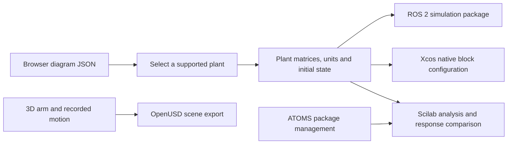

# Interfaces with Scilab, Xcos, ATOMS and ROS 2

Use this workflow to move a documented plant model between the browser experiment and engineering tools. The included adapter kit exports a selected **mass–spring–damper** or **first-order** plant, with its continuous state-space matrices, initial state and units. It does not silently convert the entire controller/feedback diagram. The [adapter kit README](../assets/interfaces/README.md) is the detailed command and runtime guide.

## Decide what is crossing the interface

A diagram JSON describes the builder's signal graph. A selected-plant JSON describes ẋ = A x + B u, y = C x + D u. A trajectory CSV contains sampled numerical results. An OpenUSD scene describes geometry and animation. A ROS message carries runtime data. These are different contracts; keeping them distinct prevents a visual animation or a plant export from being mistaken for a deployed controller.

For each handoff record the source diagram revision, selected node, equations, state order, input/output units, initial conditions, sample interval, control versus integration clocks, force/signal bounds and supported features. Explicitly identify omitted controllers, limiters, delays, sensors, neighbouring blocks and physical effects. Verify a simple known response in the receiving tool before extending the model.



## Export a selected plant

Save the browser model JSON. Use the node identifier shown in the inspector; a display label can be changed and is not the node ID.

```sh
python3 scripts/export_interfaces.py --diagram model.json --plant-node plant --out work/plant-interfaces
```

Run this from the installed skill folder; from the repository prepend `skills/mechatronics-engineering/` to the script path. The exporter uses a strict Python validation mirror of the browser schema and needs only the standard library. Keep both validators aligned when extending the block format. For first-order systems specify input/output units with the export options described by `--help`; a first-order mathematical form alone cannot determine whether the signals mean watts/kelvin, flow/level or voltage/speed.

For a mass–spring plant, choose x_state = [position, velocity]ᵀ and force input u. Then A = [[0,1],[−k/m,−b/m]], B = [[0],[1/m]], C = [[1,0]], D = [[0]]. State units are m and m/s. For τ ẏ + y = K u, A = [−1/τ], B = [K/τ], C = [1], D = [0]. Matrices without state and signal units are an incomplete engineering handoff.

## Scilab analysis

Load the generated analysis script in Scilab. It defines the exported state-space model using `syslin`, computes an independent time response and supplies plotting/comparison steps. The generated reference CSV comes from the Python simulator; compare times, input amplitude, initial state, final value and transient shape under identical conditions.

For continuous Scilab analysis, the exported object is the physical plant. It does not include the browser's PID, sampled hold, saturation or the rest of its diagram. Add the controller explicitly if analysing the full loop. A plant Bode plot can carry physical gain units; loop margins require a dimensionless full feedback transfer. Scilab frequency conventions must be checked: do not relabel Hz as rad/s. Document the actual `bode`, `csim` and related API conventions for the installed version.

Use Scilab for matrix/control analysis, scripted design studies and numerical cross-checks. Set `interface_plots=%f` before running the analysis script in `scilab-cli`; GUI plots stay enabled by default. A computed stable continuous model does not certify sampled, saturated or hardware behaviour. If a Scilab runtime is unavailable, retain the generated scripts as prepared artifacts and report execution as pending.

## Xcos native construction and batch simulation

The generated `xcos_build.sce` loads the same A/B/C/D and initial state, then uses installed native block define functions and `scicos_link` to construct a unit-step input, CLSS plant, CLOCK_c observation clock and a TOWS_c workspace recorder. It also constructs a second diagram with CSCOPE for interactive viewing. Both diagrams are saved as Scilab `.sod` data; that is distinct from an Xcos interchange file.

Run `xcos_batch.sce` in Scilab CLI or the GUI to execute native `scicos_simulate(...,"nw")`. It writes a time/output CSV, reports the actual recorded time interval, and compares matching samples with the Python reference. An observation event exactly at final time may be omitted by the native simulation; compare actual samples rather than assuming identical row counts. The configured observation interval and solver integration steps are separate clocks.

Run `xcos_setup.sce` in GUI-capable Scilab to save and reload native `selected-plant-batch.zcos` and `selected-plant-scope.zcos`, then open the scope diagram. Set `interface_open_xcos=%f` before execution to save/reload without opening an editor. Scilab's native `.zcos` serialization is disabled in `-nwni`/`scilab-cli` mode; Java-enabled `-nw` or GUI mode is needed for that step. The manual native-block recipe remains in the [adapter README](../assets/interfaces/README.md) as a learning exercise and fallback for incompatible releases.

This workflow does not reinterpret browser JSON as an Xcos file or convert unsupported neighbouring blocks. Solver tolerances, source timing, observation timing and initial conditions must be checked in the installed Xcos version. Keep the generated native files with the selected model and comparison results.

Expand the native model with controllers, actuator/sensor dynamics, events or suitable physical-network blocks when needed. For hybrid/acausal models, use Xcos's supported solvers and block libraries rather than inserting arbitrary delays merely to make the browser graph run. Verify unit consistency, algebraic-loop treatment and event ordering at each boundary.

## ATOMS package workflow

ATOMS is Scilab's extension-package manager. Start by recording the installed Scilab version, architecture and package inventory. The generated ATOMS script performs inventory and shows an explicit opt-in install/load workflow. Choose the actual package identifier from the current catalogue and verify compatibility, licence, provenance and dependencies before installation.

Installing a package and loading it are separate steps. Record the installed version and verify a representative function/block after loading. Package availability can depend on platform and Scilab release. The adapter never downloads an unspecified package automatically or treats a package name as proof of installed functionality.

## ROS 2 simulation environment

The generated workspace contains an `ament_python`/`rclpy` simulation package with the selected plant configuration and a pure Python numerical core. Build it with `colcon` in a compatible ROS 2 environment after sourcing that distribution. Source the built workspace, run the simulator node, inspect its metadata/state topics and publish a bounded scalar input using the commands in its README.

All topics use the `/mechatronics_sim/` namespace. The mass–spring input is force in newtons; first-order units come from the declared interface. Metadata identifies equations, signal units, timing and evidence scope. State data uses the kit's documented JSON message contract; it is not implicitly a `sensor_msgs/JointState`, `ros2_control` hardware interface, URDF model or TF tree. Add such adapters deliberately when a robot integration actually needs them.

The simulation advances one fixed step per timer callback and reports simulation time separately. It does not catch up a long wall-clock delay with a huge timestep. A receipt-age watchdog clears stale input to zero, validates nonfinite/out-of-bound commands and stops a failed numerical run. A scalar unstamped command cannot establish its age before local receipt; a production protocol would need timestamps, sequencing and verified clock/QoS behaviour. These software limits do not implement a physical machine safety function.

Keep simulations in an appropriate ROS domain and avoid remapping their topics into live actuator controllers. For real robot work establish the actual URDF/joint mappings, controller manager configuration, units, rates, QoS, transforms, synchronization and independent stop/limit design, then proceed through simulation, hardware-in-loop and controlled physical validation.

## Cross-tool acceptance checklist

1. Confirm the selected plant and omissions; compare matrices and initial state with the governing equations.
2. Verify time and units, including Hz/rad/s and Celsius/Kelvin or gauge/absolute pressure where relevant.
3. Match the input stimulus and sampling when comparing CSV responses; measure numerical error instead of comparing only plot appearance.
4. Load and exercise the scripts/blocks in the actual Scilab/Xcos release. Record ATOMS inventory before and after any explicit package change.
5. Build/run the ROS package in the actual ROS distribution, check message receipt, watchdog recovery, restart/reset and numerical bounds.
6. Keep generated source, configuration, model JSON, native Xcos diagram, result CSV and test notes together under version control.

Code generation, Python tests and source validation are distinct from successful Scilab execution, Xcos simulation and ROS middleware connectivity. Report only the checks actually performed. See [the project workflow](project-workflow.md) for configuration/manufacturing handoff and [OpenUSD guidance](openusd-workflow.md) for scene interchange.

### Bounded runtime evidence

On 2026-09-15, the installed macOS Scilab 2026.1.0 executed the exported mass-spring and first-order numerical analysis (including nonzero initial state), native Xcos construction and recorded batch simulation. Java-enabled batch mode saved/reloaded native `.zcos` diagrams. Those results establish these software paths on that release. Interactive scope rendering, ROS middleware and hardware operation require their own evidence. The optional native interface test uses an isolated profile and is explicitly skipped when Scilab is unavailable; ATOMS inventory does not install or load external modules.


The repository also provides a [ROS 2 Docker test environment](https://github.com/ShaunPrice/mechatronics-skill/tree/main/integrations/ros2-docker). On 2026-09-15, its generated package built successfully in ROS 2 Jazzy on Linux arm64, and seven live middleware checks passed between separate processes, including command receipt, state/metadata, stale/invalid input handling and simulation-clock behavior. The container was left stopped for reuse. See that guide and its recorded evidence for exact scope, versions and start/test/stop commands; this does not establish hardware operation.
